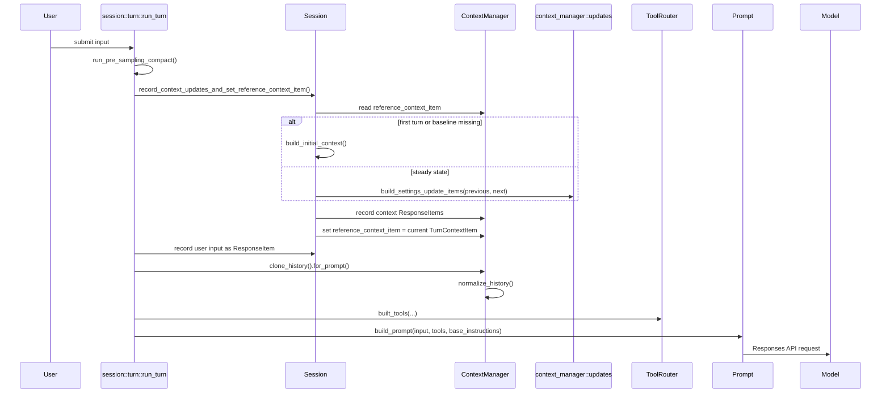
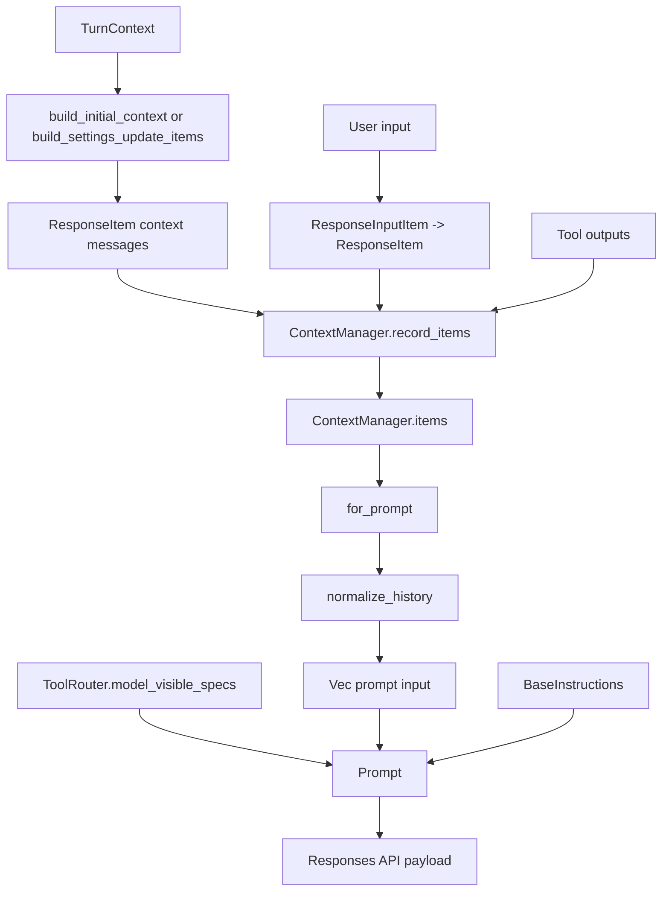
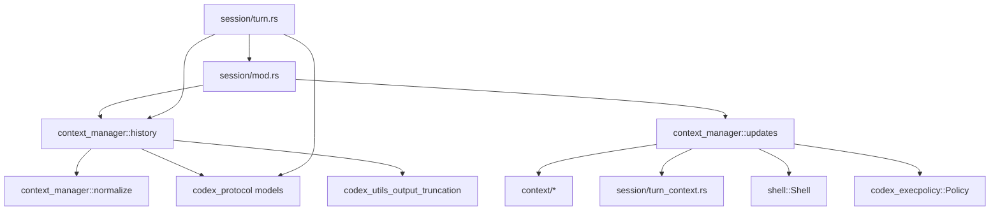

# Context Manager Overview

This folder owns the in-memory model-visible conversation transcript and the logic that injects or diffs contextual state before a sampling request.

Primary code:
- [mod.rs](/Users/yao/projects/codex/codex-rs/core/src/context_manager/mod.rs)
- [history.rs](/Users/yao/projects/codex/codex-rs/core/src/context_manager/history.rs)
- [normalize.rs](/Users/yao/projects/codex/codex-rs/core/src/context_manager/normalize.rs)
- [updates.rs](/Users/yao/projects/codex/codex-rs/core/src/context_manager/updates.rs)
- [session/mod.rs](/Users/yao/projects/codex/codex-rs/core/src/session/mod.rs)
- [session/turn.rs](/Users/yao/projects/codex/codex-rs/core/src/session/turn.rs)

## 1. Role

`ContextManager` is the core data structure. It stores:
- `items: Vec<ResponseItem>` as the ordered model-visible transcript
- `history_version: u64` for rewrite tracking
- `token_info: Option<TokenUsageInfo>` for usage accounting
- `reference_context_item: Option<TurnContextItem>` as the baseline for diff-style context reinjection

The important split is:
- Transcript state lives in `items`
- Durable context baseline lives in `reference_context_item`

See [history.rs](/Users/yao/projects/codex/codex-rs/core/src/context_manager/history.rs:32).

## 2. Runtime Sequence



Key entry points:
- Context update injection: [session/mod.rs](/Users/yao/projects/codex/codex-rs/core/src/session/mod.rs:2771)
- Prompt assembly: [session/turn.rs](/Users/yao/projects/codex/codex-rs/core/src/session/turn.rs:944)

## 3. Dataflow



## 4. Internal Hierarchy

```text
context_manager/
├── mod.rs
│   └── re-exports ContextManager and helpers
├── history.rs
│   ├── owns ContextManager
│   ├── records/truncates transcript items
│   ├── estimates token and byte usage
│   └── normalizes prompt-facing history
├── normalize.rs
│   ├── ensures call/output pairing
│   ├── removes orphan outputs
│   └── strips unsupported image content
└── updates.rs
    ├── builds environment diff items
    ├── builds permission/collab/realtime/personality updates
    └── emits developer or contextual-user ResponseItems
```

Adjacent ownership:

```text
session/mod.rs
├── decides full injection vs diff-only update
├── persists TurnContextItem baseline
└── delegates transcript storage to ContextManager

session/turn.rs
├── orchestrates turn execution
├── asks ContextManager for prompt-ready history
└── assembles Prompt with tools and base instructions
```

## 5. Dependency Graph



## 6. Core Algorithms

### A. Context injection decision

`record_context_updates_and_set_reference_context_item()` branches on whether `reference_context_item` exists:
- `None`: emit full initial context
- `Some(previous)`: emit only settings/environment diffs

This is the main control algorithm for keeping prompt overhead bounded. See [session/mod.rs](/Users/yao/projects/codex/codex-rs/core/src/session/mod.rs:2775).

### B. History normalization

Before sending prompt input, `for_prompt()` normalizes the transcript:
- ensure every call has an output
- remove orphan outputs
- strip image content when the target model does not support image input

See [history.rs](/Users/yao/projects/codex/codex-rs/core/src/context_manager/history.rs:357).

### C. Output truncation

When storing function/custom tool outputs, `process_item()` truncates payloads with a serialization budget multiplier before they land in history. This keeps large tool payloads from bloating future requests. See [history.rs](/Users/yao/projects/codex/codex-rs/core/src/context_manager/history.rs:372).

### D. Token accounting

Token tracking is heuristic and byte-based, not tokenizer-exact. `ContextManager` combines:
- base instruction size
- estimated item token counts
- last server-reported usage
- bytes/tokens added after the last model-generated item

See [history.rs](/Users/yao/projects/codex/codex-rs/core/src/context_manager/history.rs:133) and [history.rs](/Users/yao/projects/codex/codex-rs/core/src/context_manager/history.rs:330).

### E. Context diff synthesis

`updates.rs` compares `TurnContextItem` against current `TurnContext` and selectively emits:
- environment updates
- permission updates
- collaboration mode updates
- realtime start/end updates
- personality updates
- model-switch instructions

See [updates.rs](/Users/yao/projects/codex/codex-rs/core/src/context_manager/updates.rs:204).

## 7. Important Types

### `ContextManager`

Main in-memory transcript holder. See [history.rs](/Users/yao/projects/codex/codex-rs/core/src/context_manager/history.rs:34).

### `ResponseItem`

The prompt-facing union type for model-visible conversation, tool calls, tool outputs, reasoning, compaction items, and related events. `ContextManager.items` is a `Vec<ResponseItem>`.

### `TurnContextItem`

Durable snapshot of the turn-scoped context used as the baseline for future diff generation. This is separate from the visible transcript and is stored in `reference_context_item`.

## 8. Mental Model

Use this folder as if it implements a two-layer context system:

1. Transcript layer
`Vec<ResponseItem>` is the replayable conversation and tool history.

2. Baseline layer
`TurnContextItem` is the hidden reference snapshot that decides whether the next turn needs a full reinjection or a cheap diff.

That split explains most of the code shape in this area.
