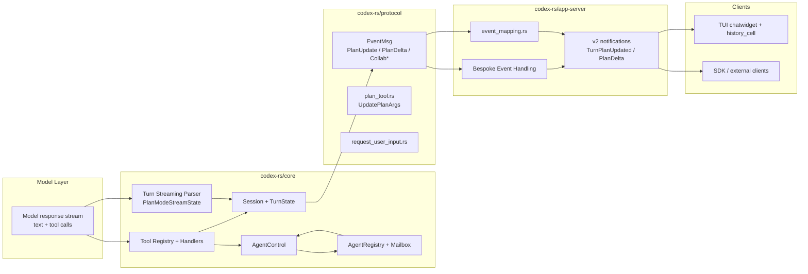
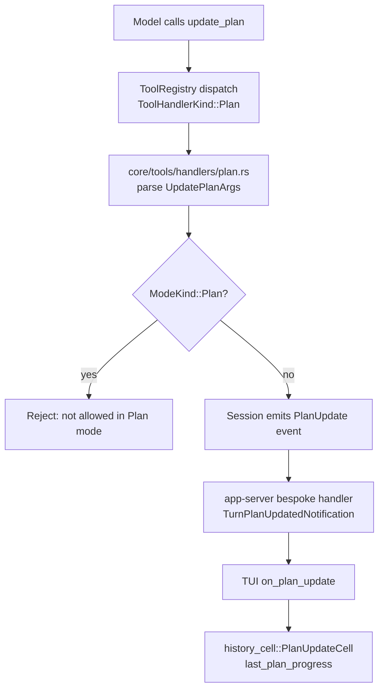
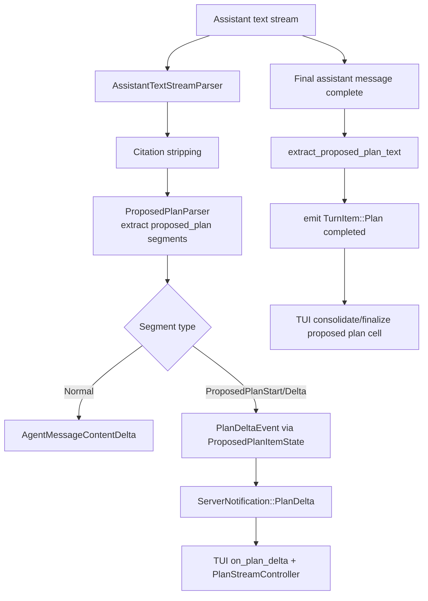
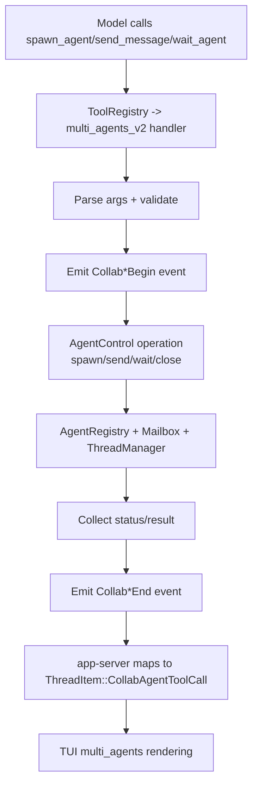
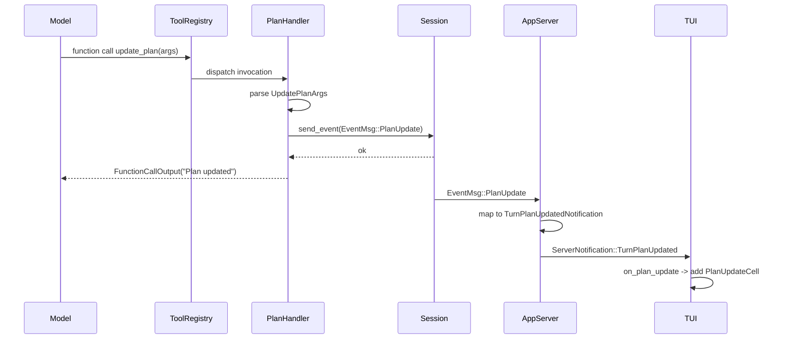
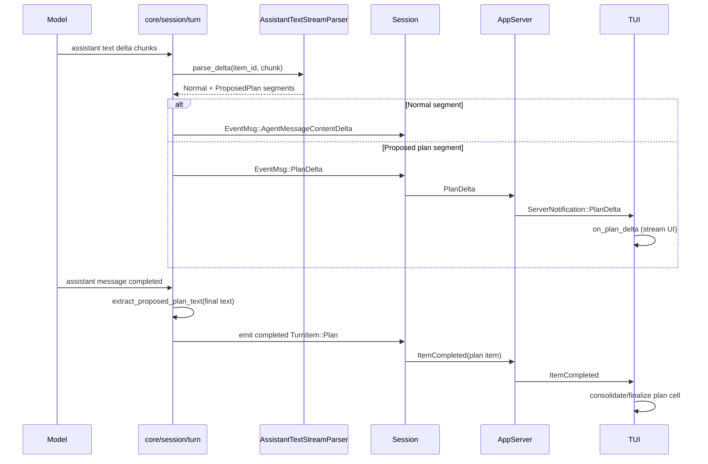
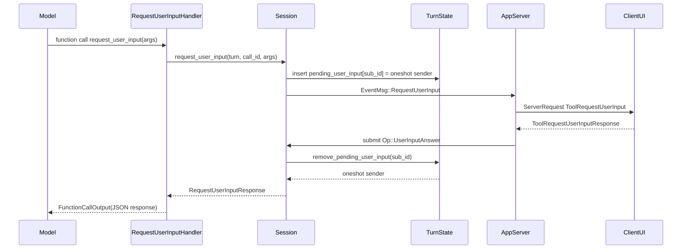

# Agentic Planning in Codex (Rust) - Architecture, Flow, and Internals

This document maps the code related to agentic planning in `codex-rs`, including:
- architecture and component boundaries
- end-to-end flow diagrams
- sequence diagrams for key paths
- design patterns
- core data structures
- key algorithms

## 1) Scope and Terminology

There are two distinct planning mechanisms:

1. **Checklist planning via `update_plan` tool**
- Structured list of steps (`pending`, `in_progress`, `completed`)
- Emitted as `PlanUpdate` events
- Rendered as plan checklist updates in clients (TUI / app-server)

2. **Plan Mode proposed plan streaming (`<proposed_plan>...</proposed_plan>`)**
- Streamed plan markdown segments inside assistant output
- Parsed incrementally into `PlanDelta` events and a final plan item
- Used when collaboration mode is `Plan`

Related collaborative agent tooling (`spawn_agent`, `wait_agent`, `send_input`, etc.) forms the **agentic execution/control plane** around planning.

---

## 2) High-Level Architecture

### Key boundaries
- **`protocol` crate**: schema and event contracts (`UpdatePlanArgs`, `EventMsg`, request-user-input payloads)
- **`tools` crate**: tool specs exposed to the model (`update_plan`, `spawn_agent`, etc.)
- **`core` crate**: runtime behavior, state management, parsing, multi-agent orchestration
- **`app-server` + `app-server-protocol`**: transport and projection to v2 notifications
- **`tui`**: rendering and interaction

---

## 3) Code Map (Primary Files)

### Planning contracts/specs
- `codex-rs/protocol/src/plan_tool.rs`
- `codex-rs/tools/src/plan_tool.rs`
- `codex-rs/tools/src/tool_registry_plan.rs`

### Plan execution / state
- `codex-rs/core/src/tools/handlers/plan.rs`
- `codex-rs/core/src/session/mod.rs`
- `codex-rs/core/src/state/turn.rs`

### Plan-mode streaming pipeline
- `codex-rs/utils/stream-parser/src/assistant_text.rs`
- `codex-rs/utils/stream-parser/src/proposed_plan.rs`
- `codex-rs/core/src/session/turn.rs`

### Agentic multi-agent orchestration
- `codex-rs/tools/src/agent_tool.rs`
- `codex-rs/core/src/tools/handlers/multi_agents.rs`
- `codex-rs/core/src/tools/handlers/multi_agents_v2.rs`
- `codex-rs/core/src/tools/handlers/multi_agents_v2/spawn.rs`
- `codex-rs/core/src/agent/control.rs`
- `codex-rs/core/src/agent/registry.rs`
- `codex-rs/core/src/agent/mailbox.rs`

### App-server mapping
- `codex-rs/app-server/src/bespoke_event_handling.rs`
- `codex-rs/app-server-protocol/src/protocol/event_mapping.rs`
- `codex-rs/app-server-protocol/src/protocol/v2.rs`

### TUI rendering
- `codex-rs/tui/src/chatwidget.rs`
- `codex-rs/tui/src/history_cell.rs`
- `codex-rs/tui/src/multi_agents.rs`

---

## 4) Flow Diagrams

## 4.1 Checklist Planning (`update_plan`) Flow

## 4.2 Plan Mode Stream Parsing Flow

## 4.3 Agentic Multi-Agent Tool Flow (spawn/send/wait)

---

## 5) Sequence Diagrams

## 5.1 `update_plan` Sequence

## 5.2 Plan Mode Proposed Plan Streaming Sequence

## 5.3 `request_user_input` Round Trip Sequence

---

## 6) Data Structures

## 6.1 Planning

- **`StepStatus`** (`protocol/src/plan_tool.rs`)
  - Enum: `Pending | InProgress | Completed`

- **`PlanItemArg`**
  - `{ step: String, status: StepStatus }`

- **`UpdatePlanArgs`**
  - `{ explanation: Option<String>, plan: Vec<PlanItemArg> }`

- **`PlanDeltaEvent`** (`protocol/src/protocol.rs`)
  - `{ thread_id, turn_id, item_id, delta }`

- **`TurnPlanUpdatedNotification`** (`app-server-protocol/src/protocol/v2.rs`)
  - `{ thread_id, turn_id, explanation, plan: Vec<TurnPlanStep> }`

## 6.2 Plan-mode parsing and stream state

- **`AssistantTextChunk`**
  - `visible_text: String`
  - `citations: Vec<String>`
  - `plan_segments: Vec<ProposedPlanSegment>`

- **`ProposedPlanSegment`**
  - `Normal(String)`
  - `ProposedPlanStart`
  - `ProposedPlanDelta(String)`
  - `ProposedPlanEnd`

- **`ProposedPlanItemState`** (`core/session/turn.rs`)
  - `item_id`, `started`, `completed`

- **`PlanModeStreamState`**
  - `pending_agent_message_items: HashMap<String, TurnItem>`
  - `started_agent_message_items: HashSet<String>`
  - `leading_whitespace_by_item: HashMap<String, String>`
  - `plan_item_state: ProposedPlanItemState`

## 6.3 Turn-level synchronization state

- **`TurnState`** (`core/state/turn.rs`)
  - `pending_approvals: HashMap<String, oneshot::Sender<ReviewDecision>>`
  - `pending_request_permissions: HashMap<String, PendingRequestPermissions>`
  - `pending_user_input: HashMap<String, oneshot::Sender<RequestUserInputResponse>>`
  - `pending_elicitations: HashMap<(String, RequestId), oneshot::Sender<ElicitationResponse>>`
  - `pending_dynamic_tools: HashMap<String, oneshot::Sender<DynamicToolResponse>>`
  - plus pending input queues and flags

## 6.4 Multi-agent control plane

- **`AgentControl`**
  - orchestration façade for spawn/send/interrupt/close/status/subscribe/list

- **`AgentRegistry`**
  - `active_agents.agent_tree: HashMap<String, AgentMetadata>` keyed by agent path
  - nickname tracking (`HashSet<String>`) + spawn counters

- **`Mailbox` / `MailboxReceiver`**
  - unbounded channel for inter-agent messages
  - watch-sequence (`AtomicU64` + `watch::Sender<u64>`) for wait-notifications
  - receiver `VecDeque` pending queue

---

## 7) Core Algorithms

## 7.1 Incremental proposed-plan extraction

1. Stream text chunk enters `AssistantTextStreamParser`.
2. Strip citation tags incrementally.
3. If plan mode enabled, pass visible text through `ProposedPlanParser`.
4. Emit ordered `ProposedPlanSegment`s.
5. In `handle_plan_segments`:
- Normal text -> agent message delta
- Plan tag segments -> `PlanDelta` lifecycle
6. On final message completion, re-parse full assistant text to extract final authoritative proposed plan content.

**Properties**:
- tolerant to tag splits across chunk boundaries
- preserves ordered segment semantics
- separates transient streaming deltas from finalized plan text

## 7.2 Request-user-input correlation (async rendezvous)

1. Handler creates `oneshot` sender/receiver pair.
2. Store sender in `TurnState.pending_user_input` keyed by turn sub-id.
3. Emit `RequestUserInput` event to client.
4. Client replies via app-server request response.
5. App-server submits `Op::UserInputAnswer` to core.
6. Core removes pending sender and resolves `oneshot` receiver.

**Properties**:
- exact correlation by turn id/sub-id
- robust fallback behavior on request cancellation/failure
- no busy polling

## 7.3 Multi-agent wait (v2 mailbox sequence wait)

1. `wait_agent` validates timeout with min/max clamps.
2. Subscribe to mailbox sequence watch channel.
3. If pending mail exists, return immediately.
4. Else wait until watch value changes or timeout.
5. Emit `CollabWaitingBegin/End` events and return summary.

**Properties**:
- event-driven wake-up (low CPU)
- deterministic timeout envelope

## 7.4 Spawn-agent config inheritance + override layering

Order in spawn v2 path:
1. clone/build child config from current turn
2. apply requested model/reasoning overrides (when allowed)
3. apply role config overrides
4. apply runtime overrides (provider/policy/cwd/sandbox)
5. apply spawn-specific depth/path/fork options
6. spawn via `AgentControl`

**Properties**:
- stable inheritance from live turn context
- role/model override precedence is explicit

---

## 8) Design Patterns Used

- **Command Pattern**
  - each tool maps to dedicated `ToolHandler` implementation

- **Registry + Dispatch Pattern**
  - tool names -> handlers registered in tool spec/runtime builder

- **Event Sourcing / Event-driven UI projection**
  - core emits `EventMsg`; app-server projects to v2 notifications; UI consumes notifications

- **Adapter Pattern**
  - mapping from core protocol structs to app-server protocol structs

- **State Machine Pattern**
  - plan streaming lifecycle (`ProposedPlanItemState`), mailbox delivery phases, collaboration wait lifecycle

- **Async Request/Response Correlation Pattern**
  - pending maps + `oneshot` channels for approvals/user-input/elicitations

- **Facade Pattern**
  - `AgentControl` centralizes thread-manager + registry + mailbox complexity

- **Layered Architecture**
  - contracts (`protocol`) -> tool surface (`tools`) -> execution/state (`core`) -> transport (`app-server`) -> presentation (`tui`)

---

## 9) Practical Notes

- `update_plan` is explicitly a checklist tool and **not** the same as Plan Mode proposed-plan streaming.
- In Plan Mode, `update_plan` is rejected by handler design (`core/tools/handlers/plan.rs`).
- Plan streaming is incremental and potentially differs from final consolidated plan text (by design).
- Multi-agent v1 and v2 coexist; v2 introduces task-path and mailbox-driven wait semantics.

---

## 10) Minimal End-to-End Trace Summary

1. Model emits tool call or stream deltas.
2. Core dispatches via ToolRegistry and mutates TurnState/AgentControl as needed.
3. Core emits normalized `EventMsg`.
4. App-server converts events into protocol notifications/requests.
5. TUI/external clients render plan deltas, plan updates, and collaboration items.
