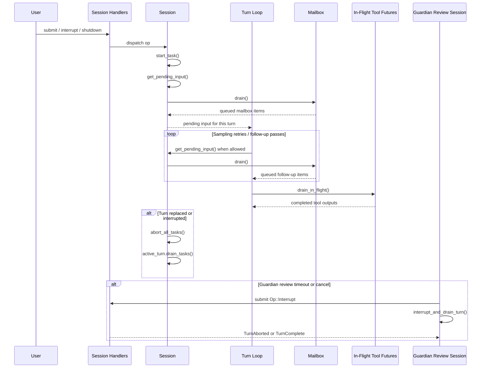
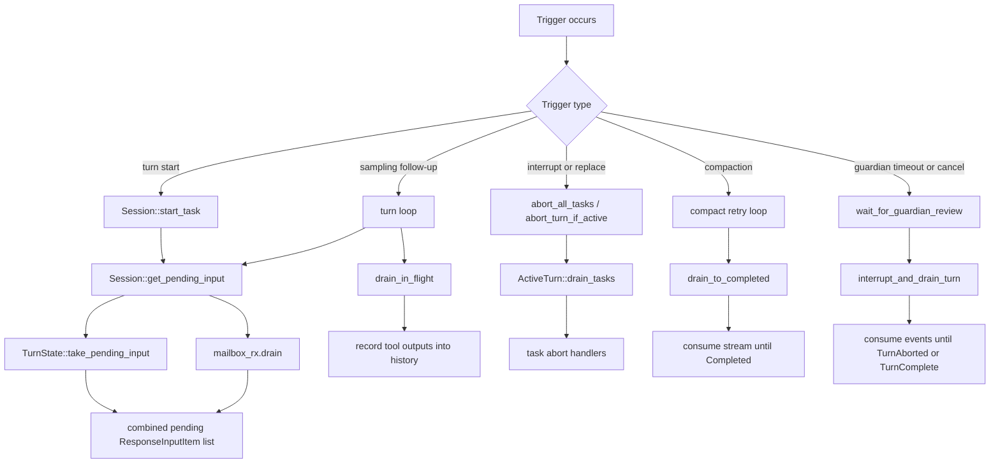

# Drains in the Event Runtime

This note explains what "drain" means in `codex-rs`, who triggers drains, when they happen, and why ownership boundaries matter.

In this codebase, `drain` usually means one of two things:

- queue drain: take all currently buffered items from a collection and leave the collection empty
- event-stream drain: keep consuming events until a known terminal condition is reached so stale work does not leak into later flow

## 1) Why Drains Exist

The runtime is turn-scoped and event-driven. That creates a recurring problem:

- some work arrives while a turn is already running
- some work is still in flight when a turn is ending
- some review/evaluation work must be interrupted cleanly before the session can safely continue

Drain points are the places where the runtime explicitly consumes pending state so the next owner sees a clean boundary.

## 2) Main Drain Categories

### 2.1 Pending Input and Mailbox Drains

These are classic queue drains.

- `TurnState.pending_input` stores response items waiting to be folded into the active turn.
- `mailbox_rx` stores inter-agent mail waiting to be delivered into turn input.
- `Session::get_pending_input()` drains both sources and returns a combined `Vec<ResponseInputItem>`.

Primary code:

- [`Session::get_pending_input()`](/Users/yao/projects/codex/codex-rs/core/src/session/mod.rs:3123)
- [`TurnState::take_pending_input()`](/Users/yao/projects/codex/codex-rs/core/src/state/turn.rs:234)
- [`mailbox_rx.drain()`](/Users/yao/projects/codex/codex-rs/core/src/session/mod.rs:3143)

### 2.2 Task Drains

These drains remove all running tasks from the active turn before abort/replacement handling proceeds.

Primary code:

- [`ActiveTurn::drain_tasks()`](/Users/yao/projects/codex/codex-rs/core/src/state/turn.rs:103)
- [`Session::abort_all_tasks()`](/Users/yao/projects/codex/codex-rs/core/src/tasks/mod.rs:473)
- [`Session::abort_turn_if_active()`](/Users/yao/projects/codex/codex-rs/core/src/tasks/mod.rs:509)

### 2.3 In-Flight Tool Future Drains

These drains wait for already-started tool futures to finish and then record the resulting items into history.

Primary code:

- [`drain_in_flight()`](/Users/yao/projects/codex/codex-rs/core/src/session/turn.rs:1778)
- call site at [`session/turn.rs:2216`](/Users/yao/projects/codex/codex-rs/core/src/session/turn.rs:2216)

### 2.4 Compaction Stream Drains

These drains consume a model response stream until `Completed` during compaction.

Primary code:

- [`drain_to_completed()`](/Users/yao/projects/codex/codex-rs/core/src/compact.rs:507)
- call site at [`compact.rs:188`](/Users/yao/projects/codex/codex-rs/core/src/compact.rs:188)

### 2.5 Guardian Review Event-Stream Drains

These are not collection drains. They interrupt a review/evaluation turn and keep reading events until that turn reaches `TurnAborted` or `TurnComplete`.

Primary code:

- [`wait_for_guardian_review()`](/Users/yao/projects/codex/codex-rs/core/src/guardian/review_session.rs:785)
- [`interrupt_and_drain_turn()`](/Users/yao/projects/codex/codex-rs/core/src/guardian/review_session.rs:988)

## 3) Trigger and Ownership Map

| Drain kind | Trigger | Immediate caller | Owner of drained state | Why it drains |
| --- | --- | --- | --- | --- |
| Pending input/mailbox | turn start or follow-up sampling pass | `Session::start_task`, turn loop | `Session` / `TurnState` / mailbox receiver | fold queued items into active turn without duplicating delivery |
| Task drain | interrupt, replace, shutdown, targeted abort | `abort_all_tasks`, `abort_turn_if_active` | `ActiveTurn` | detach all running tasks before cleanup and restart decisions |
| In-flight tool drain | sampling stream is finishing | `run_sampling_request` tail path | turn-scoped tool futures | ensure tool outputs are persisted before final turn closeout |
| Compaction drain | compaction request is in progress | compaction retry loop | compaction response stream | consume stream to terminal completion |
| Guardian event drain | review timeout or cancellation | `wait_for_guardian_review` | guardian review turn/event stream | avoid stale review events leaking into later review/session logic |

## 4) Sequence Diagram

## 5) Flow Diagram

## 6) Dependency and Control Boundaries

The main dependency chain looks like this:

- `SessionHandlers` owns submission dispatch
- `Session` owns active-turn lifecycle and pending-input access
- `TurnState` owns turn-local pending maps and buffered input
- mailbox receiver owns queued inter-agent messages
- turn execution code owns sampling and in-flight tool futures
- guardian review session owns review-turn timeout/cancel control

This is intentionally split so that no single component owns every queue and every terminal condition.

That separation is useful, but it creates handoff risk. A drain is usually the handoff point between one owner and the next.

## 7) Ownership Concerns

### 7.1 Duplicate Delivery Risk

If one component reads queued items without draining them, a later component may consume the same work again. The drain boundary prevents duplicate delivery.

### 7.2 Cross-Turn Contamination Risk

Pending mailbox or review events may belong to an earlier turn. If they are not drained or terminally consumed before the next turn begins, later logic may observe stale events and make incorrect decisions.

### 7.3 Partial Shutdown Risk

Interrupting a turn is not enough by itself. The runtime often must also drain the corresponding event stream so terminal events do not arrive after ownership has already moved on.

### 7.4 Atomicity and Locking Risk

Some drains happen near locks or turn-state transitions. The core concern is not just reading items, but reading them at a moment when ownership is still unambiguous.

## 8) Practical Reading Guide

If you are debugging "why did this old item show up now?" or "why did the runtime keep waiting after interrupt?", inspect these in order:

1. [`Session::get_pending_input()`](/Users/yao/projects/codex/codex-rs/core/src/session/mod.rs:3123)
2. [`run_sampling_request` loop](/Users/yao/projects/codex/codex-rs/core/src/session/turn.rs:376)
3. [`drain_in_flight()`](/Users/yao/projects/codex/codex-rs/core/src/session/turn.rs:1778)
4. [`abort_all_tasks()`](/Users/yao/projects/codex/codex-rs/core/src/tasks/mod.rs:473)
5. [`interrupt_and_drain_turn()`](/Users/yao/projects/codex/codex-rs/core/src/guardian/review_session.rs:988)

## 9) Short Definition

In `codex-rs`, a drain is a controlled consume-and-clear step used to establish a clean lifecycle boundary between queued work, active turn execution, and terminal cleanup.
