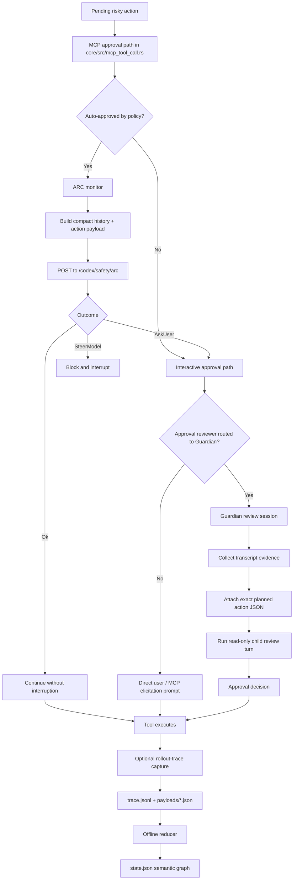
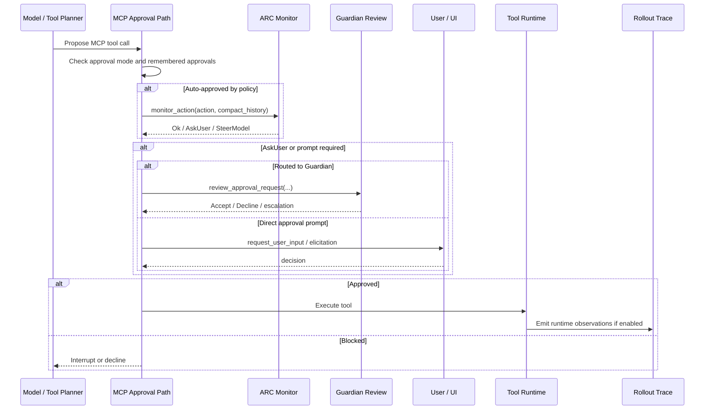

# Evidence Gathering Overview

This folder explains the main evidence-gathering architecture around risky actions and post-hoc debugging in `codex-rs`.

The important split is:

- `monitor`: live risk triage for actions that are about to run.
- `guardian`: approval review that packages transcript evidence plus the exact planned action for a reviewer model.
- `rollout-trace`: opt-in local forensic capture for reconstructing what happened after the fact.

`monitor` and `guardian` are part of the execution path for risky actions. `rollout-trace` is diagnostic infrastructure that observes runtime behavior without trying to decide policy on the hot path.

## 1) System Overview

## 2) Runtime Control Flow

## 3) Ownership Map

- `core/src/mcp_tool_call.rs`: main orchestration for MCP approval, ARC monitor, Guardian routing, and direct user prompts.
- `core/src/arc_monitor.rs`: compact evidence packaging for live safety monitoring.
- `core/src/guardian/prompt.rs`: transcript evidence selection and prompt assembly for approval review.
- `core/src/guardian/review_session.rs`: executes the Guardian review turn in read-only mode.
- `rollout-trace/src/thread.rs`: thread-scoped evidence producer used by runtime code.
- `rollout-trace/src/writer.rs`: raw event and payload writer.
- `rollout-trace/README.md`: best high-level description of the trace architecture.

## 4) Why the Design Is Split

- `monitor` is optimized for fast allow / escalate / block decisions before a risky action proceeds.
- `guardian` is optimized for richer authorization review with explicit transcript evidence and exact action JSON.
- `rollout-trace` is optimized for replayability and debugging, not live policy decisions.

## 5) Cross-References

- Monitor deep dive: [01-monitor.md](/Users/yao/projects/codex/learning/evidence-gathering/01-monitor.md)
- Rollout trace deep dive: [02-rollout-trace.md](/Users/yao/projects/codex/learning/evidence-gathering/02-rollout-trace.md)
