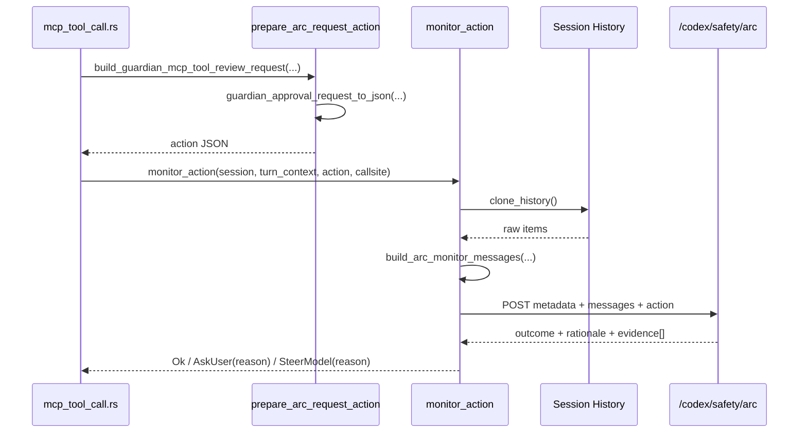

# Evidence Gathering: Monitor

This note describes the live evidence-gathering path used by the safety monitor in `core/src/arc_monitor.rs`, and how it is invoked from the MCP approval flow.

## 1) What the Monitor Does

The monitor is a lightweight pre-execution risk check. It is mainly used when a tool call would otherwise be auto-approved by policy. Instead of immediately executing, the system gathers compact evidence from the current session, serializes the exact action under review, and asks the ARC endpoint for one of three outcomes:

- `Ok`
- `AskUser`
- `SteerModel`

That makes the monitor a fast triage stage, not a full forensic recorder.

## 2) End-to-End Sequence



## 3) Decision Flow

```mermaid
flowchart TD
  A[Tool call reached approval path]
  A --> B{Approval mode == auto-approve?}
  B -->|No| C[Skip monitor]
  B -->|Yes| D[Prepare action JSON]
  D --> E[monitor_action(...)]

  E --> F{ARC credentials available?}
  F -->|No| G[Return Ok]
  F -->|Yes| H[Build request from history + action]

  H --> I{ARC HTTP request succeeds?}
  I -->|No| G
  I -->|Yes| J{ARC outcome}
  J -->|ok| G
  J -->|ask-user| K[Return AskUser(reason)]
  J -->|steer-model| L[Return SteerModel(reason)]
```

## 4) What Counts as Evidence Here

The monitor request contains:

- metadata:
  - Codex thread id
  - Codex turn id
  - conversation id
  - protection callsite
- compact conversation messages
- the exact action object under review

The code deliberately builds a compact message list rather than sending the entire raw runtime stream. This is a policy decision path, so it wants enough evidence to judge authorization and risk, but not the full replayable trace bundle.

## 5) Evidence Selection Rules

At a high level, the monitor uses recent session history to build a compact chat-like record:

- user messages are retained
- assistant final/user-facing content is retained
- contextual environment scaffolding is filtered out
- relevant tool-call context is folded into a compact representation

If the history is empty, it inserts a fallback message saying no prior conversation history is available.

## 6) Why the Action Shape Reuses Guardian Concepts

The monitor does not invent a separate action schema. The MCP approval flow first builds the same structured approval request used by Guardian, then serializes that into JSON for ARC review.

That reuse matters because:

- the risky action is represented consistently across `monitor` and `guardian`
- policy review and human-facing escalation are talking about the same object
- monitor can escalate to user / Guardian without losing the exact action semantics

## 7) Outcomes and Their Effects

- `Ok`: no interruption; the tool call continues.
- `AskUser(reason)`: the auto-approved path is converted into an explicit approval prompt.
- `SteerModel(reason)`: the action is blocked and the model is interrupted with a safety message.

So the monitor is best understood as an escalation filter in front of execution.

## 8) Key Files

- `codex-rs/core/src/mcp_tool_call.rs`
- `codex-rs/core/src/arc_monitor.rs`
- `codex-rs/core/src/arc_monitor_tests.rs`

## 9) Relationship to Rollout Trace

The monitor gathers just enough evidence to decide whether the action should proceed. It is not trying to preserve full runtime provenance.

If you later need to answer questions like:

- which exact request produced a tool call
- which nested runtime object emitted an output
- how child threads interacted

that is `rollout-trace`, not `monitor`.
