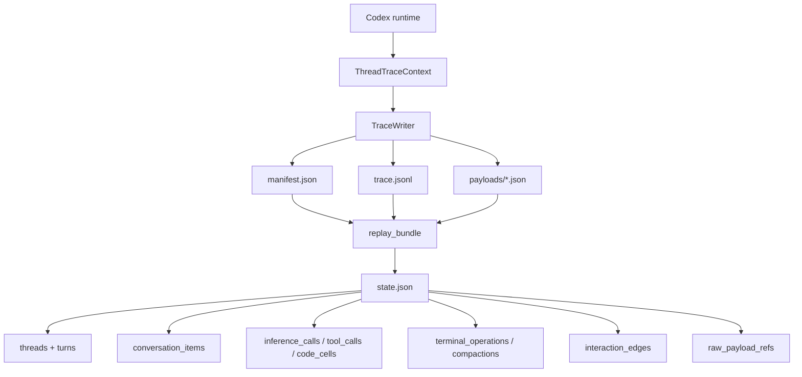
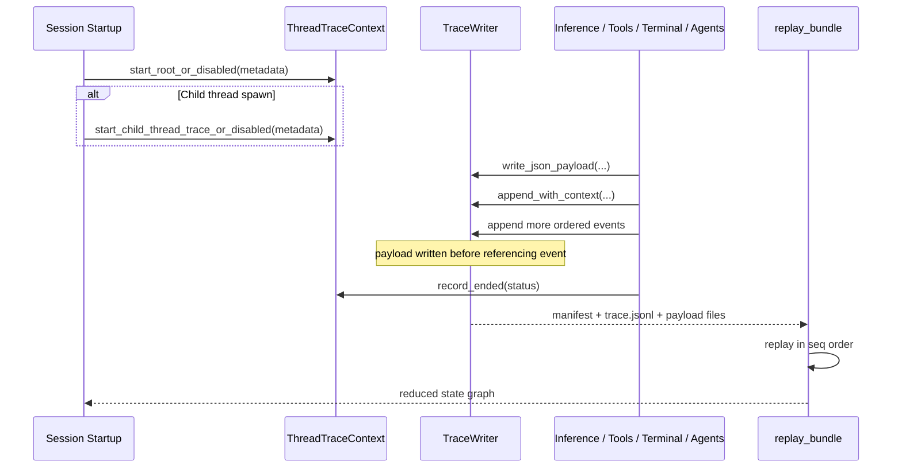
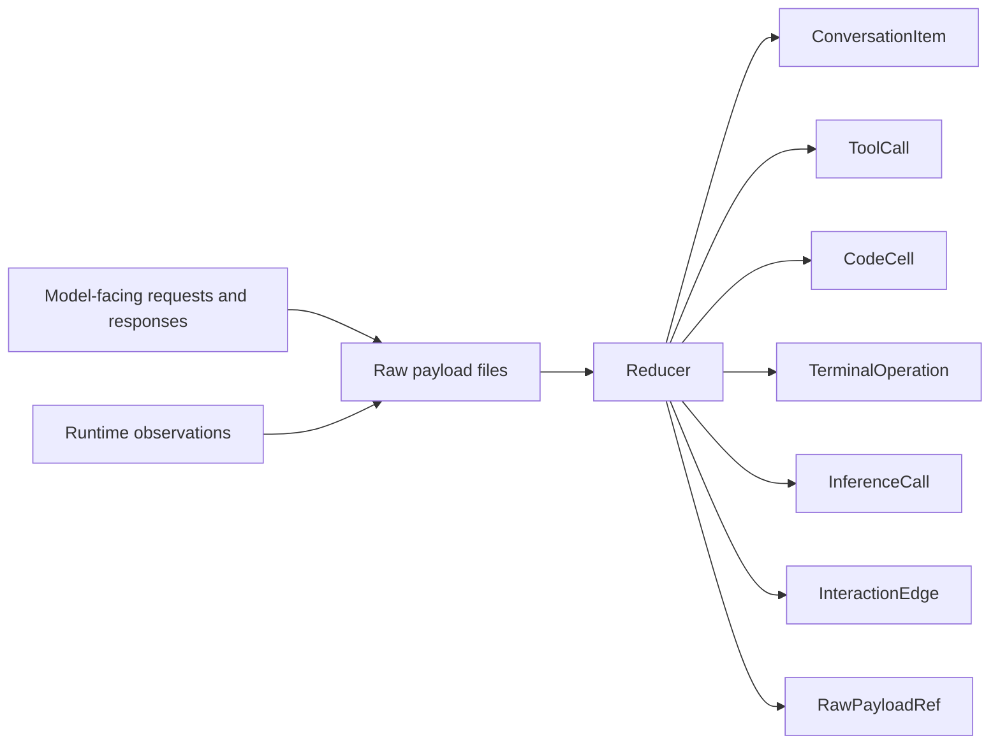
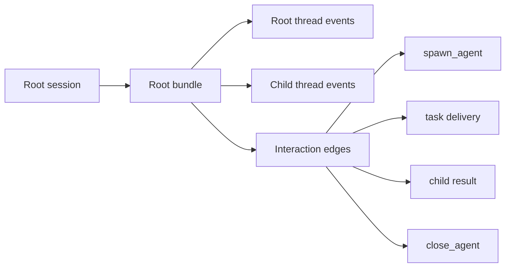

# Evidence Gathering: Rollout Trace

This note describes `codex-rs/rollout-trace`, which is the local forensic evidence system for reconstructing what happened during a Codex session.

Its core design principle is:

- observe first
- interpret later

The runtime writes raw evidence cheaply on the hot path. A reducer later converts that evidence into a semantic graph.

## 1) Big Picture

## 2) Runtime Sequence

## 3) Why It Exists

Normal conversation history is not enough to explain many runtime questions. `rollout-trace` preserves enough evidence to reconstruct:

- which model request produced a tool call
- whether output came from model-visible transcript or runtime-only execution
- which code-mode `exec` cell issued nested tools
- how terminal operations relate to tool calls
- how spawned child agents interacted with their parent

## 4) Raw Evidence vs Reduced Graph

The important rule is that raw payloads are evidence, not the final semantic model. The reducer decides what became model-visible conversation and what remained runtime-only structure.

## 5) Bundle Structure

- `manifest.json`: trace identity and top-level metadata
- `trace.jsonl`: ordered raw event spine
- `payloads/*.json`: larger raw evidence blobs
- `state.json`: optional reducer output

`TraceWriter` guarantees that payload files are written before the event that refers to them. That keeps replay deterministic even if the process is interrupted.

## 6) Multi-Agent Shape

Spawned child threads do not get their own isolated bundles if they belong to the same rollout tree. They share the root trace writer so one reduced `state.json` can explain the whole interaction graph.

## 7) Main Components

- `ThreadTraceContext`
  - no-op capable handle for one thread
  - starts root or child thread tracing
  - records typed protocol, turn, tool, and agent-result events

- `TraceWriter`
  - owns bundle layout
  - writes payload files
  - appends ordered events with sequence numbers

- reducer
  - replays raw evidence in `seq` order
  - builds semantic runtime objects and edges
  - keeps `RawPayloadRef` pointers back to exact evidence

## 8) Why This Is Different from Monitor

`monitor` asks, “Do we have enough evidence to decide whether this risky action should proceed right now?”

`rollout-trace` asks, “Can we later reconstruct what really happened across inference, tools, terminals, code mode, and child threads?”

That is why `monitor` sends a compact approval-oriented request, while `rollout-trace` records raw local evidence and defers interpretation to an offline reducer.

## 9) Key Files

- `codex-rs/rollout-trace/README.md`
- `codex-rs/rollout-trace/src/thread.rs`
- `codex-rs/rollout-trace/src/writer.rs`
- `codex-rs/core/src/session/session.rs`
