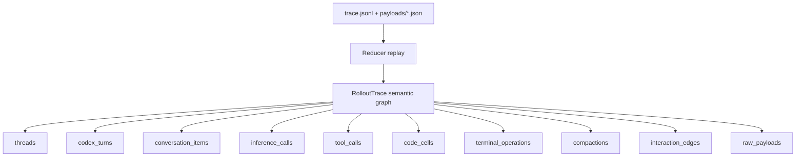
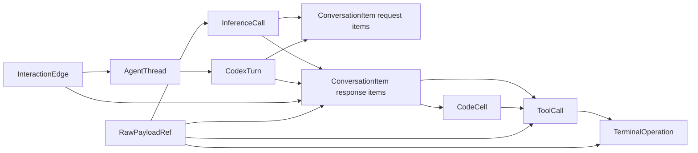
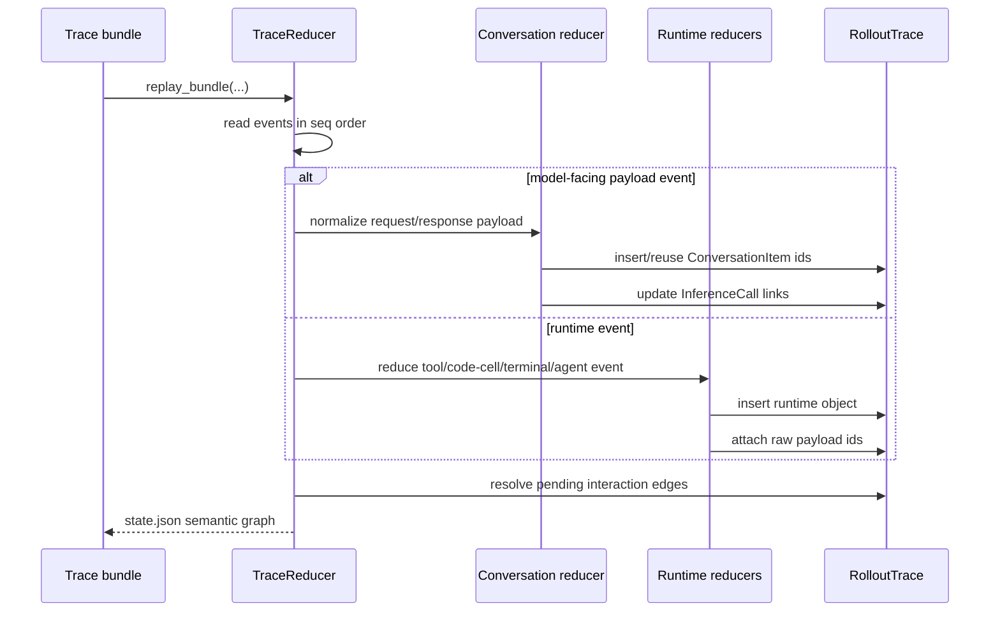
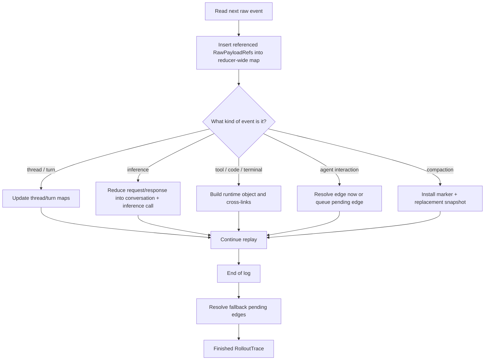
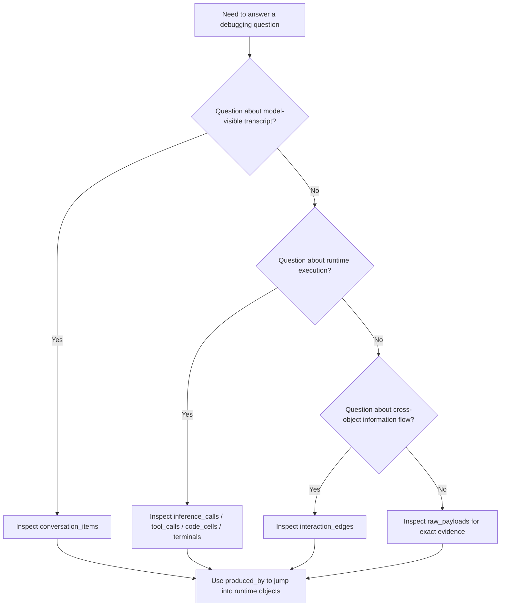

# Evidence Gathering: Semantic Graph

This note explains what the reduced “semantic graph” is in `codex-rs/rollout-trace`, why it exists, and how to read it.

The short version is:

- the trace writer records raw events and raw payload refs
- the reducer replays that evidence
- the reducer outputs a typed graph called `RolloutTrace`

That graph is “semantic” because it does not just mirror raw JSON files. It separates model-visible conversation from runtime/debug objects and then links them with stable ids.

## 1) What the Semantic Graph Is

The reduced graph is the `RolloutTrace` object in [model/mod.rs](/Users/yao/projects/codex/codex-rs/rollout-trace/src/model/mod.rs:48).

At the top level it contains:

- threads
- Codex turns
- conversation items
- inference calls
- code cells
- tool calls
- terminal sessions and terminal operations
- compactions and compaction requests
- interaction edges
- raw payload refs

The raw trace bundle is evidence. The semantic graph is the reducer’s typed interpretation of that evidence.

## 2) Big Picture

## 3) Why It Is a Graph Instead of a Transcript

A transcript alone cannot answer questions like:

- which inference request introduced this message
- which tool call corresponds to this function output item
- which terminal operation produced this tool output
- which child thread received a spawned task
- where compaction replaced live history

The semantic graph solves that by keeping multiple object families and linking them through ids.

## 4) Main Node Types

### Conversation items

`ConversationItem` is the model-visible transcript unit, defined in [model/conversation.rs](/Users/yao/projects/codex/codex-rs/rollout-trace/src/model/conversation.rs:18).

It stores:

- role
- channel
- kind
- body
- optional model-visible `call_id`
- `produced_by` references to runtime objects

This is “what the model saw” or “what the model produced”.

### Runtime/debug objects

The main runtime object families are defined across [model/conversation.rs](/Users/yao/projects/codex/codex-rs/rollout-trace/src/model/conversation.rs:128), [model/runtime.rs](/Users/yao/projects/codex/codex-rs/rollout-trace/src/model/runtime.rs:18), and [model/session.rs](/Users/yao/projects/codex/codex-rs/rollout-trace/src/model/session.rs:23).

Important examples:

- `InferenceCall`
- `ToolCall`
- `CodeCell`
- `TerminalOperation`
- `Compaction`
- `AgentThread`
- `CodexTurn`

These explain runtime structure that a plain transcript would hide.

### Interaction edges

`InteractionEdge` in [model/runtime.rs](/Users/yao/projects/codex/codex-rs/rollout-trace/src/model/runtime.rs:302) represents directed information flow between graph objects.

Edge kinds include:

- `SpawnAgent`
- `AssignAgentTask`
- `SendMessage`
- `AgentResult`
- `CloseAgent`

This is why the reduced output is a graph and not just a pile of object tables.

### Raw payload refs

`RawPayloadRef` entries are the link back to exact evidence. They let a viewer jump from a semantic object to the original payload file without inlining every raw blob into `state.json`.

## 5) Core Data Structures

The semantic graph is stored primarily as typed `BTreeMap`s inside `RolloutTrace`, visible in [model/mod.rs](/Users/yao/projects/codex/codex-rs/rollout-trace/src/model/mod.rs:63).

That means the main structural pattern is:

- one top-level typed map per object family
- string ids as stable keys
- cross-object references stored by id rather than nested ownership

Examples:

- `conversation_items: BTreeMap<ConversationItemId, ConversationItem>`
- `inference_calls: BTreeMap<InferenceCallId, InferenceCall>`
- `tool_calls: BTreeMap<ToolCallId, ToolCall>`
- `interaction_edges: BTreeMap<EdgeId, InteractionEdge>`
- `raw_payloads: BTreeMap<RawPayloadId, RawPayloadRef>`

The reducer itself keeps extra working data structures in [reducer/mod.rs](/Users/yao/projects/codex/codex-rs/rollout-trace/src/reducer/mod.rs:80):

- `thread_conversation_snapshots: BTreeMap<String, Vec<String>>`
- `pending_compaction_replacement_item_ids: BTreeMap<String, Vec<String>>`
- `code_cell_ids_by_runtime: BTreeMap<(String, String), String>`
- `pending_code_cell_starts: BTreeMap<String, PendingCodeCellStart>`
- `pending_code_cell_lifecycle_events: BTreeMap<String, Vec<...>>`
- `pending_agent_interaction_edges: Vec<PendingAgentInteractionEdge>`

So the reduced graph itself is mostly map-based persistent state, while replay-time bookkeeping uses:

- maps for stable lookup
- vectors for ordered transcript snapshots
- queues/lists for pending events whose target has not materialized yet

## 6) Main Algorithms

The semantic graph is built with a few strong algorithmic patterns rather than one complicated graph algorithm.

### Deterministic single-pass replay

The reducer replays raw events in sequence order from `trace.jsonl`, shown in [reducer/mod.rs](/Users/yao/projects/codex/codex-rs/rollout-trace/src/reducer/mod.rs:39).

This is essentially:

- read linearly
- parse one event
- insert raw payload refs
- dispatch to the typed reducer arm

So the main replay algorithm is an ordered streaming fold over the event log.

### Id-based graph assembly

Instead of building deeply nested objects, the reducer uses:

- id allocation
- id lookup
- id cross-linking

This makes later object enrichment cheap and keeps replay deterministic.

### Deferred edge resolution

Some edges cannot be resolved when first observed. For example, a multi-agent delivery can be observed before the recipient-side `ConversationItem` exists.

So the reducer uses a deferred-resolution algorithm:

1. record a pending edge
2. continue replay
3. try to resolve it when matching items appear
4. apply a fallback after full replay if necessary

This is handled by `pending_agent_interaction_edges` and the final `resolve_pending_spawn_edge_fallbacks()` call in [reducer/mod.rs](/Users/yao/projects/codex/codex-rs/rollout-trace/src/reducer/mod.rs:76).

### Snapshot reconciliation

For model-visible conversation, the reducer does not naively append every repeated request item. It uses reconciliation against prior snapshots to decide when ids can be reused.

That is the main algorithmic trick behind stable semantic transcript identity.

## 7) Graph Shape

## 8) Reduction Sequence

## 9) Flow Diagram for Graph Construction

## 10) Reading the Graph Correctly

The key reading rule is:

- `conversation_items` tell you what was model-visible
- runtime object maps tell you how Codex actually executed work

Those two layers overlap, but they are not interchangeable.

Examples:

- a terminal result may exist as runtime evidence even when the model never saw the exact bytes
- a code cell may have a runtime lifecycle that extends beyond the initial custom tool output
- a tool output conversation item may be produced by both an inference response and a runtime tool call

That is why `ConversationItem.produced_by` is plural.

## 11) Hard-Core Algorithms and Data Structures

This code is not using heavy graph theory like shortest paths, SCCs, or general-purpose graph traversal engines.

The “hard-core” parts are more practical systems algorithms:

- deterministic event-sourced replay
- stable-id semantic reduction
- snapshot reconciliation against prior transcript state
- deferred resolution of causally early events
- dual-representation storage:
  - semantic objects for common queries
  - raw payload refs for exact evidence

The important data-structure choices are:

- `BTreeMap` for canonical reduced object stores and replay-time indices
- `Vec<String>` for ordered thread transcript snapshots
- pending queues/lists for unresolved edges and lifecycle events
- reducer-owned ordinal counters for stable local ids like `conversation_item:N`

So the sophistication is not in abstract graph algorithms. It is in making replay deterministic, identity-stable, and debuggable under partially out-of-order causal evidence.

## 12) Flow Diagram for Interpretation

## 13) Why This Matters

The semantic graph is the reducer’s main value-add. It gives you a stable, typed view over a messy runtime:

- repeated request history can reuse conversation item ids
- runtime-only work can stay out of the transcript while remaining inspectable
- multi-agent interactions can be represented as edges instead of inferred from text
- exact evidence is still recoverable through raw payload refs

## 14) Key Files

- `codex-rs/rollout-trace/src/model/mod.rs`
- `codex-rs/rollout-trace/src/model/conversation.rs`
- `codex-rs/rollout-trace/src/model/runtime.rs`
- `codex-rs/rollout-trace/src/model/session.rs`
- `codex-rs/rollout-trace/src/reducer/mod.rs`
- `codex-rs/rollout-trace/README.md`
