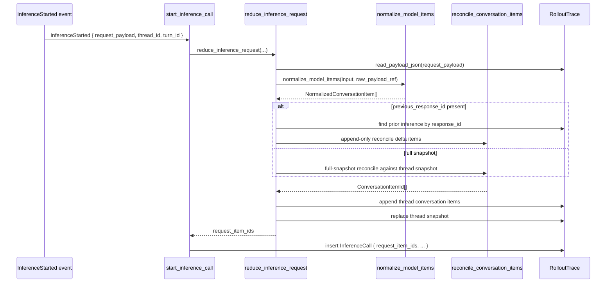
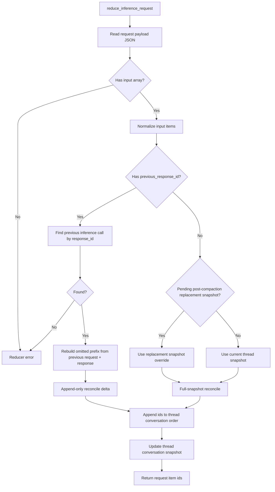
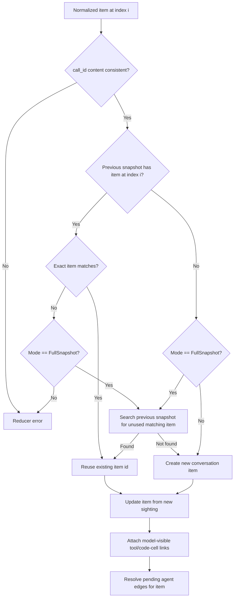

# Evidence Gathering: `reduce_inference_request`

This note explains `reduce_inference_request` in the rollout-trace reducer.

The function lives in [reducer/conversation.rs](/Users/yao/projects/codex/codex-rs/rollout-trace/src/reducer/conversation.rs:25). It is the reducer entry that turns a raw inference request payload into model-visible `ConversationItem`s and updates the thread’s current conversation snapshot.

## 1) What It Does

`reduce_inference_request(...)` takes:

- an inference request payload ref
- thread id
- Codex turn id
- inference call id
- wall-clock timestamp

Then it:

1. reads the raw request payload JSON
2. extracts the `input` array
3. normalizes model items into `NormalizedConversationItem`s
4. decides whether this request is:
   - a full snapshot, or
   - an incremental follow-up request using `previous_response_id`
5. reconciles those normalized items against prior conversation state
6. returns the resulting `ConversationItemId`s

This is the reducer step that reconstructs “what the model was sent”.

## 2) Position in the Inference Lifecycle

`start_inference_call(...)` in [reducer/inference.rs](/Users/yao/projects/codex/codex-rs/rollout-trace/src/reducer/inference.rs:28) calls `reduce_inference_request(...)` before inserting the `InferenceCall` object into the graph.

That order is deliberate: request snapshots are model-visible transcript evidence, so the conversation items are normalized first, and the `InferenceCall` then points at those item ids.

## 3) End-to-End Sequence



## 4) Decision Flow



## 5) Why It Exists

Inference requests are not just runtime events. They are the exact payload snapshots sent to the model.

So the reducer needs a dedicated step that says:

- take the request payload
- recover the logical model-visible input
- preserve identity for repeated history where possible
- still create fresh ids when the request truly introduces new transcript items

Without this step, the reduced trace would either:

- duplicate conversation history every time a request repeats prior items, or
- lose the distinction between full snapshots and incremental follow-up requests

## 6) Full Snapshot vs Incremental Delta

This is the most important behavior in `reduce_inference_request`.

### Full snapshot request

If `previous_response_id` is absent, the reducer treats the request as a full model-visible input snapshot.

It reconciles the normalized items against the thread’s previous snapshot using `FullSnapshot` mode. Repeated items can reuse ids; new items get new ids.

### Incremental follow-up request

If `previous_response_id` is present, the reducer treats the request as a delta.

The Responses API can omit repeated prefix history and send only newly added input plus a `previous_response_id`. The reducer reconstructs the logical full input by:

1. finding the earlier `InferenceCall` with that `response_id`
2. taking its request item ids
3. appending its response item ids
4. reconciling the new delta items in append-only mode

That means the semantic graph still exposes the complete logical model-visible input even when the wire request was compact.

## 7) Compaction-Aware Behavior

The function also handles post-compaction behavior.

If there is no `previous_response_id`, and the thread has a pending compaction replacement snapshot, the reducer compares the new request against the installed replacement history instead of the pre-compaction prompt.

That prevents reinjected post-compaction content from being incorrectly treated as old pre-compaction history.

## 8) What Reconciliation Does

`reconcile_conversation_items(...)` is the core identity-preserving step.

It compares normalized items against the previous thread snapshot and decides whether to:

- reuse an existing `ConversationItemId`
- find another matching item already in the snapshot
- or create a fresh conversation item

That is how the reducer turns repeated model payloads into a stable semantic graph instead of a log with endless duplicates.

## 9) Core Data Structures

`reduce_inference_request` depends on a few very specific reducer data structures:

- raw payload storage:
  - `RawPayloadRef` points to the request JSON file
- normalized working set:
  - `Vec<NormalizedConversationItem>`
- thread-local transcript state:
  - `thread_conversation_snapshots: BTreeMap<String, Vec<String>>`
- compaction override state:
  - `pending_compaction_replacement_item_ids: BTreeMap<String, Vec<String>>`
- reduced object store:
  - `rollout.conversation_items: BTreeMap<ConversationItemId, ConversationItem>`
- inference lookup:
  - `rollout.inference_calls: BTreeMap<InferenceCallId, InferenceCall>`

The most important one is the per-thread snapshot vector. That vector is the baseline used to reconcile a new request against already-known model-visible history.

## 10) Algorithms It Uses

This function is more algorithmic than it first looks.

### A. Normalize-then-reconcile pipeline

The request `input` is first normalized into typed `NormalizedConversationItem`s. That decouples parsing from identity decisions.

So the pipeline is:

1. parse JSON
2. normalize model items
3. reconcile normalized items against prior state

### B. Two-mode reconciliation algorithm

The reconciliation algorithm has two modes in [reducer/conversation.rs](/Users/yao/projects/codex/codex-rs/rollout-trace/src/reducer/conversation.rs:267):

- `FullSnapshot`
- `AppendOnly`

`FullSnapshot` means:

- treat the incoming request as authoritative current context
- reuse matching items by content/identity
- allow reordering/reuse within the old snapshot

`AppendOnly` means:

- assume the prefix is already known
- append new items after that prefix
- fail if an occupied position mismatches

That is a strict replay-safety algorithm, not just convenience logic.

### C. Position-first with content fallback

In `FullSnapshot` mode, reconciliation first checks whether the item already at the target index matches. If not, it searches the previous snapshot for another matching unused item via `find_matching_snapshot_item(...)`.

That algorithm is effectively:

- try exact positional reuse
- else do a linear search over prior snapshot candidates
- else allocate a new item id

This gives stable ids without requiring identical absolute positions across every request.

### D. Call-id consistency checking

Before accepting an item, the reducer runs `ensure_call_id_consistency(...)`.

That algorithm scans existing conversation items in the same thread and rejects cases where the same model-visible `call_id` is reused with different content.

So `call_id` acts like a semantic consistency constraint, not just display metadata.

### E. Merge-on-resighting for reasoning

`update_conversation_item_from_sighting(...)` can merge reasoning representations across sightings instead of treating them as mismatches.

This is a specialized reconciliation rule for reasoning items, where encrypted and readable forms may differ across request/response serialization.

## 11) Data Shapes Involved

```mermaid
flowchart LR
  A[RawPayloadRef request_payload]
  A --> B[JSON payload]
  B --> C[input array]
  C --> D[NormalizedConversationItem[]]
  D --> E[reconcile_conversation_items]
  E --> F[ConversationItemId[]]
  F --> G[thread_conversation_snapshots]
  F --> H[thread.conversation_item_ids]
  F --> I[InferenceCall.request_item_ids]
```

## 12) Hard-Core Algorithms and Data Structures

The “hard-core” part here is not fancy ML or graph theory. It is careful state reconciliation under repeated, compacted, and partially omitted request history.

Concretely, this function uses:

- incremental snapshot reconstruction
- identity-preserving reconciliation
- linear matching over prior snapshot candidates
- append-only strictness for replay validation
- BTreeMap-backed thread and inference indexes
- vector-based ordered snapshots

In systems terms, it is doing semantic deduplication plus consistency-checked replay over an event-sourced transcript.

## 13) Common Failure Cases

The reducer treats some inconsistencies as hard errors:

- request payload missing `input`
- `input` not being an array
- `previous_response_id` referring to an unknown prior response
- append-only reconciliation seeing a mismatch where a stable append was expected

This is intentional. The reduced trace should fail loudly when the raw evidence is not self-consistent.

## 14) Flow Diagram for Reconciliation Internals



## 15) Why This Function Matters

`reduce_inference_request` is the bridge between raw provider payloads and the reduced conversation graph.

It is where the reducer decides:

- what the model-visible request actually was
- how repeated history gets stable ids
- how incremental requests are expanded into logical full inputs
- how compaction changes the baseline snapshot

If you want to understand why a `ConversationItem` exists in the semantic graph, this function is one of the first places to inspect.

## 16) Key Files

- `codex-rs/rollout-trace/src/reducer/conversation.rs`
- `codex-rs/rollout-trace/src/reducer/inference.rs`
- `codex-rs/rollout-trace/src/reducer/conversation/normalize.rs`
- `codex-rs/rollout-trace/src/model/conversation.rs`
- `codex-rs/rollout-trace/src/reducer/mod.rs`
