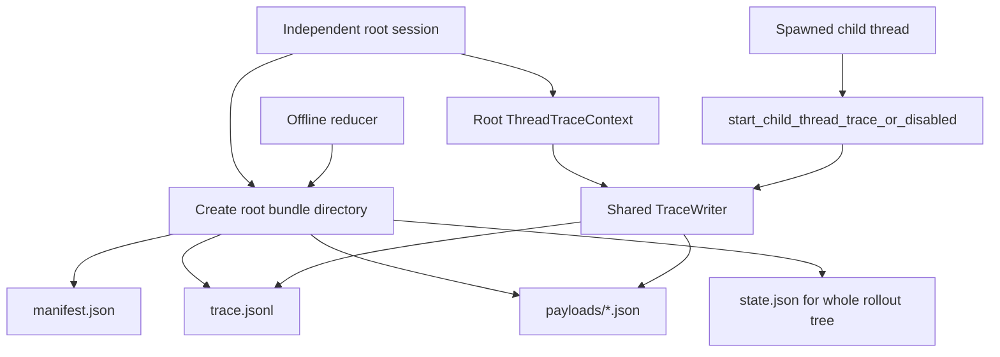
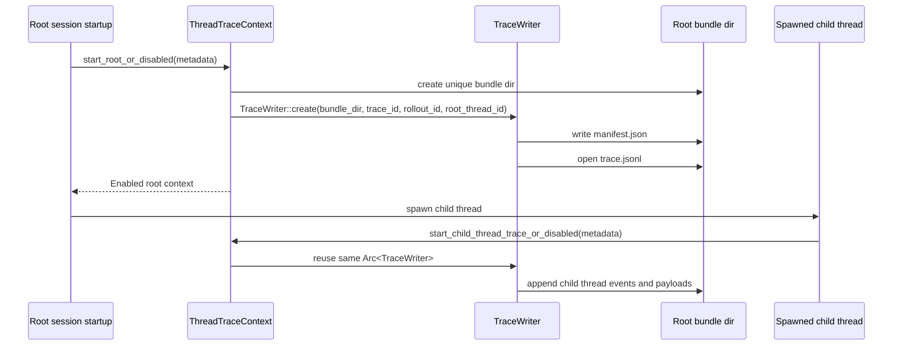
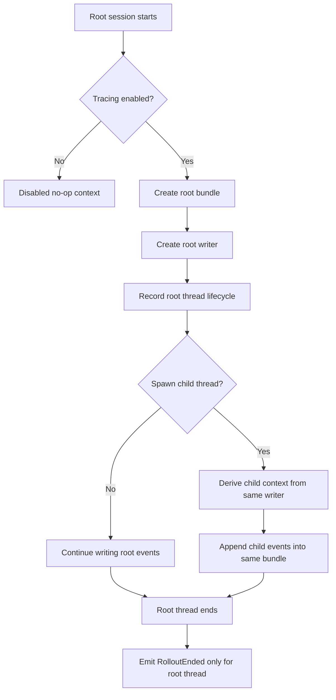

# Evidence Gathering: Root Bundle

This note explains what the “root bundle” is in `codex-rs/rollout-trace`, how it behaves, and what design pattern it uses.

## 1) What the Root Bundle Is

The root bundle is the single trace-bundle directory created for one independent root Codex session.

Its layout is defined in [bundle.rs](/Users/yao/projects/codex/codex-rs/rollout-trace/src/bundle.rs:7):

- `manifest.json`
- `trace.jsonl`
- `payloads/`
- optionally `state.json` after reduction

The manifest stores the `root_thread_id`, which anchors the whole replay tree. See [bundle.rs](/Users/yao/projects/codex/codex-rs/rollout-trace/src/bundle.rs:15).

## 2) Why It Is Called the Root Bundle

The important distinction is:

- a root session gets its own bundle
- spawned child threads do not get independent bundles
- child threads append into the root session’s bundle through the same writer

That behavior is stated directly in [thread.rs](/Users/yao/projects/codex/codex-rs/rollout-trace/src/thread.rs:37) and validated in [thread_tests.rs](/Users/yao/projects/codex/codex-rs/rollout-trace/src/thread_tests.rs:52).

So “root bundle” means:

- one bundle per rollout tree
- not one bundle per thread

## 3) Big Picture

## 4) Startup Sequence

## 5) Runtime Flow

## 6) Design Pattern

The root bundle uses a combination of a few systems design patterns.

### Aggregate-root pattern

The root thread is the aggregate root for the rollout trace.

That means:

- the manifest stores one `root_thread_id`
- child threads are scoped under that root rollout tree
- replay expects every reduced object to resolve back into that rooted thread tree

This is visible in the manifest comment at [bundle.rs](/Users/yao/projects/codex/codex-rs/rollout-trace/src/bundle.rs:19).

### Shared append-only event log

The bundle acts like an append-only event store:

- `trace.jsonl` is the ordered event spine
- `payloads/*.json` hold larger evidence blobs
- the reducer replays the log later

So another strong pattern here is event sourcing:

- write observations now
- interpret later

### Root-owned resource with child handles

The `TraceWriter` is created once for the root session, then child thread contexts reuse it through `Arc<TraceWriter>`.

That is a shared-resource / fan-in pattern:

- many per-thread producers
- one writer
- one physical bundle

### No-op object pattern

`ThreadTraceContext::disabled()` returns a context that accepts the same calls but records nothing.

That is a classic null-object pattern used to keep tracing optional without branching everywhere.

## 7) Core Data Structures

The root bundle pattern depends on these structures:

- `TraceBundleManifest`
  - records layout and `root_thread_id`
- `TraceWriter`
  - owns bundle files and append ordering
- `ThreadTraceContext`
  - per-thread façade over the shared writer
- `EnabledThreadTraceContext`
  - stores:
    - `writer: Arc<TraceWriter>`
    - `root_thread_id`
    - `thread_id`

The key structural choice is:

- per-thread identity
- shared bundle writer

instead of:

- one writer per thread

## 8) Algorithmic Behavior

The root bundle does not use a complicated algorithm, but it does enforce a specific coordination model.

### Bundle creation algorithm

For a root session:

1. resolve trace root directory from env
2. create one unique child bundle directory
3. create one writer
4. write the manifest before replayable event traffic starts

### Child-thread fan-in algorithm

For a spawned child thread:

1. do not create a new independent bundle
2. derive a child trace context from the parent context
3. reuse the parent writer
4. append child events tagged with child `thread_id`

### Root-only rollout termination

Only the root thread emits `RolloutEnded`; child thread termination only emits `ThreadEnded`.

That preserves the invariant that the bundle’s rollout lifecycle belongs to the root rollout tree, not to each child individually.

## 9) Why This Design Was Chosen

This design solves several problems cleanly:

- one reduction pass can reconstruct the entire multi-agent rollout tree
- parent/child causality stays in one ordered event space
- there is no ambiguity about which child bundle belongs to which root session
- debugging does not require stitching multiple bundle directories together

If each child had its own bundle, replay would need a second-stage merge or explicit cross-bundle correlation layer. The current design avoids that.

## 10) Practical Mental Model

Think of the root bundle as:

- the container for one rollout tree
- the append-only evidence store for that tree
- the parent-owned log that child threads write into

So the bundle boundary is rollout-level, not thread-level.

## 11) Key Files

- `codex-rs/rollout-trace/src/bundle.rs`
- `codex-rs/rollout-trace/src/thread.rs`
- `codex-rs/rollout-trace/src/writer.rs`
- `codex-rs/rollout-trace/src/thread_tests.rs`
