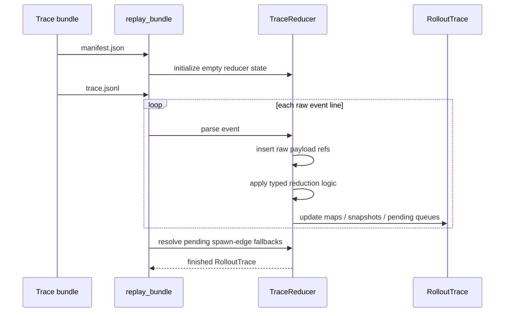
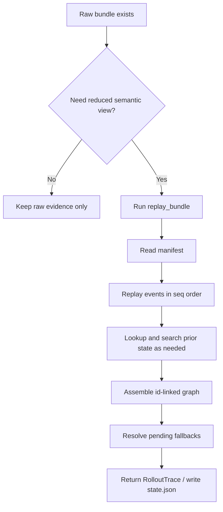

# Evidence Gathering: BTreeMaps and Replay

This note explains:

- why the rollout-trace reducer keeps the reduced graph in `BTreeMap`s
- whether items are searched and by whom
- what id-based graph assembly means
- why the reducer replays at all
- when replay is triggered

## 1) Why So Many `BTreeMap`s

The reduced graph in `RolloutTrace` stores almost every object family in a `BTreeMap`, visible in [model/mod.rs](/Users/yao/projects/codex/codex-rs/rollout-trace/src/model/mod.rs:69).

Examples:

- `threads: BTreeMap<AgentThreadId, AgentThread>`
- `conversation_items: BTreeMap<ConversationItemId, ConversationItem>`
- `inference_calls: BTreeMap<InferenceCallId, InferenceCall>`
- `tool_calls: BTreeMap<ToolCallId, ToolCall>`
- `interaction_edges: BTreeMap<EdgeId, InteractionEdge>`
- `raw_payloads: BTreeMap<RawPayloadId, RawPayloadRef>`

The main reasons are practical:

- keyed lookup by stable id
- deterministic iteration order
- stable JSON serialization order for debugging and tests
- easy cross-linking between object families

So the choice is less about “we need tree algorithms” and more about “we want deterministic keyed storage for a reducer output object.”

## 2) What Problem the Maps Solve

The reducer is building a graph out of many object families that refer to each other by id.

That means it constantly needs operations like:

- insert a new object by reducer-owned id
- fetch an object by id later
- mutate an object when more evidence arrives
- serialize the final graph in predictable order

`BTreeMap` fits those needs directly.

## 3) Are Items Searched

Yes. The reducer searches items during replay.

There are two broad kinds of search:

### Direct key lookup

This is the normal map lookup path:

- `inference_calls.get(...)`
- `conversation_items.get(...)`
- `threads.get(...)`
- `interaction_edges.get_mut(...)`

Examples:

- [conversation.rs](/Users/yao/projects/codex/codex-rs/rollout-trace/src/reducer/conversation.rs:146)
- [agents.rs](/Users/yao/projects/codex/codex-rs/rollout-trace/src/reducer/tool/agents.rs:497)

### Semantic/content search

Sometimes the reducer does not know the target id yet and has to search by meaning.

Examples:

- find prior inference by `previous_response_id`:
  - [conversation.rs](/Users/yao/projects/codex/codex-rs/rollout-trace/src/reducer/conversation.rs:74)
- find matching transcript item in a prior snapshot:
  - [conversation.rs](/Users/yao/projects/codex/codex-rs/rollout-trace/src/reducer/conversation.rs:217)
- find unlinked inter-agent message items:
  - [agents.rs](/Users/yao/projects/codex/codex-rs/rollout-trace/src/reducer/tool/agents.rs:527)
- scan whether a conversation item is already an interaction-edge target:
  - [agents.rs](/Users/yao/projects/codex/codex-rs/rollout-trace/src/reducer/tool/agents.rs:556)

So yes, there is searching, but not from a user-facing query engine. It is reducer-internal search during reconstruction.

## 4) Who Controls the Searching

The reducer controls it.

More specifically:

- `TraceReducer` owns replay state and lookup tables
- reducer submodules decide when key lookup is enough
- reducer submodules fall back to scans when they need semantic matching

This happens because raw events do not always arrive with exact reducer-owned ids for every semantic object. The reducer sometimes has to infer the right object by:

- prior snapshot position
- model-visible `call_id`
- thread membership
- message content
- prior inference `response_id`

That is why the searching logic lives inside the reducer rather than in the writer.

## 5) Why the Reducer Searches at All

The writer is intentionally dumb. It records evidence first and does not try to build the final semantic graph on the hot path.

That means replay has to do the higher-level work:

- reconstruct omitted prefixes in incremental requests
- reuse transcript ids when content is the same
- connect runtime events to model-visible items
- resolve pending edges when their target items finally appear

Searching is the cost of delaying interpretation until replay time.

## 6) Id-Based Graph Assembly

Id-based graph assembly means:

- the reducer creates stable ids for reduced objects
- each object family lives in its own map
- cross-object relationships are represented by those ids

So instead of nesting everything directly, the reducer builds a graph by reference.

Examples:

- an `InferenceCall` stores `request_item_ids` and `response_item_ids`
- a `ToolCall` stores model-visible item ids and maybe a terminal operation id
- a `CodeCell` stores source and output conversation item ids
- an `InteractionEdge` stores `source` and `target` anchors

This is what makes the reduced state a graph rather than just a transcript plus blobs.

## 7) What the IDs Represent

The core id aliases are defined in [model/mod.rs](/Users/yao/projects/codex/codex-rs/rollout-trace/src/model/mod.rs:17).

Important ones:

- `AgentThreadId`
  - one traced session/thread in the rollout tree
- `CodexTurnId`
  - one runtime activation of Codex for a thread
- `ConversationItemId`
  - one reduced model-visible transcript item
- `InferenceCallId`
  - one outbound upstream inference request
- `ToolCallId`
  - one reducer-owned runtime tool-call object
- `CodeCellId`
  - one reducer-owned `exec` code cell
- `TerminalOperationId`
  - one exec/write/poll against a terminal
- `CompactionId`
  - one installed compaction checkpoint
- `EdgeId`
  - one information-flow edge
- `RawPayloadId`
  - one raw evidence payload ref

Some ids come from upstream/runtime concepts and are carried through. Others are reducer-owned ids created specifically for the semantic graph.

## 8) Two Kinds of Identity

There are really two identity layers here:

### Runtime/upstream identity

Examples:

- model-visible `call_id`
- provider `response_id`
- runtime `terminal_id`
- code-mode runtime `cell_id`

These come from the live system.

### Reducer-owned semantic identity

Examples:

- `conversation_item:123`
- `tool_call:17`
- `edge:spawn:...`

These exist so replay can build a stable local graph even when the raw system did not expose a nice canonical id for that semantic object.

## 9) Why Replay Exists

Replay exists because the trace writer does not build `RolloutTrace` live.

Instead, the writer stores:

- raw events in `trace.jsonl`
- raw payloads in `payloads/*.json`

Then the reducer replays those observations later and decides:

- what was model-visible conversation
- what was runtime-only execution
- how objects are linked
- which pending relationships can now be resolved

This is the “observe first, interpret later” design from the rollout-trace architecture.

## 10) What Replay Actually Replays

Replay is not rerunning the model or rerunning tools.

It is replaying the recorded evidence:

- read manifest
- read `trace.jsonl` in sequence order
- load payload JSON when needed
- apply reducer logic event by event
- build a new `RolloutTrace`

That loop is implemented in [reducer/mod.rs](/Users/yao/projects/codex/codex-rs/rollout-trace/src/reducer/mod.rs:43).

## 11) Replay Sequence

## 12) When Replay Is Triggered

Replay is primarily an offline/debug action.

The main user-facing trigger is:

- `codex debug trace-reduce <trace-bundle>`

That command calls `replay_bundle(...)` and writes `state.json`, shown in [cli/src/main.rs](/Users/yao/projects/codex/codex-rs/cli/src/main.rs:1321).

The reducer is also triggered in tests, where replay is used to validate trace correctness and reducer behavior.

What it is not:

- it is not part of the hot-path write flow
- it is not continuously rebuilding `state.json` while the session runs

## 13) Flow Diagram

## 14) Hard-Core Algorithms and Data Structures

The hardest parts here are not balanced trees themselves. The harder systems ideas are:

- deterministic event-log replay
- id-linked semantic graph construction
- snapshot reconciliation for transcript identity
- deferred resolution for causally early events
- mixing direct id lookup with semantic scans when exact ids are not yet known

The key data structures are:

- `BTreeMap` for stable keyed stores
- `Vec<String>` for ordered transcript snapshots
- `Vec<Pending...>` or map-backed pending queues for deferred resolution
- reducer-owned ordinal counters for fresh semantic ids

## 15) Practical Takeaway

The reducer uses `BTreeMap`s because it is building a deterministic, id-addressable reduced graph.

Searching happens inside replay because replay is where raw evidence is turned into semantic structure.

The ids represent semantic graph objects, not just raw runtime handles.

Replay is triggered later, usually by `codex debug trace-reduce`, because the architecture deliberately keeps interpretation off the hot path.
