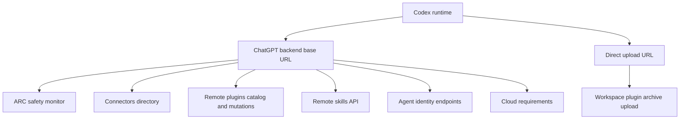
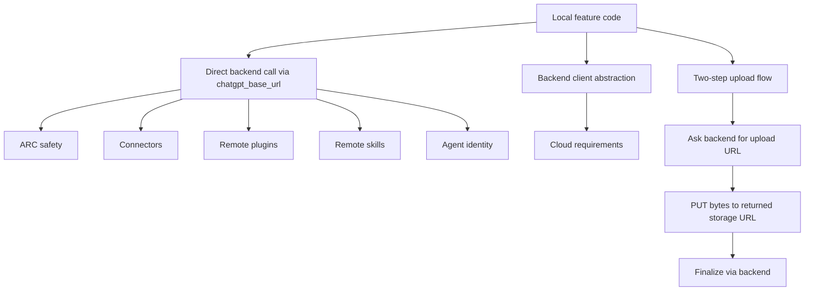

# External Endpoints Overview

This note inventories the main external endpoint integrations visible in this repository, what problems they appear to solve, and the control flows around them.

This is not a byte-for-byte exhaustive dump of every outbound URL in the repo. It is a practical architecture map of the clearly product-relevant external endpoint families.

## 1) Endpoint Families

## 2) Base URL Model

Most of these integrations are anchored off `Config.chatgpt_base_url`, defined in [config/mod.rs](/Users/yao/projects/codex/codex-rs/core/src/config/mod.rs:701). In config tests, the default base URL is `https://chatgpt.com/backend-api/`, shown in [config_tests.rs](/Users/yao/projects/codex/codex-rs/core/src/config/config_tests.rs:6412).

That means many outbound calls in this repo are not arbitrary third-party destinations. They are product backend integrations built by appending paths to the ChatGPT backend base URL.

## 3) External Endpoint Inventory

### A. ARC safety monitor

- Problem it seems to solve:
  - Fast pre-execution safety triage for risky actions, especially MCP tool calls that would otherwise be auto-approved.
- Local entry point:
  - [core/src/arc_monitor.rs](/Users/yao/projects/codex/codex-rs/core/src/arc_monitor.rs:98)
- Target:
  - `CODEX_ARC_MONITOR_ENDPOINT_OVERRIDE`, or else `{chatgpt_base_url}/codex/safety/arc` at [arc_monitor.rs](/Users/yao/projects/codex/codex-rs/core/src/arc_monitor.rs:116)
- Control flow:
  1. `mcp_tool_call.rs` decides an MCP tool call is in the approval path.
  2. If the call is auto-approved by policy, it still passes through ARC monitor first.
  3. The code builds compact history plus exact action JSON.
  4. It sends a `POST` to `/codex/safety/arc`.
  5. The response is interpreted as `Ok`, `AskUser`, or `SteerModel`.
- Repository scope:
  - This repo contains the client integration and tests, but I did not find a server implementation of `/codex/safety/arc` here.

### B. Connectors directory

- Problem it seems to solve:
  - Fetch the app / connector catalog that Codex can expose to users, including workspace-visible connectors.
- Local entry point:
  - [connectors/src/lib.rs](/Users/yao/projects/codex/codex-rs/connectors/src/lib.rs:88)
- Targets:
  - `/connectors/directory/list?external_logos=true`
  - `/connectors/directory/list_workspace?external_logos=true`
  - Path construction at [connectors/src/lib.rs](/Users/yao/projects/codex/codex-rs/connectors/src/lib.rs:156)
- Control flow:
  1. Caller provides a `fetch_page` closure rooted at the ChatGPT backend base URL.
  2. Codex paginates through the directory list endpoint.
  3. For workspace accounts, it also hits the workspace-specific list endpoint.
  4. Results are merged, normalized, decorated with install URLs, and cached.
- Notes:
  - This integration is catalog/discovery oriented, not execution oriented.

### C. Remote plugin catalog and plugin mutations

- Problem it seems to solve:
  - Discover remote plugins, inspect details, install/uninstall them, and list installed plugins by marketplace scope.
- Local entry point:
  - [core-plugins/src/remote.rs](/Users/yao/projects/codex/codex-rs/core-plugins/src/remote.rs:637)
- Targets:
  - `GET {chatgpt_base_url}/ps/plugins/list`
  - `GET {chatgpt_base_url}/ps/plugins/installed`
  - `GET {chatgpt_base_url}/ps/plugins/{plugin_id}`
  - `POST {chatgpt_base_url}/ps/plugins/{plugin_id}/install`
  - `POST {chatgpt_base_url}/plugins/{plugin_id}/uninstall`
  - Skill-detail path building at [remote.rs](/Users/yao/projects/codex/codex-rs/core-plugins/src/remote.rs:990)
- Control flow:
  1. Codex requires ChatGPT backend auth.
  2. It lists remote catalog pages by scope, following `pageToken`.
  3. It separately lists installed plugins, also paginated.
  4. It joins those views into summaries and details.
  5. Install/uninstall mutations are sent to backend endpoints.
  6. Local cache cleanup runs after uninstall.
- Notes:
  - This looks like the main “remote marketplace” control plane for plugins.

### D. Remote workspace plugin sharing and upload flow

- Problem it seems to solve:
  - Share a local plugin to a workspace-hosted remote store and manage created workspace plugin shares.
- Local entry point:
  - [core-plugins/src/remote/share.rs](/Users/yao/projects/codex/codex-rs/core-plugins/src/remote/share.rs:155)
- Targets:
  - `GET {chatgpt_base_url}/ps/plugins/workspace/created`
  - `POST {chatgpt_base_url}/public/plugins/workspace/upload-url`
  - `POST {chatgpt_base_url}/public/plugins/workspace`
  - `POST {chatgpt_base_url}/public/plugins/workspace/{remote_plugin_id}`
  - `DELETE {chatgpt_base_url}/public/plugins/workspace/{remote_plugin_id}`
  - Plus a separate `PUT` to the returned upload URL at [share.rs](/Users/yao/projects/codex/codex-rs/core-plugins/src/remote/share.rs:231)
- Control flow:
  1. Codex archives a local plugin directory into `.tar.gz`.
  2. It asks the backend for an upload URL.
  3. It uploads archive bytes to that returned URL.
  4. It finalizes creation or update through `/public/plugins/workspace...`.
  5. It can also list previously created workspace plugins or delete a share.
- Notes:
  - The `PUT` upload target is indirect. The backend provides it, so that leg may terminate at object storage rather than the ChatGPT backend itself.

### E. Remote skills API

- Problem it seems to solve:
  - List and export remotely hosted skills.
- Local entry point:
  - [core-skills/src/remote.rs](/Users/yao/projects/codex/codex-rs/core-skills/src/remote.rs:77)
- Targets:
  - `GET {chatgpt_base_url}/hazelnuts`
  - `GET {chatgpt_base_url}/hazelnuts/{skill_id}/export`
- Control flow:
  1. Codex requires ChatGPT backend auth.
  2. It lists skills with query params like `scope`, `product_surface`, and `enabled`.
  3. Export downloads a zip payload.
  4. The zip is validated and extracted under local `codex_home/skills/{skill_id}`.
- Notes:
  - The file explicitly says this low-level client is “not used yet by any active product surface,” so this integration exists in code but appears dormant for now.

### F. Agent identity endpoints

- Problem it seems to solve:
  - Register agent runtimes, register per-task authorizations, and verify agent identity JWTs.
- Local entry point:
  - [agent-identity/src/lib.rs](/Users/yao/projects/codex/codex-rs/agent-identity/src/lib.rs:128)
- Targets:
  - `{chatgpt_base_url}/v1/agent/register`
  - `{chatgpt_base_url}/v1/agent/{agent_runtime_id}/task/register`
  - `{chatgpt_base_url}/authenticate_app_v2`
  - `{chatgpt_base_url}/wham/agent-identities/jwks` when base URL contains `/backend-api`
  - otherwise `{chatgpt_base_url}/agent-identities/jwks`
  - URL builders at [agent-identity/src/lib.rs](/Users/yao/projects/codex/codex-rs/agent-identity/src/lib.rs:299)
- Control flow:
  1. Codex generates or loads agent key material.
  2. It signs task registration payloads locally.
  3. It registers tasks against the backend.
  4. It fetches JWKS for JWT verification.
  5. It constructs `AgentAssertion` authorization headers for task-scoped identity.
- Notes:
  - This is identity and control-plane infrastructure, not normal user tool execution.

### G. Cloud requirements

- Problem it seems to solve:
  - Load workspace-managed requirements/policies from the backend for eligible business/enterprise accounts.
- Local entry point:
  - [cloud-requirements/src/lib.rs](/Users/yao/projects/codex/codex-rs/cloud-requirements/src/lib.rs:215)
- Target:
  - Hidden behind `BackendClient::get_config_requirements_file()` at [cloud-requirements/src/lib.rs](/Users/yao/projects/codex/codex-rs/cloud-requirements/src/lib.rs:230)
- Control flow:
  1. Codex checks whether the auth/account is eligible.
  2. It builds a backend client from `chatgpt_base_url`.
  3. It fetches cloud requirements with retry/timeout handling.
  4. It caches the result locally with HMAC signing.
  5. For eligible accounts, failures are treated as configuration-loading failures rather than soft misses.
- Notes:
  - The exact REST path is abstracted behind `codex_backend_client`, but the integration clearly targets the ChatGPT/Codex backend control plane.

### H. Generic ChatGPT backend GET wrapper

- Problem it seems to solve:
  - Shared authenticated GET access to ChatGPT backend endpoints for product features that need direct backend reads.
- Local entry point:
  - [chatgpt/src/chatgpt_client.rs](/Users/yao/projects/codex/codex-rs/chatgpt/src/chatgpt_client.rs:8)
- Target:
  - `{chatgpt_base_url}/{path}`
- Control flow:
  1. Caller provides a path string.
  2. The helper loads ChatGPT/Codex backend auth.
  3. It adds auth headers and issues a direct GET.
  4. It deserializes JSON or surfaces the backend failure body.
- Notes:
  - This is not one product feature by itself; it is a shared transport helper.

## 4) Control-Flow Comparison

## 5) What Problems These Integrations Cover

- Safety and approval gating:
  - ARC monitor

- Marketplace/catalog discovery:
  - connectors directory
  - remote plugin list/detail
  - remote skills list

- Remote artifact lifecycle:
  - plugin install/uninstall
  - workspace plugin upload/share/delete
  - skill export/download

- Identity and trust bootstrap:
  - agent registration
  - task registration
  - JWKS retrieval

- Enterprise policy/bootstrap:
  - cloud requirements

## 6) Scope Boundaries

- This repo usually contains the client and control-flow logic for these integrations.
- It often does not contain the remote service implementation itself.
- The clearest example is ARC monitor: the caller is here, but the `/codex/safety/arc` service is not.
- Cloud requirements are similar at the path level: the local flow is here, but the concrete backend endpoint is abstracted behind `codex_backend_client`.

## 7) Practical Takeaway

The dominant pattern in this repo is not “call many unrelated external vendors.” It is closer to:

- use `chatgpt_base_url` as the main backend control-plane root
- layer feature-specific paths on top of it
- use authenticated HTTP calls for safety, catalogs, sharing, and identity
- fall back to secondary upload URLs only when moving binary artifacts like plugin archives
