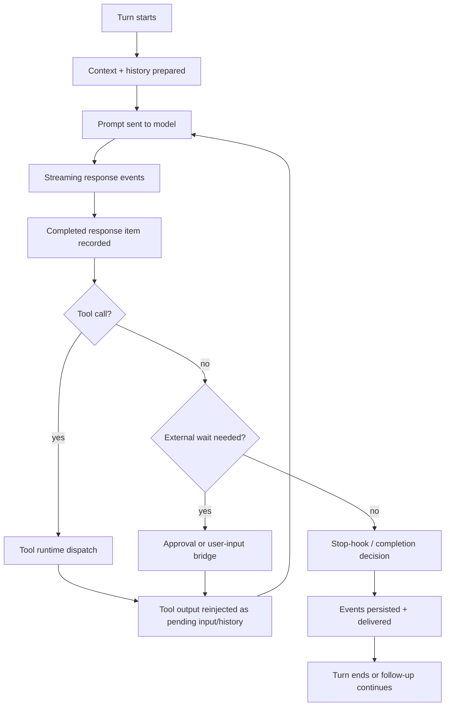

# Integration Points Overview

This note maps the main runtime integration points in `codex-rs/core`, with three views:

- temporal: when each integration point participates in the turn
- problem-oriented: what problem the integration point solves
- orthogonal axes: which independent direction of integration it belongs to

This is an architecture map, not an exhaustive inventory of every function call.

## 1) Core Idea

The Codex runtime is not integrated through one central bus. It is stitched together through a set
of recurring handoff seams inside the turn loop:

- prompt/history handoff
- model-stream handoff
- tool/runtime handoff
- event/UI handoff
- pending-wait handoff
- mailbox/subagent handoff
- persistence/trace handoff

Most of these converge in or around:

- `codex-rs/core/src/session/turn.rs`
- `codex-rs/core/src/session/mod.rs`
- `codex-rs/core/src/stream_events_utils.rs`
- `codex-rs/core/src/state/turn.rs`

## 2) Temporal Map

## 3) Integration Points By Time

### A. Turn entry integration

Where:

- `run_turn(...)` in `codex-rs/core/src/session/turn.rs`
- `record_conversation_items(...)` in `codex-rs/core/src/session/mod.rs`

What gets integrated:

- user input
- pending input already buffered for the turn
- session-start hook output
- skill/plugin/context injections
- prior conversation history

Problem solved:

- build one coherent prompt surface from multiple producers before the model is called

### B. Model-stream integration

Where:

- `run_sampling_request(...)`
- `try_run_sampling_request(...)`
- `ModelClientSession::stream(...)`

What gets integrated:

- provider/model stream events
- assistant text deltas
- reasoning deltas
- output-item completion
- token usage and rate-limit metadata

Problem solved:

- normalize a provider stream into runtime-usable events and turn items

### C. Completed-item integration

Where:

- `record_completed_response_item(...)` in `stream_events_utils.rs`
- `emit_turn_item_started(...)` / `emit_turn_item_completed(...)` in `session/mod.rs`

What gets integrated:

- conversation history
- mailbox answer-boundary behavior
- memory-citation accounting
- UI-visible item lifecycle

Problem solved:

- make completed model output visible and durable in one place, with side effects attached once

### D. Tool execution integration

Where:

- `handle_output_item_done(...)` in `stream_events_utils.rs`
- `ToolCallRuntime::handle_tool_call(...)`

What gets integrated:

- typed tool-call parsing
- runtime dispatch
- parallel/serialized execution policy
- tool result conversion back into `ResponseInputItem`

Problem solved:

- turn model tool requests into executable runtime work without creating a separate control plane

### E. External wait / approval integration

Where:

- `request_command_approval(...)`
- `request_patch_approval(...)`
- `request_permissions_for_cwd(...)`
- `request_user_input(...)`
- MCP elicitation insertion in `session/mcp.rs`

What gets integrated:

- runtime request
- event sent to client or guardian
- pending-response slot stored in `TurnState`
- asynchronous response matched back to the waiting turn

Problem solved:

- safely pause turn progress on external decisions without losing turn identity or correlation

### F. Pending-input reintegration

Where:

- `get_pending_input(...)` in `session/mod.rs`
- `prepend_pending_input(...)` / `inject_response_items(...)`
- `TurnState.pending_input`

What gets integrated:

- tool outputs
- steer input
- developer/system fragments
- mailbox-derived assistant commentary
- requeued blocked items

Problem solved:

- feed external or deferred results back into the same turn loop in a uniform format

### G. Mailbox / subagent integration

Where:

- `MailboxDeliveryPhase` in `state/turn.rs`
- `defer_mailbox_delivery_to_next_turn(...)`
- `accept_mailbox_delivery_for_current_turn(...)`
- child-completion forwarding in `session/mod.rs`

What gets integrated:

- child-agent messages
- parent/child completion envelopes
- same-turn versus next-turn delivery policy

Problem solved:

- let collaboration messages join the active turn when appropriate, but protect answer boundaries

### H. Event delivery integration

Where:

- `send_event(...)`
- `send_event_raw(...)`
- `deliver_event_raw(...)`

What gets integrated:

- rollout persistence
- trace recording
- live client delivery
- legacy event mirroring
- realtime handoff text mirroring
- parent notification for subagent completion

Problem solved:

- keep observability, persistence, and user-visible output aligned from one emission path

### I. Turn exit integration

Where:

- post-sampling branch in `run_turn(...)`
- `hooks.run_stop(...)`
- compaction branch

What gets integrated:

- token-budget pressure
- stop-hook policy
- continuation prompt fragments
- final stop decision

Problem solved:

- decide whether the same logical turn should continue, compact, or terminate

## 4) Key Problems Solved By Each Integration Point

| Integration point | Key problem it solves |
| --- | --- |
| Turn entry | unify all pre-model context into one promptable history |
| Model stream | adapt provider streaming into runtime events and items |
| Completed item | persist output once while attaching side effects consistently |
| Tool execution | bridge model intent to executable tool work |
| External wait | pause safely on user/guardian/client decisions |
| Pending-input reintegration | re-enter deferred results through a uniform turn interface |
| Mailbox/subagent | merge collaboration messages without corrupting answer boundaries |
| Event delivery | synchronize persistence, tracing, and UI delivery |
| Turn exit | resolve continue vs compact vs stop |

## 5) Orthogonal Directions Of Integration

These integration points are easier to reason about if you split them into independent axes.

### A. Time axis: before, during, after sampling

- before sampling:
  - prompt assembly
  - pending-input drain
  - hook/context injection
- during sampling:
  - provider stream handling
  - output-item parsing
  - delta emission
- after sampling:
  - follow-up decision
  - compaction
  - stop-hook continuation/termination

### B. Control axis: synchronous vs asynchronous

- synchronous:
  - history cloning
  - turn-item creation
  - most branch decisions in `run_turn(...)`
- asynchronous:
  - model streaming
  - tool futures
  - approvals
  - user input
  - guardian review
  - mailbox arrival

### C. Boundary axis: internal vs external

- internal integrations:
  - history to prompt
  - stream item to turn item
  - pending input to next prompt
  - event to rollout/trace
- external integrations:
  - model provider stream
  - UI/client approval response
  - guardian review
  - MCP elicitation
  - subagent messaging

### D. Data-shape axis: conversation items vs events vs pending waits

- conversation-item path:
  - durable turn history
  - prompt reconstruction
- event path:
  - transient UI/transport/trace notifications
- pending-wait path:
  - outstanding external decisions keyed in `TurnState`

These are intentionally separate. A runtime action may touch more than one path, but they are not
the same thing.

### E. Ownership axis: turn-scoped vs session-scoped

- turn-scoped:
  - `TurnState`
  - pending approvals
  - pending user input
  - mailbox delivery phase
  - tool-call follow-up state
- session-scoped:
  - event channel
  - rollout trace
  - mailbox queue
  - model client services
  - policy persistence

This split is what allows one active turn to be isolated while still using shared session services.

## 6) The Most Important Architectural Observation

The runtime’s core trick is that many different subsystems eventually collapse back into one shared
re-entry format:

- `ResponseInputItem`

Tool outputs, steer input, developer fragments, and mailbox commentary can all be fed back into the
same turn machinery through pending input. That is the main unifying integration point in the
system.

The second key unifier is:

- `send_event(...)`

That is the main fan-out point for persistence, tracing, and client-visible delivery.

## 7) Mental Model

If you need a compact way to remember the architecture, use this:

1. `record_conversation_items(...)` is the main durable-input seam.
2. `run_sampling_request(...)` is the provider integration seam.
3. `handle_output_item_done(...)` is the model-to-tool seam.
4. `TurnState` is the wait-correlation seam.
5. `get_pending_input(...)` is the re-entry seam.
6. `send_event(...)` is the outward fan-out seam.

Everything else is mostly a specialization of one of those six.
