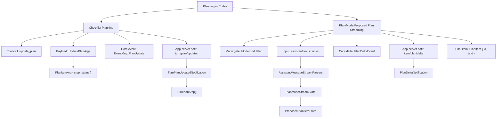

# Planning Overview

This document covers planning-specific architecture in `codex-rs`, separated from protocol transport details.

## 1) Planning Structure Tree

## 2) Planning-Relevant Type Index

- `protocol/src/config_types.rs`: `ModeKind`, `CollaborationMode`, `CollaborationModeMask`
- `protocol/src/plan_tool.rs`: `UpdatePlanArgs`, `PlanItemArg`
- `protocol/src/protocol.rs`: `PlanDeltaEvent`
- `protocol/src/items.rs`: `PlanItem`
- `app-server-protocol/src/protocol/v2.rs`: `TurnStartParams`, `TurnPlanUpdatedNotification`, `TurnPlanStep`, `PlanDeltaNotification`
- `core/src/session/turn.rs`: `AssistantMessageStreamParsers`, `PlanModeStreamState`, `ProposedPlanItemState`

## 3) Cross-References

- Data structures and state control: [02-planning-data-structures.md](/Users/yao/projects/codex/learning/planning/02-planning-data-structures.md)
- Algorithm patterns: [03-planning-algorithm-patterns.md](/Users/yao/projects/codex/learning/planning/03-planning-algorithm-patterns.md)
- Protocol transport/contracts view: [planning-protocol-structures.md](/Users/yao/projects/codex/learning/protocol/planning-protocol-structures.md)
