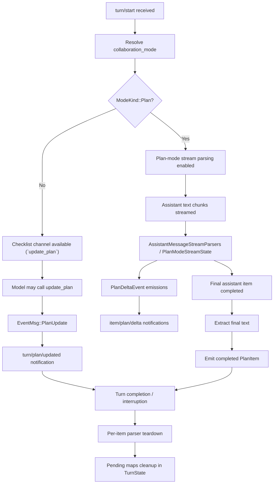

# Planning Life Cycle

This document describes the runtime life cycle of planning behavior in `codex-rs`, from turn start through cleanup.

## 1) Life Cycle Overview

## 2) Phase-by-Phase

### 2.1 Turn Start and Mode Gating

- `turn/start` is parsed in app-server and submitted as core op.
- `collaboration_mode` determines whether the turn is in `Default` or `Plan`.
- In `Plan` mode:
  - plan-mode parser pipeline is enabled.
  - `update_plan` is rejected by handler design.
- In `Default` mode:
  - checklist updates via `update_plan` are valid.

### 2.2 Checklist Planning Channel (`update_plan`)

- Model calls `update_plan` with `UpdatePlanArgs`.
- Core parses payload and emits `EventMsg::PlanUpdate`.
- App-server maps to `turn/plan/updated` with `TurnPlanUpdatedNotification`.
- Client renders structured checklist state (`step`, `status`).

### 2.3 Plan-Mode Streaming Channel (`<proposed_plan>`)

- Assistant text arrives incrementally in chunks.
- `AssistantMessageStreamParsers` splits:
  - normal assistant text
  - proposed-plan segments
- `PlanModeStreamState` coordinates:
  - deferred agent-message starts
  - whitespace buffering
  - `ProposedPlanItemState` lifecycle (`started/completed`)
- Deltas are emitted as `PlanDeltaEvent` and projected as `item/plan/delta`.

### 2.4 Authoritative Finalization Pass

- On completed assistant message item:
  - core re-extracts final `<proposed_plan>` text from the fully assembled message.
  - emits completed `PlanItem { id, text }`.
- This final item is authoritative and may differ from raw concatenated deltas.

### 2.5 Request/Response Rendezvous During Planning

- For interactive clarification (`request_user_input`):
  - core inserts `oneshot::Sender` into `TurnState.pending_user_input`.
  - app-server sends server request to client.
  - client response resolves the pending sender via correlation key.
- Same pattern is used for approvals and other pending turn-scoped exchanges.

### 2.6 Turn End and Cleanup

- On completion, interruption, or cancellation:
  - parser state is drained/removed per item.
  - pending maps in `TurnState` are cleared.
  - no stale async waiters should remain for the ended turn.

## 3) Control and Ownership

- Ownership boundaries:
  - app-server: request parsing + transport notifications
  - core: state transitions + parser/control logic
  - protocol/app-server-protocol: type contracts
- Core control points:
  - mode gate (`ModeKind`)
  - pending maps (`TurnState`)
  - parser lifecycle (`AssistantMessageStreamParsers`, `PlanModeStreamState`)

## 4) Cross-References

- Planning overview: [01-planning-overview.md](/Users/yao/projects/codex/learning/planning/01-planning-overview.md)
- Data structures and control containers: [02-planning-data-structures.md](/Users/yao/projects/codex/learning/planning/02-planning-data-structures.md)
- Algorithm patterns: [03-planning-algorithm-patterns.md](/Users/yao/projects/codex/learning/planning/03-planning-algorithm-patterns.md)
- Protocol transport/contracts: [planning-protocol-structures.md](/Users/yao/projects/codex/learning/protocol/planning-protocol-structures.md)
