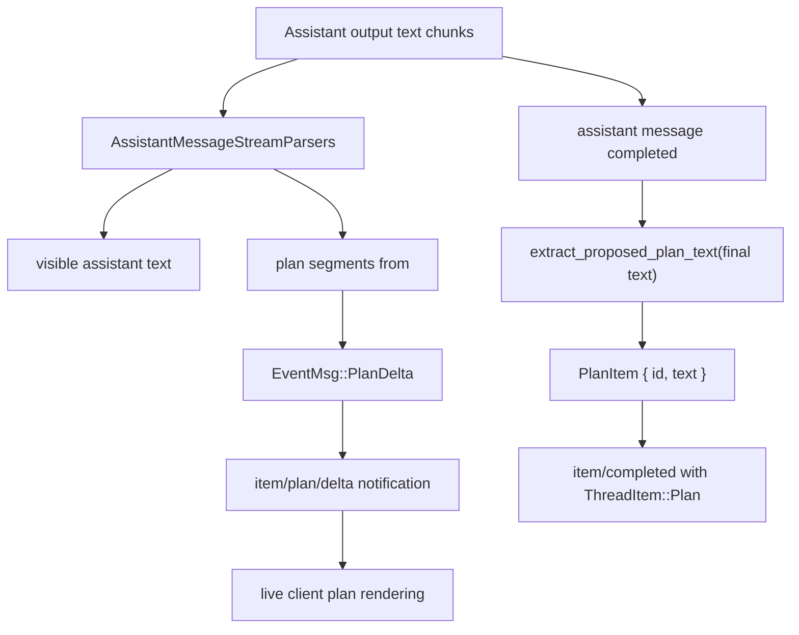

# Planning Stream

This document focuses on the streamed proposed-plan path in `codex-rs`: why it exists, what a plan delta looks like, and which part is authoritative.

## 1) Why Planning Uses Streams and Deltas

Planning in `Plan` mode has two distinct outputs:

1. A normal assistant message stream.
2. A plan-specific stream extracted from the `<proposed_plan>` block inside that assistant message.

The streamed path exists because the final plan text is not authoritative until the full assistant message has finished and core re-extracts the final `<proposed_plan>` block. Before that point, clients still want low-latency feedback and a dedicated plan panel instead of waiting for `item/completed`.

So plan deltas are mainly a transport and UI affordance:

- transport, because they let app-server expose partial plan text as soon as core recognizes plan segments
- UI, because TUI and other clients can render a separate "Proposed Plan" surface while the turn is still running
- not authoritative, because the completed `plan` item is derived from the finalized assistant message, not from blindly concatenating deltas

This matches the protocol contract: `PlanDeltaNotification` explicitly warns that clients should not assume concatenated deltas equal the completed plan item content.

## 2) Runtime Shape



## 3) Why the Final Plan Item Is Authoritative

Core finalizes the plan only after the assistant message item completes:

- it rebuilds the full assistant text
- extracts the final `<proposed_plan>` block
- strips citations from that extracted plan text
- starts/completes the dedicated plan item if needed

That finalization step is why deltas are provisional. During streaming:

- tags may arrive split across chunks
- whitespace may still be buffered
- partial markdown may not yet be renderable as a stable final plan
- the model can continue emitting or revising plan text before the assistant item finishes

The finalized `ThreadItem::Plan` is therefore the stable source of truth for persistence and post-turn reads.

## 4) Example Plan Delta

A representative app-server notification looks like:

```json
{
  "method": "item/plan/delta",
  "params": {
    "threadId": "thread_123",
    "turnId": "turn_123",
    "itemId": "turn_123-plan",
    "delta": "# Summary\n- inspect current flow\n"
  }
}
```

Interpretation:

- `threadId` and `turnId` scope the delta to a running turn
- `itemId` identifies the in-flight plan item
- `delta` is just the newly streamed slice, not the whole plan

## 5) Where the Stream Is Implemented

- Core parsing/finalization: `codex-rs/core/src/session/turn.rs`
  - streamed plan segments are emitted during assistant-text parsing
  - final plan completion happens by re-extracting the completed assistant message
- App-server protocol contract: `codex-rs/app-server-protocol/src/protocol/v2.rs`
  - `PlanDeltaNotification`
- TUI live rendering: `codex-rs/tui/src/streaming/controller.rs`
  - `PlanStreamController` keeps transient streamed lines and the raw source
  - finalization returns source so history can be re-rendered later as a stable `ProposedPlanCell`

The TUI split between transient stream cells and finalized source-backed cells is another reason deltas exist: clients need something cheap to render immediately, then something stable to keep after the turn ends.

## 6) SDK/Client Examples

- `sdk/python/examples/03_turn_stream_events/`
  - closest example for consuming streamed notifications in real time
- `sdk/python/examples/06_thread_lifecycle_and_controls/`
  - useful companion because plan-mode turns still live inside the ordinary thread lifecycle: start, read, resume, archive, unarchive, fork, and compact

## 7) Cross-References

- Overview: [01-planning-overview.md](/Users/yao/projects/codex/learning/planning/01-planning-overview.md)
- Data structures: [02-planning-data-structures.md](/Users/yao/projects/codex/learning/planning/02-planning-data-structures.md)
- Algorithm patterns: [03-planning-algorithm-patterns.md](/Users/yao/projects/codex/learning/planning/03-planning-algorithm-patterns.md)
- Life cycle: [04-planning-life-cycle.md](/Users/yao/projects/codex/learning/planning/04-planning-life-cycle.md)
