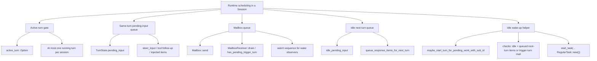
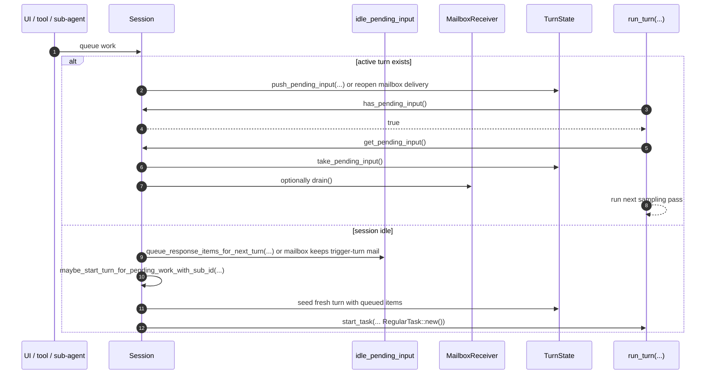

# Runtime Scheduling Analysis

This note explains how `codex-rs/core` schedules work at runtime.

The main conclusion is that Codex does not have a single centralized "scheduler" module. Instead,
runtime scheduling emerges from a small set of cooperating mechanisms:

- `Session.active_turn`: enforces at most one running turn per session
- `TurnState.pending_input`: queues same-turn follow-up work
- `Mailbox` / `MailboxReceiver`: buffers inter-agent mail and wake signals
- `idle_pending_input`: buffers next-turn work while the session is idle
- `maybe_start_turn_for_pending_work*`: starts a regular turn only when the session is idle and
  queued work should wake it

Primary implementations:

- `codex-rs/core/src/session/session.rs`
- `codex-rs/core/src/session/mod.rs`
- `codex-rs/core/src/session/turn.rs`
- `codex-rs/core/src/tasks/mod.rs`
- `codex-rs/core/src/session/handlers.rs`
- `codex-rs/core/src/state/turn.rs`
- `codex-rs/core/src/agent/mailbox.rs`

## 1) Scheduling Structure Tree

## 2) What Is Actually Being Scheduled

The runtime schedules four different kinds of work:

1. A currently running turn.
2. Same-turn follow-up input that should be folded into that turn.
3. Mailbox messages from other agents.
4. Idle-session work that should start a new regular turn later.

Those categories intentionally do not all use the same queue.

### 2.1 Running turn

`Session.active_turn: Mutex<Option<ActiveTurn>>` is the top-level concurrency gate. A session can
own many tasks inside one logical turn, but only one active turn object exists at a time.

That means scheduling is session-local and serialized at the turn level:

- if `active_turn` exists, new work is usually injected into the current turn
- if `active_turn` does not exist, eligible pending work may start a new regular turn

### 2.2 Same-turn pending work

`TurnState.pending_input` is the queue for work that should join the next sampling pass of the
already-running turn.

Typical producers:

- `steer_input(...)`
- `inject_response_items(...)`
- queued next-turn items moved into turn state when a new task starts
- drained mailbox items converted to `ResponseInputItem`

This queue is consumed by `Session::get_pending_input()` and then inspected inside `run_turn(...)`
before the next sampling request.

### 2.3 Mailbox work

Inter-agent communication is buffered separately in `MailboxReceiver.pending_mails`.

Important split:

- mailbox storage is transport-oriented
- `TurnState.mailbox_delivery_phase` decides whether mailbox mail can join the current turn

So mailbox scheduling is a two-step decision:

1. queue mail in the mailbox
2. decide whether to drain it into the current turn now or leave it queued for later

### 2.4 Idle next-turn work

`Session.idle_pending_input` stores response items that could not be injected into an active turn,
or were intentionally deferred to the next turn.

This queue is not sampled directly. It becomes active only when a new regular turn starts, at
which point `start_task(...)` moves those items into `TurnState.pending_input`.

## 3) Scheduling Algorithm

## 3.1 Start a turn only when the session is idle

The closest thing to an idle scheduler is:

- `Session::maybe_start_turn_for_pending_work()`
- `Session::maybe_start_turn_for_pending_work_with_sub_id(...)`

Its policy is narrow by design:

1. Check whether there is any queued next-turn input or any mailbox mail marked `trigger_turn`.
2. If neither exists, do nothing.
3. If an `active_turn` already exists, do nothing.
4. Otherwise, create a new default turn and start `RegularTask`.

This is the runtime rule that prevents background work from creating overlapping turns.

## 3.2 New turns inherit queued work

When `start_task(...)` begins a regular turn, it pulls in two queues before launching the task:

1. `take_queued_response_items_for_next_turn()`
2. `get_pending_input()`

Those items are copied into the fresh `TurnState.pending_input`, so the new turn begins with the
previously deferred work already staged.

This is why idle scheduling is "wake and drain" rather than "run a separate background worker."

## 3.3 Active turns run an open-ended loop

Inside `run_turn(...)`, scheduling is loop-driven rather than timer-driven.

After each sampling request, the turn continues when either condition is true:

- the model requested follow-up work
- the session still has pending input

That pending input can come from:

- UI steer input
- tool outputs
- hook-generated continuation messages
- mailbox drain

So the running turn is effectively a work-conserving loop: it keeps going while more follow-up
work is queued.

## 4) Mailbox Scheduling Rules

## 4.1 Mailbox delivery is gated, not the mailbox itself

`Mailbox` always accepts messages. The gate lives in `TurnState.mailbox_delivery_phase`.

Two phases matter:

- `CurrentTurn`: mailbox mail may be drained into the active turn
- `NextTurn`: mailbox mail stays buffered for a later turn

This protects the answer boundary: once visible final output is emitted, late child-agent mail
should not silently extend that already-shown answer.

## 4.2 Reopening same-turn delivery

Mailbox delivery reopens for the current turn when the runtime receives explicit same-turn work,
especially:

- `steer_input(...)`
- accepted tool-call follow-up

That policy makes mailbox scheduling preemptible by explicit user/model work without starting a new
turn.

## 4.3 Trigger-turn mail

Some mailbox messages are marked `trigger_turn = true`.

That flag does not force immediate drain into the current turn. Instead, it marks the mailbox mail
as eligible to wake an idle session through `maybe_start_turn_for_pending_work_with_sub_id(...)`.

So `trigger_turn` is an idle wake-up hint, not a bypass around the mailbox delivery gate.

## 5) End-to-End Scheduling Sequence

## 6) Practical Interpretation

The runtime scheduling policy is conservative:

- one active turn per session
- no eager background turn creation while a turn is active
- explicit same-turn work is preferred over spawning a second turn
- mailbox messages are buffered until the current answer boundary policy allows them
- idle wake-up happens only for clearly queued work

This keeps the model-facing history linear even though work can arrive from several sources.

## 7) Cross-References

- Turn loop state machine: [02-turn-lifecycle.md](/Users/yao/projects/codex/learning/statemachine/02-turn-lifecycle.md)
- Mailbox delivery gate: [01-mailbox-delivery-phase.md](/Users/yao/projects/codex/learning/statemachine/01-mailbox-delivery-phase.md)
- State ownership and mutation: [03-state-ownership-and-mutation.md](/Users/yao/projects/codex/learning/statemachine/03-state-ownership-and-mutation.md)
- Planning runtime lifecycle: [04-planning-life-cycle.md](/Users/yao/projects/codex/learning/planning/04-planning-life-cycle.md)
