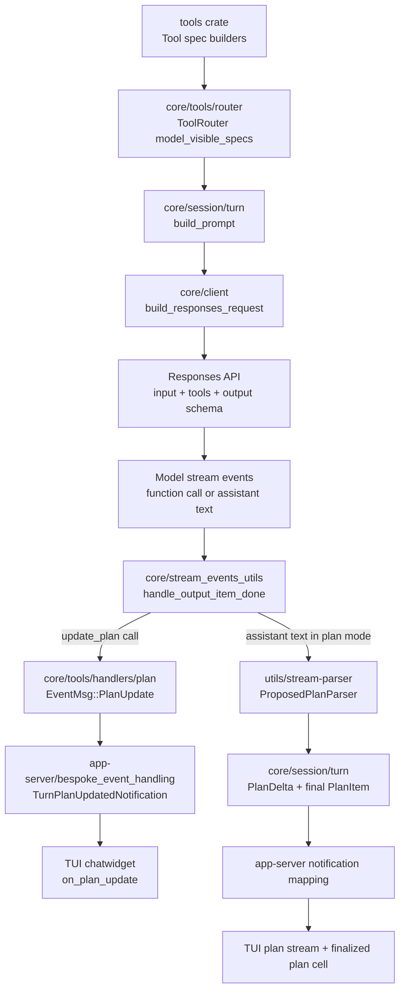
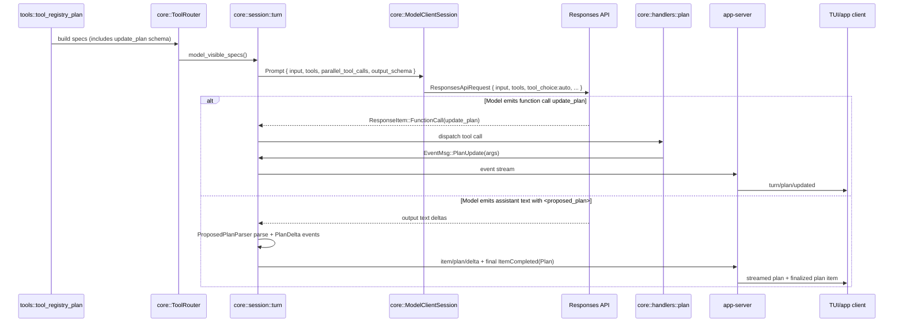

# Plan Schema Flow (Core -> Model API -> Client)

This note traces planning-related schema flow in `codex-rs` from tool schema generation to model request payloads to client-visible output.

## Scope

Covers both planning channels:

1. `update_plan` checklist tool path
2. Plan Mode `<proposed_plan>` streaming path

## 1) Hierarchy Diagram (Schema Ownership + Data Flow)



## 2) Sequence Diagram (End-to-End)



## 3) Tool Schema: `update_plan`

Source builder:
- [plan_tool.rs](/Users/yao/projects/codex/codex-rs/tools/src/plan_tool.rs)

Generated function-tool shape (conceptual JSON):

```json
{
  "type": "function",
  "name": "update_plan",
  "description": "Updates the task plan...",
  "strict": false,
  "parameters": {
    "type": "object",
    "properties": {
      "explanation": { "type": "string" },
      "plan": {
        "type": "array",
        "items": {
          "type": "object",
          "properties": {
            "step": { "type": "string" },
            "status": { "type": "string" }
          },
          "required": ["step", "status"],
          "additionalProperties": false
        }
      }
    },
    "required": ["plan"],
    "additionalProperties": false
  }
}
```

`update_plan` tool registration:
- [tool_registry_plan.rs](/Users/yao/projects/codex/codex-rs/tools/src/tool_registry_plan.rs:220)

## 4) Request Schema Sent to Model API

Request assembly:
- [turn.rs build_prompt](/Users/yao/projects/codex/codex-rs/core/src/session/turn.rs:944)
- [client.rs build_responses_request](/Users/yao/projects/codex/codex-rs/core/src/client.rs:831)
- [codex-api ResponsesApiRequest](/Users/yao/projects/codex/codex-rs/codex-api/src/common.rs:166)

Request fields relevant to planning:

```json
{
  "model": "...",
  "instructions": "...",
  "input": ["ResponseItem..."],
  "tools": ["serialized ToolSpec[]"],
  "tool_choice": "auto",
  "parallel_tool_calls": true,
  "text": {
    "format": {
      "type": "json_schema | text",
      "schema": "optional final_output_json_schema"
    }
  }
}
```

Notes:
- `tools` comes from `Prompt.tools = router.model_visible_specs()`.
- `tools` are JSON-serialized by `create_tools_json_for_responses_api`.
- `output_schema` in prompt is separate from tool schemas and maps to `text.format` controls.

## 5) Runtime Output Paths

### A) `update_plan` path

- Tool call detected and executed via runtime:
  - [handle_output_item_done](/Users/yao/projects/codex/codex-rs/core/src/stream_events_utils.rs:228)
- Handler parses args and emits `EventMsg::PlanUpdate(args)`:
  - [plan handler](/Users/yao/projects/codex/codex-rs/core/src/tools/handlers/plan.rs:80)
- App-server projects to `TurnPlanUpdatedNotification` (`turn/plan/updated`):
  - [bespoke_event_handling.rs](/Users/yao/projects/codex/codex-rs/app-server/src/bespoke_event_handling.rs:1288)
- UI consumes and renders checklist cell/progress:
  - [chatwidget on_plan_update](/Users/yao/projects/codex/codex-rs/tui/src/chatwidget.rs:3369)

### B) Plan Mode `<proposed_plan>` path

- Mode prompt contract and finalization rules:
  - [plan mode template](/Users/yao/projects/codex/codex-rs/collaboration-mode-templates/templates/plan.md)
- Streaming parser for proposed plan tags:
  - [proposed_plan.rs](/Users/yao/projects/codex/codex-rs/utils/stream-parser/src/proposed_plan.rs)
- Core emits `PlanDelta` during stream and finalized `TurnItem::Plan` on completion:
  - [turn plan-mode state](/Users/yao/projects/codex/codex-rs/core/src/session/turn.rs:1261)

## 6) Important Distinctions

- `update_plan` is a checklist tool, not Plan Mode output.
- In Plan Mode, `update_plan` is rejected by handler design.
- Plan Mode canonical output is `<proposed_plan>...</proposed_plan>` parsed into deltas + final plan item.

Reference:
- [update_plan rejection in Plan mode](/Users/yao/projects/codex/codex-rs/core/src/tools/handlers/plan.rs:86)
