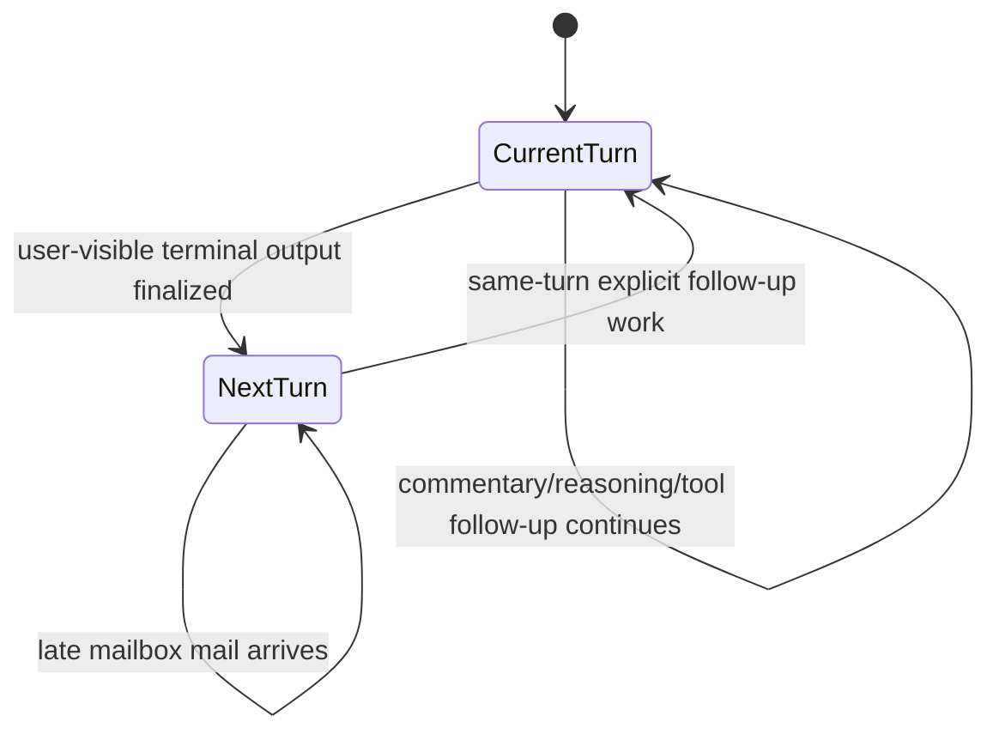
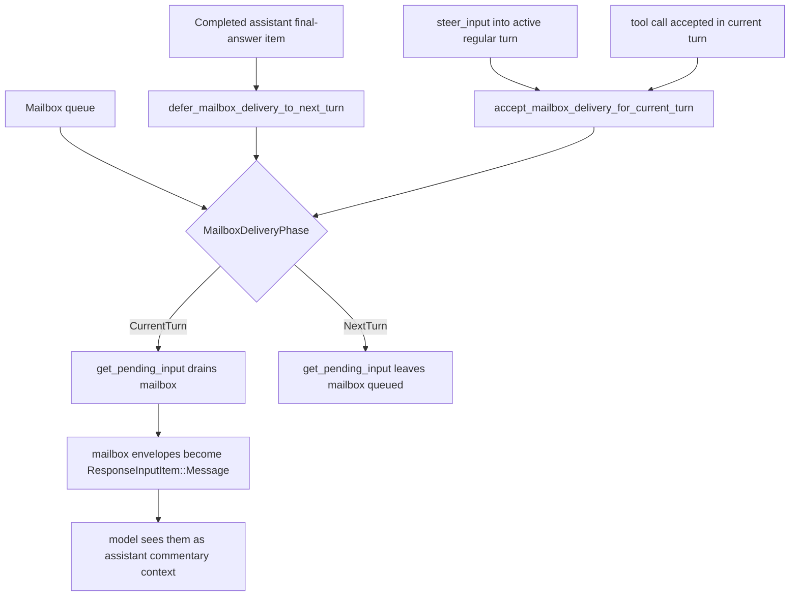
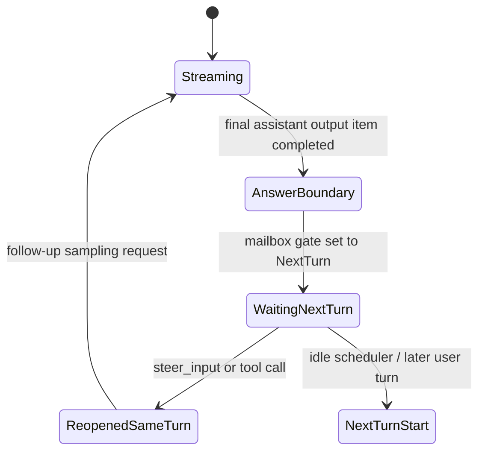
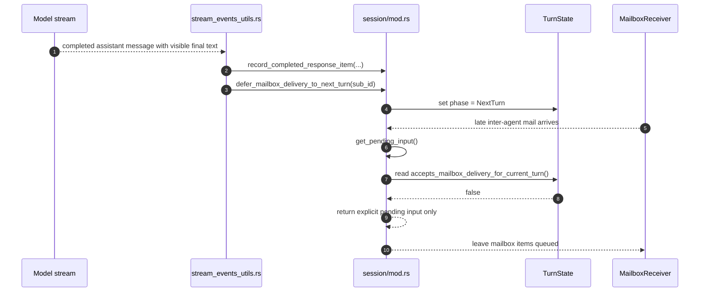
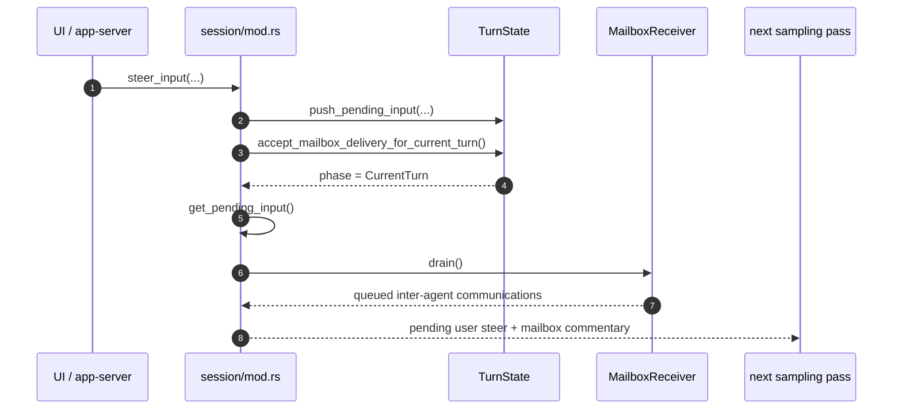
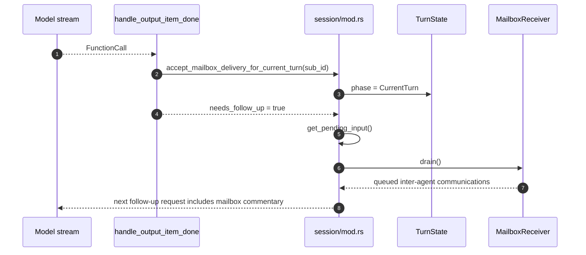

# Mailbox Delivery Phase State Machine

This note documents the mailbox delivery phase state machine in `codex-rs/core` and explains what
“same-turn explicit follow-up work” means in the runtime.

Primary implementations:

- `codex-rs/core/src/state/turn.rs`
- `codex-rs/core/src/session/mod.rs`
- `codex-rs/core/src/session/turn.rs`
- `codex-rs/core/src/stream_events_utils.rs`
- `codex-rs/core/src/agent/mailbox.rs`
- `codex-rs/protocol/src/protocol.rs`

## 1) What This State Machine Controls

The mailbox delivery phase decides whether queued inter-agent mailbox messages are allowed to join
the currently running turn or must stay buffered for a later turn.

The runtime uses this to protect an answer boundary:

- before visible final-answer output, child-agent mail may still join the current turn
- after visible final-answer output, late child-agent mail should not silently extend that answer
- if the same task explicitly resumes work in the same turn, mailbox delivery is reopened so queued
  mail can join that follow-up request

This is a per-turn gate, not a mailbox queue state. The mailbox queue itself is always allowed to
accumulate messages.

---

## 2) Core State Machine

## 2.1 Mailbox Delivery Phase

### Notes

- `CurrentTurn` means `get_pending_input()` may drain mailbox mail into the active turn.
- `NextTurn` means `get_pending_input()` returns only explicit pending input and leaves mailbox
  mail queued.
- The transition to `NextTurn` is triggered by completed assistant final-answer text or completed
  image generation items.
- Commentary does not close delivery.

## 2.2 Delivery Gate Graph

## 2.3 Same-Turn Follow-Up Preemption

### Notes

- `ReopenedSameTurn` is the key runtime behavior behind “same-turn explicit follow-up work”.
- Reopening does not create a new logical task. It allows the same active turn to keep going.

---

## 3) Sequence Diagrams

## 3.1 Final Answer Closes Mailbox Delivery

## 3.2 Steered Same-Turn Follow-Up Reopens Delivery

## 3.3 Tool Call Reopens Delivery For Same Turn

---

## 4) Data Structures

## 4.1 Turn-local phase

`TurnState` stores:

- `pending_input: Vec<ResponseInputItem>`
- `mailbox_delivery_phase: MailboxDeliveryPhase`

`MailboxDeliveryPhase`:

- `CurrentTurn`
- `NextTurn`

This is the direct state machine.

## 4.2 Mailbox queue

`Mailbox` / `MailboxReceiver` stores:

- transport queue: `mpsc::UnboundedSender/Receiver<InterAgentCommunication>`
- wake sequence: `watch::Sender<u64>` + `AtomicU64`
- buffered queue: `VecDeque<InterAgentCommunication>`

The queue is separate from the delivery phase. Messages can be queued even while delivery is
closed.

## 4.3 Mailbox payload

`InterAgentCommunication` carries:

- `author`
- `recipient`
- `other_recipients`
- `content`
- `trigger_turn`

When injected into a turn, it becomes:

- `ResponseInputItem::Message`
- `role = "assistant"`
- `phase = Commentary`

So mailbox delivery means converting queued child-agent mail into model-visible assistant
commentary context.

---

## 5) Algorithms

## 5.1 Close delivery at answer boundary

1. A completed response item is recorded.
2. If the item is visible final-answer text, or image-generation output, it is treated as a turn
   answer boundary.
3. The session calls `defer_mailbox_delivery_to_next_turn(sub_id)`.
4. If there is no explicit pending input already queued, the phase becomes `NextTurn`.

Important detail:

- `defer_mailbox_delivery_to_next_turn(...)` is intentionally ignored if explicit pending input is
  already present, so stale closure cannot override already-reopened same-turn work.

## 5.2 Drain pending input with mailbox gate

1. `get_pending_input()` takes explicit turn-local pending input.
2. It reads whether the turn currently accepts mailbox delivery.
3. If the phase is `NextTurn`, it returns only explicit pending input.
4. If the phase is `CurrentTurn`, it drains mailbox messages and appends them.

This is the runtime gate that makes the state machine observable.

## 5.3 Reopen delivery for explicit same-turn work

Two operations reopen mailbox delivery:

1. `steer_input(...)`
2. accepted tool calls in `handle_output_item_done(...)`

Both move the phase back to `CurrentTurn` so any queued child mail can join the next follow-up
sampling request for the same running task.

## 5.4 Trigger-turn behavior while idle

Mailbox mail marked `trigger_turn = true` has an additional effect:

1. it is queued in the mailbox
2. if the session is idle, it may start a regular turn for pending work

This is orthogonal to mailbox delivery phase. The delivery phase matters only when a turn is
already active.

---

## 6) Key Concepts

## 6.1 What “same-turn explicit follow-up work” means

It means the current active regular turn has been explicitly given more work after the answer
boundary:

- a user/client steer message injected into the active turn
- a tool call that keeps the same turn alive and requires another model pass

It does not mean any random late mailbox arrival. Mailbox arrivals alone do not reopen the phase.

## 6.2 Why the gate exists

Without this gate, child-agent mail could arrive after Codex had already shown a final answer and
silently change or extend the current turn. The phase boundary preserves the intuitive meaning of
“the answer has already been shown”.

## 6.3 Why reopening exists

Once the same active task explicitly resumes work, queued child-agent mail becomes relevant again.
Reopening avoids starving that follow-up request of already-produced child context.

---

## 7) Code Index

- `core/src/state/turn.rs`: `MailboxDeliveryPhase`, turn-local state, phase helpers
- `core/src/session/mod.rs`: `steer_input`, `defer_mailbox_delivery_to_next_turn`,
  `accept_mailbox_delivery_for_current_turn`, `get_pending_input`
- `core/src/stream_events_utils.rs`: answer-boundary detection via
  `completed_item_defers_mailbox_delivery_to_next_turn`
- `core/src/session/turn.rs`: preemption and same-turn follow-up handling
- `core/src/agent/mailbox.rs`: queueing, draining, trigger-turn detection
- `protocol/src/protocol.rs`: `InterAgentCommunication` and commentary conversion
