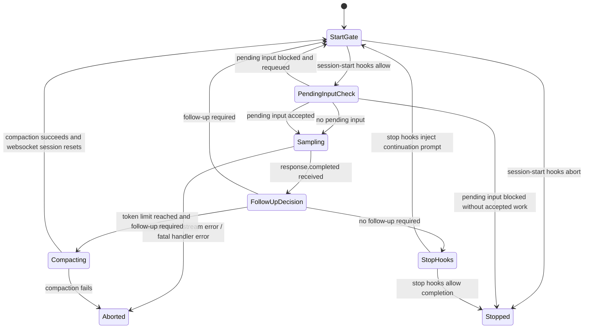

# Turn Lifecycle State Machine

This note formalizes the core turn-execution state machine in `codex-rs/core`.

Primary implementations:

- `codex-rs/core/src/session/turn.rs`
- `codex-rs/core/src/session/mod.rs`
- `codex-rs/core/src/state/turn.rs`
- `codex-rs/core/src/stream_events_utils.rs`

## 1) What This State Machine Controls

`run_turn(...)` is an open-ended event loop. It does not count iterations. Instead, the turn stays
alive while either of these is true after a sampling pass:

- the model requires follow-up work (`model_needs_follow_up`)
- the session has queued pending input (`sess.has_pending_input()`)

That gives the runtime an implicit but precise state machine:

- input can be accepted, blocked, or requeued
- a sampling pass can continue, compact, or terminate
- stop hooks can either finish the turn or reopen it with a continuation prompt

## 2) State Machine

## 3) State Definitions

### `StartGate`

The top of the outer `loop` in `run_turn(...)`.

Responsibilities:

- run pending session-start hooks
- decide whether the turn can proceed at all

Exit conditions:

- to `PendingInputCheck` when hooks allow execution
- to `Stopped` when hooks end the turn early

### `PendingInputCheck`

Handles turn-local and mailbox-derived pending input before the next sampling request.

Responsibilities:

- optionally drain pending input via `sess.get_pending_input()`
- inspect each pending item with `inspect_pending_input(...)`
- record accepted items into history
- requeue remaining items when a blocked item is encountered mid-batch

Exit conditions:

- to `Sampling` when there is no pending input, or some input was accepted
- to `StartGate` when blocked input was requeued and the loop should retry
- to `Stopped` when pending input is blocked and nothing was accepted

Important detail:

- `can_drain_pending_input` suppresses draining at the very start of a turn and immediately after a
  mid-turn compaction when model continuation should resume before steer input.

### `Sampling`

Runs one model sampling pass through `run_sampling_request(...)`.

Responsibilities:

- stream response events
- record assistant output items
- queue tool futures
- treat `end_turn: false` as model-directed continuation
- flush streamed text and drain tool futures before returning

Internal continuation signals:

- tool calls cause `handle_output_item_done(...)` to set `needs_follow_up = true`
- `ResponseEvent::Completed { end_turn: Some(false), .. }` also sets
  `needs_follow_up = true`
- mailbox preemption can also end the current sampling pass early with
  `needs_follow_up = true`

Exit conditions:

- to `FollowUpDecision` on a successful completed response
- to `Aborted` on cancellation, stream failure, or fatal item-handling error

### `FollowUpDecision`

This is the post-pass control point in `run_turn(...)`.

Computed values:

- `model_needs_follow_up`
- `has_pending_input = sess.has_pending_input().await`
- `needs_follow_up = model_needs_follow_up || has_pending_input`

Exit conditions:

- to `Compacting` when the token limit is reached and follow-up is still needed
- to `StartGate` when follow-up is needed without compaction
- to `StopHooks` when no follow-up remains

### `Compacting`

Runs mid-turn auto-compaction and resumes the same logical turn.

Responsibilities:

- call `run_auto_compact(...)` with `CompactionPhase::MidTurn`
- reset the model websocket session on success
- preserve the outer turn loop rather than starting a fresh turn object

Exit conditions:

- to `StartGate` on success
- to `Aborted` if compaction fails

### `StopHooks`

This state runs only when the runtime believes the turn is otherwise complete.

Responsibilities:

- call `hooks.run_stop(...)`
- emit hook lifecycle events
- optionally record a hook-generated continuation prompt

Exit conditions:

- to `Stopped` when hooks allow stop or request stop
- to `StartGate` when hooks block stop and provide continuation fragments

Important detail:

- a stop hook can reopen the same turn by appending a hook prompt message and continuing the loop

### `Stopped`

Terminal state for a normal turn stop.

This includes:

- normal completion
- early stop because blocked pending input cannot proceed
- hook-driven stop before another sampling pass begins

### `Aborted`

Terminal error or cancellation state.

This includes:

- `CodexErr::TurnAborted`
- stream closure before `response.completed`
- fatal response-item handling errors
- compaction failure

## 4) Transition Table

| From | Condition | To | Source |
| --- | --- | --- | --- |
| `StartGate` | session-start hooks allow | `PendingInputCheck` | `run_turn(...)` |
| `StartGate` | session-start hooks abort | `Stopped` | `run_turn(...)` |
| `PendingInputCheck` | pending input accepted or none | `Sampling` | `inspect_pending_input(...)` + history recording |
| `PendingInputCheck` | blocked item with remaining items requeued | `StartGate` | `sess.prepend_pending_input(...)` |
| `PendingInputCheck` | blocked item and no accepted work | `Stopped` | `run_turn(...)` |
| `Sampling` | completed response | `FollowUpDecision` | `run_sampling_request(...)` |
| `Sampling` | cancellation or fatal error | `Aborted` | `run_sampling_request(...)` |
| `FollowUpDecision` | `token_limit_reached && needs_follow_up` | `Compacting` | `run_turn(...)` |
| `FollowUpDecision` | `needs_follow_up` without compaction | `StartGate` | `run_turn(...)` |
| `FollowUpDecision` | `!needs_follow_up` | `StopHooks` | `run_turn(...)` |
| `Compacting` | compaction succeeds | `StartGate` | `run_auto_compact(...)` + `reset_websocket_session()` |
| `Compacting` | compaction fails | `Aborted` | `run_turn(...)` |
| `StopHooks` | hooks provide continuation prompt | `StartGate` | `build_hook_prompt_message(...)` |
| `StopHooks` | hooks allow stop or request stop | `Stopped` | `run_turn(...)` |

## 5) Why The Loop Is Open-Ended

There is no explicit iteration cap in `run_turn(...)`.

The effective guards are:

- follow-up eventually becomes false
- token pressure triggers compaction
- cancellation interrupts the turn
- stop hooks can terminate the turn
- tool execution and approvals can block progress externally

So the turn loop is better modeled as a guarded state machine than as a bounded `for` loop.

## 6) Relationship To Other State Machines

- Mailbox delivery is a separate per-turn gate layered underneath this loop:
  [01-mailbox-delivery-phase.md](/Users/yao/projects/codex/learning/statemachine/01-mailbox-delivery-phase.md)
- The older narrative write-up on tool-driven continuation is here:
  [01-turn-tool-execution-state-machine.md](/Users/yao/projects/codex/learning/turn-execution/01-turn-tool-execution-state-machine.md)
