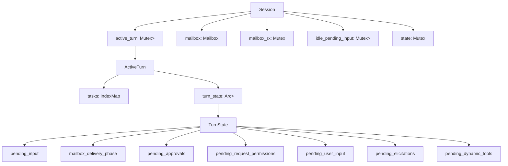
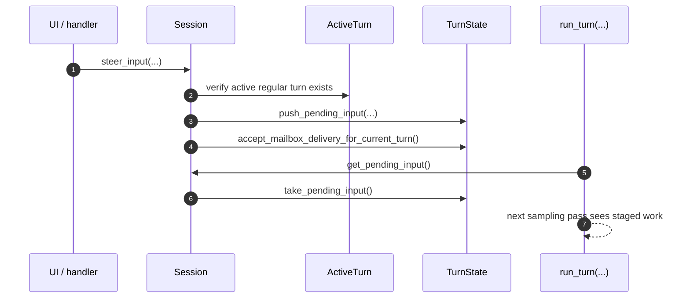
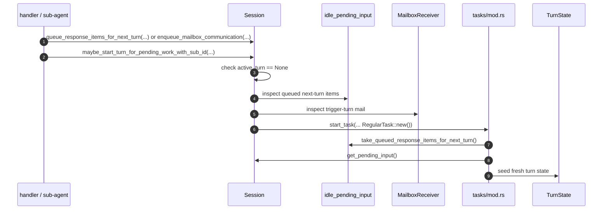

# State Ownership And Mutation

This note documents the low-level design for runtime state ownership in `codex-rs/core`.

The main question it answers is:

- which component owns each mutable state bucket
- who is allowed to mutate that state
- which functions perform the important mutations
- how those ownership boundaries fit into the existing state machines

Primary implementations:

- `codex-rs/core/src/session/session.rs`
- `codex-rs/core/src/session/mod.rs`
- `codex-rs/core/src/session/turn.rs`
- `codex-rs/core/src/tasks/mod.rs`
- `codex-rs/core/src/state/turn.rs`
- `codex-rs/core/src/agent/mailbox.rs`

## 1) Ownership Model

At runtime, mutable state is not owned by one global state machine enum. It is split across a few
owners with different scopes:

1. `Session`
   Owns session-lifetime state and the top-level turn gate.
2. `ActiveTurn`
   Owns the currently running logical turn.
3. `TurnState`
   Owns turn-scoped mutable queues and correlation tables.
4. `Mailbox` / `MailboxReceiver`
   Own transport buffering for inter-agent communication.
5. `SessionState`
   Owns longer-lived session metadata, history-adjacent bookkeeping, and config-derived runtime
   state.

That split is the actual low-level design. The state machines are layered on top of these owners,
not the other way around.

## 2) Ownership Tree

## 3) State Owner Table

| State | Owner | Scope | Typical mutators |
| --- | --- | --- | --- |
| `active_turn` | `Session` | session-lifetime gate | `start_task(...)`, `maybe_start_turn_for_pending_work_with_sub_id(...)`, task-finish/abort paths |
| `ActiveTurn.tasks` | `ActiveTurn` | one logical active turn | `add_task(...)`, `remove_task(...)`, `drain_tasks(...)` |
| `TurnState.pending_input` | `TurnState` | current turn only | `steer_input(...)`, `inject_response_items(...)`, `prepend_pending_input(...)`, `get_pending_input(...)`, `start_task(...)` |
| `TurnState.mailbox_delivery_phase` | `TurnState` | current turn only | `defer_mailbox_delivery_to_next_turn(...)`, `accept_mailbox_delivery_for_current_turn(...)` |
| `TurnState.pending_*` maps | `TurnState` | current turn only | request/approval registration and resolution paths in `session/mod.rs` and `session/mcp.rs` |
| `mailbox` sender side | `Session` | session-lifetime transport | `enqueue_mailbox_communication(...)` |
| `MailboxReceiver.pending_mails` | `MailboxReceiver` | session-lifetime buffered mail | `send(...)` indirectly, `drain()`, `has_pending()`, `has_pending_trigger_turn()` |
| `idle_pending_input` | `Session` | cross-turn deferred input | `queue_response_items_for_next_turn(...)`, `take_queued_response_items_for_next_turn(...)` |
| `SessionState` | `Session` | session-lifetime metadata | many `state.lock().await` read/write helpers in `session/mod.rs` |

## 4) Core Data Structures

## 4.1 `Session`

`Session` is the top-level runtime owner. The most scheduling-relevant fields are:

- `active_turn: Mutex<Option<ActiveTurn>>`
- `mailbox: Mailbox`
- `mailbox_rx: Mutex<MailboxReceiver>`
- `idle_pending_input: Mutex<Vec<ResponseInputItem>>`
- `state: Mutex<SessionState>`

Interpretation:

- `active_turn` is the top-level turn-existence gate
- `mailbox` is the producer-side enqueue handle for inter-agent communication
- `mailbox_rx` owns buffered mailbox items on the consumer side
- `idle_pending_input` stores deferred next-turn work across turn boundaries
- `state` stores broader session metadata that is not specific to one active turn

## 4.2 `ActiveTurn`

`ActiveTurn` is a small ownership wrapper around the currently running logical turn:

- `tasks: IndexMap<String, RunningTask>`
- `turn_state: Arc<Mutex<TurnState>>`

Interpretation:

- `tasks` tracks live task membership keyed by sub-id
- `turn_state` is the shared mutable turn-local state accessed by those tasks and session helpers

Important consequence:

- the runtime separates "which tasks belong to the current turn" from "what mutable queues and
  wait tables the turn owns"

## 4.3 `RunningTask`

Each running task stores:

- `done: Arc<Notify>`
- `kind: TaskKind`
- `task: Arc<dyn AnySessionTask>`
- `cancellation_token: CancellationToken`
- `handle: AbortOnDropHandle<()>`
- `turn_context: Arc<TurnContext>`

This is task-lifecycle state, not the higher-order turn coordination store. That distinction is why
`RunningTask` belongs under `ActiveTurn`, while `pending_input` and correlation maps belong in
`TurnState`.

## 4.4 `TurnState`

`TurnState` is the main turn-scoped mutable coordination struct.

Its fields are:

- `pending_approvals: HashMap<String, oneshot::Sender<ReviewDecision>>`
- `pending_request_permissions: HashMap<String, PendingRequestPermissions>`
- `pending_user_input: HashMap<String, oneshot::Sender<RequestUserInputResponse>>`
- `pending_elicitations: HashMap<(String, RequestId), oneshot::Sender<ElicitationResponse>>`
- `pending_dynamic_tools: HashMap<String, oneshot::Sender<DynamicToolResponse>>`
- `pending_input: Vec<ResponseInputItem>`
- `mailbox_delivery_phase: MailboxDeliveryPhase`
- `granted_permissions: Option<AdditionalPermissionProfile>`
- `strict_auto_review_enabled: bool`
- `tool_calls: u64`
- `has_memory_citation: bool`
- `token_usage_at_turn_start: TokenUsage`

The useful grouping is:

- correlation maps:
  `pending_approvals`, `pending_request_permissions`, `pending_user_input`,
  `pending_elicitations`, `pending_dynamic_tools`
- scheduling fields:
  `pending_input`, `mailbox_delivery_phase`
- turn accounting / flags:
  `granted_permissions`, `strict_auto_review_enabled`, `tool_calls`,
  `has_memory_citation`, `token_usage_at_turn_start`

## 4.5 `Mailbox` and `MailboxReceiver`

The mailbox transport is intentionally split into producer and consumer sides.

`Mailbox` stores:

- `tx: mpsc::UnboundedSender<InterAgentCommunication>`
- `next_seq: AtomicU64`
- `seq_tx: watch::Sender<u64>`

`MailboxReceiver` stores:

- `rx: mpsc::UnboundedReceiver<InterAgentCommunication>`
- `pending_mails: VecDeque<InterAgentCommunication>`

Interpretation:

- `tx` is the enqueue path
- `next_seq` and `seq_tx` provide a monotonic wake sequence for observers
- `rx` receives newly enqueued mail
- `pending_mails` is the consumer-side buffered queue after sync/drain

Important detail:

- this is an unbounded mailbox transport, so ownership here is about ordering and wake-up, not
  bounded-capacity backpressure

## 4.6 `PendingRequestPermissions`

One example of a nested turn-local payload is `PendingRequestPermissions`, which stores:

- `tx_response: oneshot::Sender<RequestPermissionsResponse>`
- `requested_permissions: RequestPermissionProfile`
- `cwd: AbsolutePathBuf`

This is representative of the general pattern in `TurnState`: the turn owns correlation metadata
plus the responder channel needed to continue execution later.

## 5) Mutation Rules By Owner

## 5.1 `Session` owns the top-level scheduling gate

`Session.active_turn` is the ownership boundary for "is there a running turn right now?"

Only orchestration code should mutate it:

- task start paths in `tasks/mod.rs`
- task completion / abort cleanup paths in `tasks/mod.rs`
- idle wake-up helpers that create a fresh `ActiveTurn`

Operationally:

- `session/handlers.rs` decides what operation to run
- `tasks/mod.rs` mutates the top-level gate
- `run_turn(...)` does not directly own `active_turn`; it runs inside a task already registered in
  that gate

So the low-level rule is:

- handlers decide
- tasks layer allocates and clears the gate
- turn loop consumes the already-established turn context

## 5.2 `ActiveTurn` owns the set of running tasks for one logical turn

`ActiveTurn.tasks` is the local ownership table for live tasks under the current turn.

Important mutations:

- `add_task(...)`
- `remove_task(...)`
- `drain_tasks(...)`

This is why turn ownership is not equal to one OS task or one future. A logical turn can have task
scaffolding around it, but `ActiveTurn` remains the authoritative owner of the live set.

## 5.3 `TurnState` owns turn-local mutable coordination state

`TurnState` is the main low-level mutable store for the active turn.

Its fields fall into two groups:

1. scheduling state
2. correlation/wait state

Scheduling state:

- `pending_input`
- `mailbox_delivery_phase`

Correlation/wait state:

- `pending_approvals`
- `pending_request_permissions`
- `pending_user_input`
- `pending_elicitations`
- `pending_dynamic_tools`

This means `TurnState` is not the full lifecycle state machine. It is the mutable backing store
used by the lifecycle state machine.

## 5.4 `Mailbox` owns transport buffering, not turn-local policy

`Mailbox` and `MailboxReceiver` own arrival order and buffering for inter-agent messages.

They do not decide:

- whether a message should join the current turn
- whether a new turn should start immediately

Those decisions belong to:

- `TurnState.mailbox_delivery_phase`
- `Session::maybe_start_turn_for_pending_work_with_sub_id(...)`

That separation is deliberate. It keeps message transport independent from turn policy.

## 5.5 `idle_pending_input` owns deferred next-turn input

This queue is session-owned because it outlives any particular active turn.

Typical mutation pattern:

1. some path tries to inject response items
2. if there is no active turn, injection fails
3. the items are moved into `idle_pending_input`
4. a later regular turn inherits those items during `start_task(...)`

So this queue is the bridge between turn-scoped scheduling and session-idle scheduling.

## 6) Mutation Flow Diagrams

## 6.1 Same-turn mutation flow

## 6.2 Idle-session wake-up flow

## 7) How This Fits Into The Existing State Machines

## 7.1 Turn lifecycle state machine

The turn lifecycle in `run_turn(...)` is a control-flow state machine.

Its backing mutable owners are:

- `Session.active_turn` for existence of the turn
- `ActiveTurn.tasks` for live task membership
- `TurnState.pending_input` for follow-up work

So the turn lifecycle transitions are implemented by mutating those owners rather than by
transitioning one explicit enum.

## 7.2 Mailbox delivery state machine

The mailbox delivery state machine is the clearest ownership-to-state-machine mapping:

- owner: `TurnState`
- state field: `mailbox_delivery_phase`
- mutators:
  - `defer_mailbox_delivery_to_next_turn(...)`
  - `accept_mailbox_delivery_for_current_turn(...)`

This is a real state machine embedded in a concrete owner object.

## 7.3 External wait states

Approval waits, permission waits, request-user-input waits, and elicitation waits are also stored
in `TurnState`.

That means the runtime's "waiting external" state is not one enum variant either. It is the
presence of entries in one or more turn-local correlation maps plus the fact that the running task
is awaiting those channels.

## 8) Practical Low-Level Design Rules

These are the useful design rules to preserve if the runtime changes:

1. Session-lifetime state should stay session-owned.
2. Turn-local mutable coordination should stay inside `TurnState`.
3. Transport queues should not also own delivery policy.
4. Idle wake-up logic should remain separate from same-turn follow-up logic.
5. Top-level turn creation/cleanup should stay in orchestration/task code, not leak into
   low-level transport helpers.

If those boundaries blur, the turn lifecycle becomes much harder to reason about.

## 9) Cross-References

- Mailbox delivery phase: [01-mailbox-delivery-phase.md](/Users/yao/projects/codex/learning/statemachine/01-mailbox-delivery-phase.md)
- Turn lifecycle: [02-turn-lifecycle.md](/Users/yao/projects/codex/learning/statemachine/02-turn-lifecycle.md)
- Scheduling analysis: [00-runtime-scheduling-analysis.md](/Users/yao/projects/codex/learning/scheduling/00-runtime-scheduling-analysis.md)
