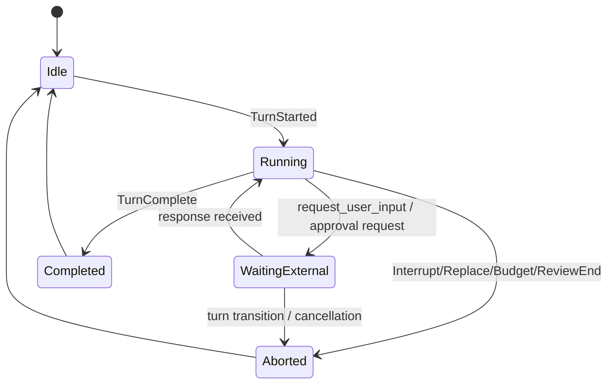
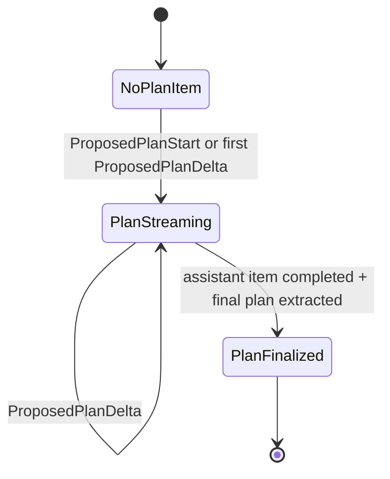
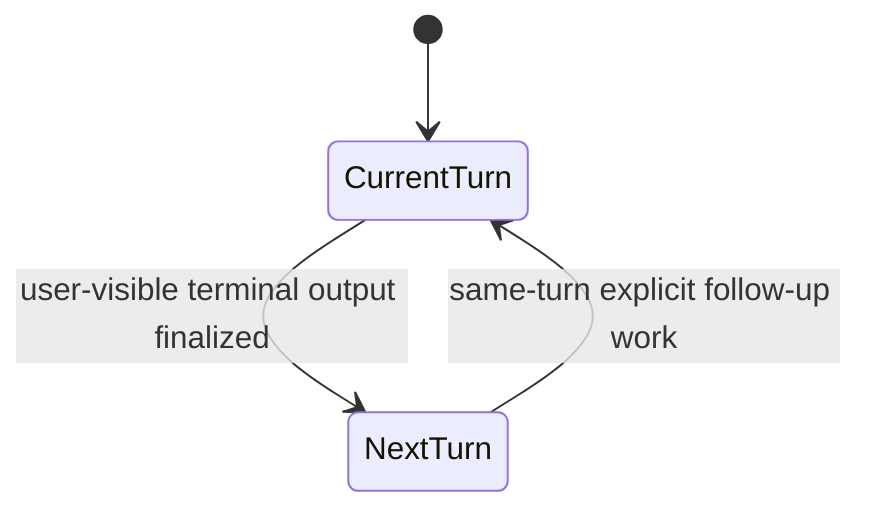
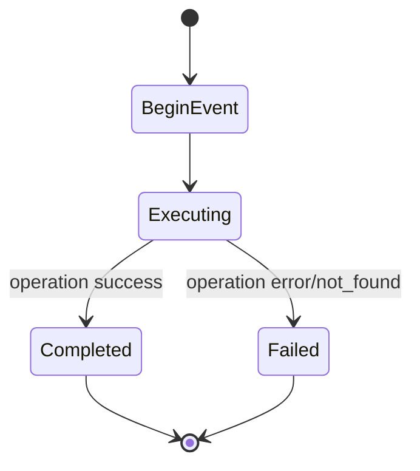

# State Machine README: Agentic Planning + Collaboration Runtime

This document explains the state machine used by the Codex Rust runtime around:
- turn execution
- plan-mode streaming
- checklist planning (`update_plan`)
- request/response waits (`request_user_input`, approvals)
- multi-agent collaboration (spawn/send/wait/close)

## 1) What This State Machine Controls

The runtime is event-driven and turn-scoped. At a high level it controls:

1. **Turn lifecycle**: start, in-progress, completion/abort.
2. **Streaming lifecycle**: assistant deltas, plan deltas, reasoning deltas.
3. **Pending interaction lifecycle**: waits for user input or approvals.
4. **Mailbox lifecycle**: inter-agent messages and waiting semantics.
5. **Plan lifecycle**:
- checklist updates via `update_plan`
- proposed plan streaming in Plan Mode.

---

## 2) Core State Machines

## 2.1 Turn State Machine

### Notes
- `WaitingExternal` does not end the turn; it pauses progression until response.
- Pending entries are stored in turn-local maps keyed by call id / sub id.

## 2.2 Plan Mode Stream State Machine

### Notes
- Normal assistant text and plan segments are split during streaming.
- Final plan text is authoritative from completed assistant message parsing.

## 2.3 Mailbox Delivery Phase State Machine

### Notes
- Controls whether queued inter-agent mailbox messages join current turn or next turn.

## 2.4 Multi-Agent Collaboration Tool State Machine (per call)

`BeginEvent`/`Completed|Failed` are emitted as `Collab*` events and projected to UI items.

---

## 3) Data Structures

## 3.1 Turn-local mutable state

`TurnState` (in `core/src/state/turn.rs`) holds pending asynchronous waits:

- `pending_approvals: HashMap<String, oneshot::Sender<ReviewDecision>>`
- `pending_request_permissions: HashMap<String, PendingRequestPermissions>`
- `pending_user_input: HashMap<String, oneshot::Sender<RequestUserInputResponse>>`
- `pending_elicitations: HashMap<(String, RequestId), oneshot::Sender<ElicitationResponse>>`
- `pending_dynamic_tools: HashMap<String, oneshot::Sender<DynamicToolResponse>>`
- `pending_input: Vec<ResponseInputItem>`
- `mailbox_delivery_phase: MailboxDeliveryPhase`

Why this matters:
- correlation of async replies to exact in-flight requests
- deterministic cleanup on abort/transition

## 3.2 Plan-mode stream state

`PlanModeStreamState` (in `core/src/session/turn.rs`):

- `pending_agent_message_items: HashMap<String, TurnItem>`
- `started_agent_message_items: HashSet<String>`
- `leading_whitespace_by_item: HashMap<String, String>`
- `plan_item_state: ProposedPlanItemState`

`ProposedPlanItemState`:
- `item_id: String`
- `started: bool`
- `completed: bool`

Why this matters:
- avoids rendering empty/premature assistant rows
- preserves correct lifecycle for streamed plan item

## 3.3 Planning payloads

- `UpdatePlanArgs { explanation: Option<String>, plan: Vec<PlanItemArg> }`
- `PlanItemArg { step: String, status: StepStatus }`
- `StepStatus = Pending | InProgress | Completed`

## 3.4 Multi-agent runtime structures

`AgentRegistry`:
- active tree keyed by agent path (`HashMap<String, AgentMetadata>`)
- nickname set for uniqueness (`HashSet<String>`)
- spawn counters / limits (`AtomicUsize`)

`Mailbox` / `MailboxReceiver`:
- message queue: `mpsc::UnboundedSender/Receiver<InterAgentCommunication>`
- wake signal: monotonic sequence via `watch::Sender<u64>` + `AtomicU64`
- local pending queue: `VecDeque<InterAgentCommunication>`

Why this matters:
- efficient wait/wakeup without polling
- stable identity and path-based agent addressing

---

## 4) Algorithms

## 4.1 Streaming plan extraction algorithm

Input: assistant text chunks.

1. Strip citations incrementally.
2. Parse proposed-plan tags incrementally.
3. Emit ordered segments:
- `Normal(text)` -> assistant text deltas
- `ProposedPlan*` -> plan deltas/lifecycle
4. On item completion, parse final assistant text and extract final plan block.
5. Emit completed plan item.

Properties:
- chunk-boundary safe
- separates transient stream from final authoritative plan text

## 4.2 Async pending-response correlation algorithm

1. Create `oneshot (tx, rx)` per request.
2. Insert sender into `TurnState` pending map by key.
3. Emit request event to client.
4. On client response, remove sender by key.
5. Resolve waiting task via oneshot.

Properties:
- exact request matching
- no shared mutable callbacks across requests

## 4.3 Wait-agent mailbox algorithm

1. Validate and clamp timeout.
2. Check local pending mail first (fast path).
3. Else subscribe to mailbox sequence watch channel.
4. Block until sequence changes or timeout.
5. Return timed_out vs completed summary.

Properties:
- low CPU
- immediate wake on new mailbox message

## 4.4 Spawn-agent config layering algorithm

1. Start from current turn effective config.
2. Apply requested model/reasoning overrides (if allowed).
3. Apply role overrides.
4. Apply runtime overrides (provider/approval/cwd/sandbox).
5. Apply spawn depth/path/fork options.
6. Spawn and register metadata.

Properties:
- deterministic precedence
- child consistency with parent runtime context

---

## 5) Key Concepts

## 5.1 Event-driven architecture

Everything important is represented as events (`EventMsg`) and projected into client notifications. This decouples runtime execution from UI/transport.

## 5.2 Turn-scoped isolation

Pending waits and mutable state are scoped to active turns, reducing cross-turn interference.

## 5.3 Explicit lifecycle signaling

For major operations (tool calls, collab operations, plan streaming), begin/end or started/completed events are explicit.

## 5.4 Two planning channels (important)

1. **Checklist plan** (`update_plan`) for structured progress snapshots.
2. **Plan-mode proposed plan stream** for markdown planning content.

They are intentionally different and mapped to different event/notification paths.

## 5.5 Concurrency correctness via ownership + channels

Rust ownership plus `oneshot`, `mpsc`, and `watch` channels provide deterministic coordination without shared mutable race-prone callback structures.

---

## 6) Failure and Recovery Semantics

- Missing pending entry on response -> warning/log, safe no-op behavior.
- Turn transition during wait -> pending request resolved with empty/cancel semantics.
- Agent not found / closed -> collab operation emits failed end event.
- Timeout in wait_agent -> explicit timed-out result, no hidden retries.

---

## 7) Observable Outputs

From this state machine, clients see:

- `TurnStarted` / `TurnCompleted` / `TurnAborted`
- `AgentMessageDelta`, `PlanDelta`, reasoning deltas
- `TurnPlanUpdated` (checklist updates)
- `ToolRequestUserInput` request + response path
- `CollabAgentToolCall` item lifecycle (spawn/send/wait/close/resume)

---

## 8) Primary Source Files

- `codex-rs/core/src/state/turn.rs`
- `codex-rs/core/src/session/mod.rs`
- `codex-rs/core/src/session/turn.rs`
- `codex-rs/utils/stream-parser/src/assistant_text.rs`
- `codex-rs/utils/stream-parser/src/proposed_plan.rs`
- `codex-rs/core/src/agent/control.rs`
- `codex-rs/core/src/agent/registry.rs`
- `codex-rs/core/src/agent/mailbox.rs`
- `codex-rs/core/src/tools/handlers/plan.rs`
- `codex-rs/core/src/tools/handlers/request_user_input.rs`
- `codex-rs/core/src/tools/handlers/multi_agents_v2/*.rs`

---

## 9) Quick Reading Order

1. `state/turn.rs` (pending maps + core turn data)
2. `session/mod.rs` (request/response wiring)
3. `session/turn.rs` (streaming + plan-mode lifecycle)
4. `agent/control.rs`, `agent/registry.rs`, `agent/mailbox.rs` (collab control plane)
5. app-server mapping files for API projection.
