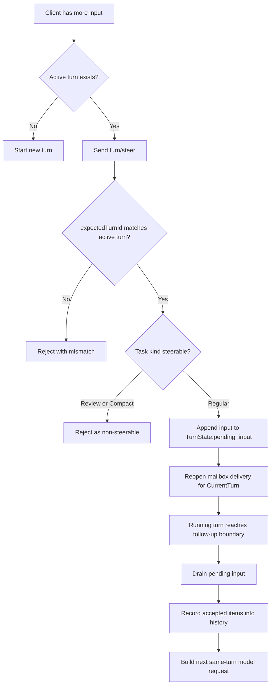

# Steering Overview

This document explains the steering mechanism in `codex-rs`: what it is, where it is triggered from, how control flows through app-server and core, and how the running turn consumes steered input.

## 1) What Steering Is

Steering is the same-turn input injection path.

It does **not** start a new turn when a regular turn is already active. Instead, it:

- targets the current active turn
- appends new user input into that turn's pending-input queue
- lets the running turn consume that input on its next follow-up sampling pass

The wire request is `turn/steer`, carried by `TurnSteerParams { thread_id, input, expected_turn_id, ... }`.

## 2) Where Steering Is Triggered From

There are three main trigger surfaces:

### 2.1 SDK

- Python sync: `TurnHandle.steer(...)`
- Python async: `AsyncTurnHandle.steer(...)`

This is the explicit public client API for "send more input to the currently running turn".

### 2.2 TUI

When the user submits more input while a turn is already active, TUI prefers `turn/steer` before falling back to `turn/start`.

TUI also has an interrupt-assisted path:

- if pending steers exist and the user presses `Esc` while a task is running
- TUI interrupts the active turn
- then resubmits the pending steer content immediately

That path exists to make the steer take effect sooner when the user wants to preempt the current generation.

### 2.3 Core User-Turn Handler

The regular submission path in core also tries `steer_input(...)` first.

- if there is an active regular turn, the input is accepted as a steer
- if there is no active turn, core falls back to spawning a new regular task

So "start a turn" and "steer a turn" share the same higher-level user-input path; the presence of an active regular turn decides which path wins.

## 3) Sequence Diagram

```mermaid
sequenceDiagram
    actor User
    participant Client as SDK or TUI
    participant App as app-server
    participant Sess as Session::steer_input
    participant State as TurnState
    participant Loop as running turn loop
    participant Model as model

    User->>Client: steer("keep it brief")
    Client->>App: turn/steer(threadId, expectedTurnId, input)
    App->>App: validate request
    App->>Sess: steer_input(input, expectedTurnId, metadata)
    Sess->>Sess: confirm active turn exists
    Sess->>Sess: confirm expectedTurnId matches
    Sess->>Sess: confirm task kind is Regular
    Sess->>State: push_pending_input(...)
    Sess->>State: accept_mailbox_delivery_for_current_turn()
    Sess-->>App: active turn id
    App-->>Client: TurnSteerResponse { turnId }

    Note over Loop: current model/tool step continues until follow-up boundary
    Loop->>Sess: get_pending_input()
    Sess-->>Loop: queued steers + mailbox items
    Loop->>Loop: inspect and record accepted pending input
    Loop->>Model: next same-turn sampling request
    Model-->>Client: normal item deltas and completion
```

## 4) Flow Diagram



## 5) Control Flow

### 5.1 App-Server Entry

`turn/steer` enters app-server in `codex_message_processor.rs`.

App-server:

- loads the target thread
- requires `expectedTurnId` to be non-empty
- validates input limits
- converts v2 wire input into core input items
- calls `thread.steer_input(...)`

If steering fails, app-server maps the error to structured JSON-RPC errors:

- no active turn
- expected-turn mismatch
- active turn is not steerable
- empty input

### 5.2 Core Acceptance Path

`Session::steer_input(...)` is the gatekeeper.

It performs four checks:

1. input must not be empty
2. there must be an active turn
3. `expected_turn_id` must match the currently active turn when provided
4. the active task must be `Regular`, not `Review` or `Compact`

On success it does two state mutations:

- `turn_state.push_pending_input(...)`
- `turn_state.accept_mailbox_delivery_for_current_turn()`

That is the essence of steering. No new task is spawned here.

### 5.3 Turn-State Interaction

Steered input lands in `TurnState.pending_input`.

`MailboxDeliveryPhase` matters because a turn may already have emitted visible final answer text and switched mailbox handling to `NextTurn`. A steer reopens `CurrentTurn`, allowing pending mailbox mail to be folded into the same turn again.

This means steering affects both:

- direct user follow-up input
- whether inter-agent mailbox items can still join the current turn's next request

### 5.4 Running Turn Consumption

Inside the turn loop:

- pending input is drained only when the loop is allowed to do so
- each pending item passes through `inspect_pending_input(...)`
- accepted items are recorded into history
- the next sampling request is built from updated conversation history

After each sampling pass, the loop checks:

- whether the model itself needs follow-up
- whether the session still has pending input

If either is true, the same turn continues instead of completing.

That is how a steer extends a turn without creating a new one.

## 6) TUI-Specific Behavior

TUI keeps a local queue of pending steers so the user can see that follow-up instructions are waiting.

Important TUI behaviors:

- while a turn is running, new submissions can be queued as pending steers
- when the server later commits the corresponding user message, TUI matches it against the pending-steer queue and renders the right local history item
- if a steer is rejected because the active turn is not steerable, TUI downgrades it into a queued follow-up instead of losing it
- if the user interrupts with `Esc`, TUI can convert the queued steer into an immediate fresh submission after the interrupt completes

So the TUI adds UX and race-handling around the core steering primitive, but the fundamental server-side behavior remains "append pending input to the active regular turn".

## 7) What Steering Is Not

Steering is not:

- a guaranteed immediate preemption
- a new turn
- valid for review turns
- valid for manual compact turns

It is a best-effort same-turn follow-up mechanism. The currently running step still has to reach a point where the turn loop drains pending input and issues another sampling request.

## 8) Primary Source Map

- App-server entry and error mapping:
  - `codex-rs/app-server/src/codex_message_processor.rs`
- Wire contract:
  - `codex-rs/app-server-protocol/src/protocol/v2.rs`
- Core acceptance:
  - `codex-rs/core/src/session/mod.rs`
- Turn-state mailbox and pending-input state machine:
  - `codex-rs/core/src/state/turn.rs`
- Running turn loop:
  - `codex-rs/core/src/session/turn.rs`
- TUI routing and client call:
  - `codex-rs/tui/src/app/thread_routing.rs`
  - `codex-rs/tui/src/app_server_session.rs`
- Python SDK trigger surface:
  - `sdk/python/src/codex_app_server/api.py`
