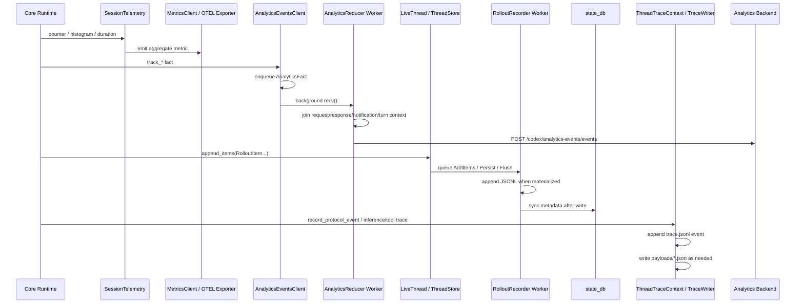
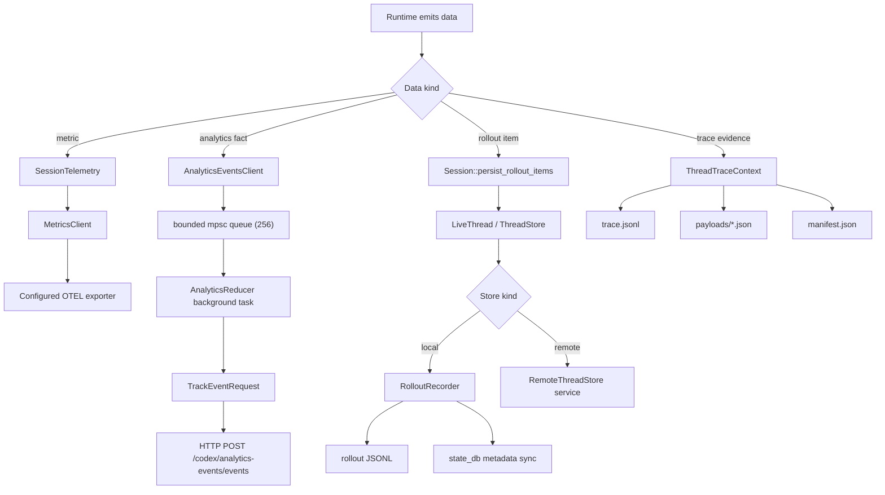

# Telemetry and Evaluable Data

This note answers two questions for `codex-rs`:

1. Where does telemetry drain to?
2. Where does replayable or eval-usable session data drain to?

The short answer is that there are three different pipelines:

- OTEL/runtime metrics: aggregate counters, histograms, durations
- analytics events: reduced product telemetry shipped to the backend
- rollout evidence: local or storage-backed session history and optional raw trace bundles

They are related, but they are not the same sink.

## 1) The Three Pipelines

| Pipeline | Primary purpose | Main entrypoints | Drain destination |
| --- | --- | --- | --- |
| OTEL metrics | runtime counters/histograms/timers | `SessionTelemetry::counter`, `histogram`, `record_duration` | configured metrics exporter via `MetricsClient` |
| Analytics events | product/event telemetry | `AnalyticsEventsClient::track_*` | background reducer, then HTTP POST to `/codex/analytics-events/events` |
| Rollout persistence | replay/debug/eval evidence | `Session::record_conversation_items`, `send_event_raw` | `thread-store`, usually local rollout JSONL plus `state_db` metadata |
| Rollout trace | exact raw diagnostic evidence | `ThreadTraceContext::*` | local trace bundle under `CODEX_ROLLOUT_TRACE_ROOT` |

## 2) OTEL Metrics

The lowest-friction telemetry path is `SessionTelemetry`.

- It is attached to the session in `core/src/session/session.rs`.
- Callers record counters, histograms, and durations throughout turn execution, tool calls, websocket/SSE handling, and related runtime paths.
- `SessionTelemetry` does not keep a local event log. It forwards measurements into `MetricsClient`.
- If no metrics exporter is configured, calls become a no-op.

Primary code:

- `codex-rs/otel/src/events/session_telemetry.rs`
- `codex-rs/core/src/tasks/mod.rs`
- `codex-rs/core/src/mcp_tool_call.rs`

Design shape:

- low-overhead, aggregate-only
- not replayable
- not a turn transcript
- meant for operational measurement rather than forensic reconstruction

## 3) Analytics Events

`AnalyticsEventsClient` is the explicit product-analytics drain.

### 3.1 Queue and Reduction Design

- `AnalyticsEventsClient::record_fact()` pushes `AnalyticsFact` into a bounded Tokio `mpsc` queue.
- Queue size is `256`.
- If the queue is full, analytics events are dropped with a warning.
- A background task owns an `AnalyticsReducer`.
- The reducer joins together request, response, notification, thread, and turn facts until it can emit a higher-level `TrackEventRequest`.

This is important: analytics is not sent one-for-one from each callsite.

Instead, the reducer waits until enough context exists. For example, a full turn event is only emitted once it has:

- thread id
- connection id
- resolved config
- completion status
- token usage if available

Primary code:

- `codex-rs/analytics/src/client.rs`
- `codex-rs/analytics/src/reducer.rs`

### 3.2 Final Drain Destination

When the reducer emits events:

- `send_track_events()` posts them to:
  - `{base_url}/codex/analytics-events/events`
- auth is attached through the normal auth provider
- non-success responses are logged and not retried by a durable local spool

This means analytics is:

- asynchronous
- reduced
- lossy under queue pressure
- not the source of truth for session replay

## 4) Rollout Persistence

The closest thing to "evaluable data" in the codebase is rollout persistence.

This is the durable session history used for:

- replay
- resume
- inspection
- thread listing and metadata lookup
- tests that assert actual persisted interaction history

### 4.1 What Gets Written

Session code persists both:

- model-visible `ResponseItem`s
- selected `EventMsg`s wrapped as `RolloutItem::EventMsg`

Main session callsites:

- `Session::record_conversation_items()`
- `Session::send_event_raw()`
- `Session::persist_rollout_items()`

Primary code:

- `codex-rs/core/src/session/mod.rs`
- `codex-rs/rollout/src/recorder.rs`
- `codex-rs/thread-store/src/live_thread.rs`

### 4.2 Storage Abstraction

The session does not write directly to files.

It writes through `LiveThread`, which delegates to `ThreadStore`.

That means the sink can be:

- local rollout storage via `LocalThreadStore`
- remote persistence via `RemoteThreadStore`

Primary code:

- `codex-rs/thread-store/src/live_thread.rs`
- `codex-rs/thread-store/src/local/live_writer.rs`
- `codex-rs/thread-store/src/remote/mod.rs`

### 4.3 Local Writer Design

In the local case, `LocalThreadStore` uses `RolloutRecorder`.

`RolloutRecorder`:

- owns a bounded `mpsc` command channel
- spawns one background writer task
- buffers `RolloutItem`s in memory
- materializes the JSONL file lazily on `persist()`
- flushes eagerly after `AddItems` if the file is already materialized
- updates `state_db` after writes so listing and metadata queries stay in sync

Important commands:

- `AddItems`
- `Persist`
- `Flush`
- `Shutdown`

Important properties:

- async write boundary is explicit
- persistence is append-only JSONL
- write failures stay buffered for retry paths like later `persist()` or `flush()`
- `state_db` is an index/metadata companion, not the full transcript

Primary code:

- `codex-rs/rollout/src/recorder.rs`

### 4.4 What This Produces

For local threads, the durable artifact is typically a rollout file under the Codex home sessions tree, for example:

- `sessions/YYYY/MM/DD/rollout-<timestamp>-<thread_id>.jsonl`

The exact path is computed by the rollout recorder and exposed through `LiveThread::local_rollout_path()`.

## 5) Rollout Trace Bundles

Rollout traces are separate from normal rollout JSONL.

They are opt-in and diagnostic.

If `CODEX_ROLLOUT_TRACE_ROOT` is set:

- a root session creates a trace bundle directory
- child spawned threads join the same rollout tree rather than creating independent bundles

Bundle layout:

- `manifest.json`
- `trace.jsonl`
- `payloads/*.json`

Primary code:

- `codex-rs/rollout-trace/src/thread.rs`
- `codex-rs/rollout-trace/src/writer.rs`
- `codex-rs/rollout-trace/src/bundle.rs`

Design intent:

- preserve exact raw payloads for inference/tool/compaction/runtime debugging
- keep heavyweight payloads out of normal reduced state
- allow later replay/reduction into a structured `RolloutTrace`

This is the highest-fidelity local evidence sink in the codebase.

## 6) What Is Actually "Evaluable"?

The code does not define a single first-class concept named "evaluable data".

In practice, the most evaluation-friendly artifacts are:

- rollout JSONL:
  - user input
  - assistant messages
  - persisted tool/runtime events
  - enough history to replay or inspect a session
- `state_db`:
  - indexed metadata for discovery, repair, filtering, and resume support
- rollout trace bundles:
  - exact raw request/response payload evidence for deep debugging

By contrast:

- OTEL metrics are aggregate measurements
- analytics events are reduced product telemetry

Those two are useful for monitoring and product analysis, but they are not the full replay/eval substrate.

## 7) Sequence Diagram

## 8) Flow Diagram

## 9) Practical Mental Model

If you are asking "where did this runtime fact go?", use this map:

- "I need counters, timings, rates"
  - OTEL metrics
- "I need product telemetry for backend analysis"
  - analytics reducer and HTTP events
- "I need to replay or inspect what actually happened in a session"
  - rollout JSONL and `state_db`
- "I need exact raw request/response/tool payload evidence"
  - rollout trace bundle

## 10) Most Important Files

- `codex-rs/analytics/src/client.rs`
- `codex-rs/analytics/src/reducer.rs`
- `codex-rs/otel/src/events/session_telemetry.rs`
- `codex-rs/core/src/session/mod.rs`
- `codex-rs/core/src/session/session.rs`
- `codex-rs/core/src/session/turn.rs`
- `codex-rs/thread-store/src/live_thread.rs`
- `codex-rs/thread-store/src/local/live_writer.rs`
- `codex-rs/rollout/src/recorder.rs`
- `codex-rs/rollout-trace/src/thread.rs`
- `codex-rs/rollout-trace/src/writer.rs`
