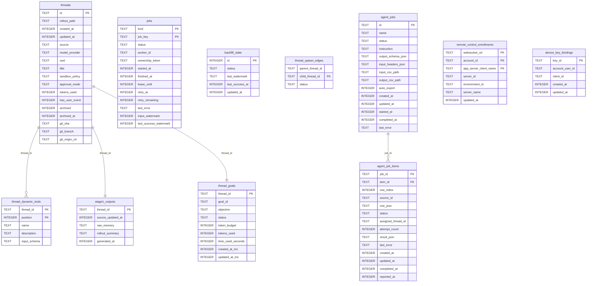
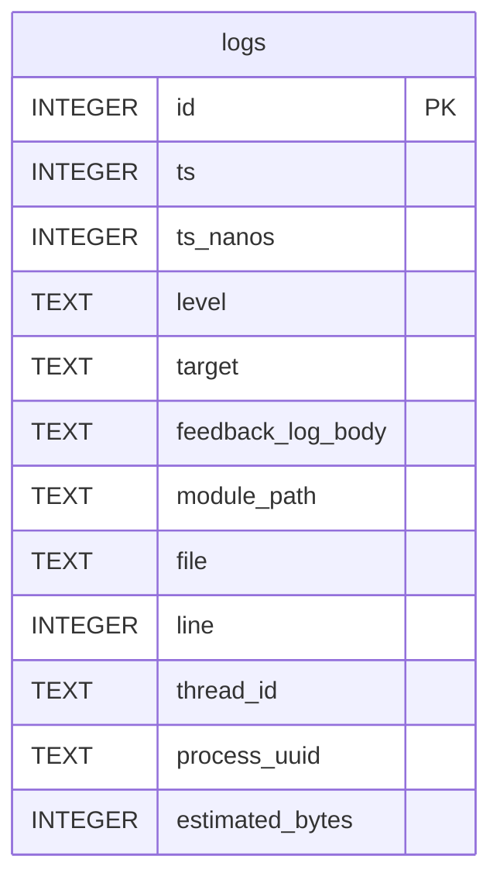
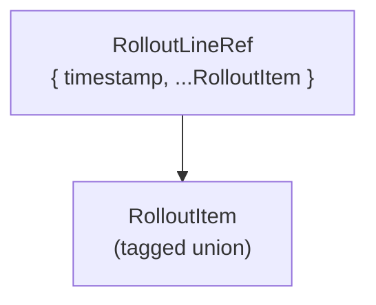
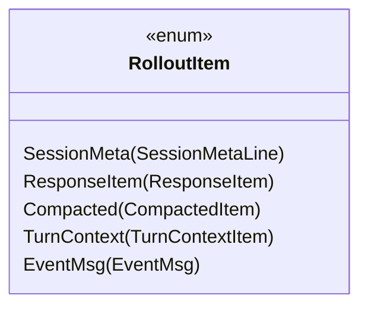
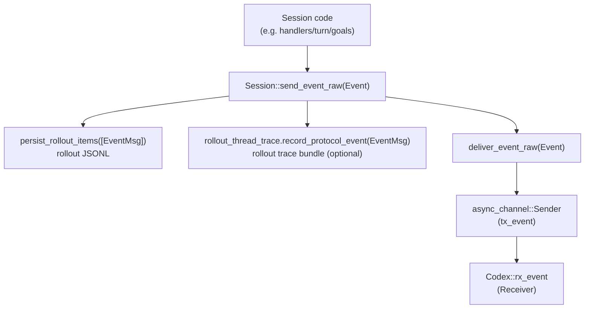
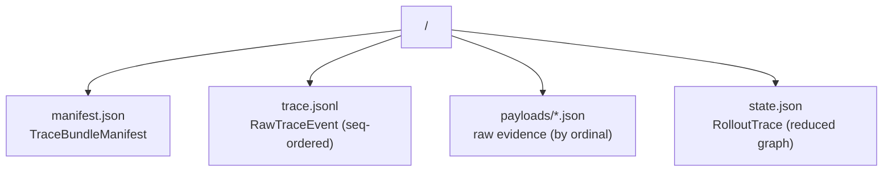
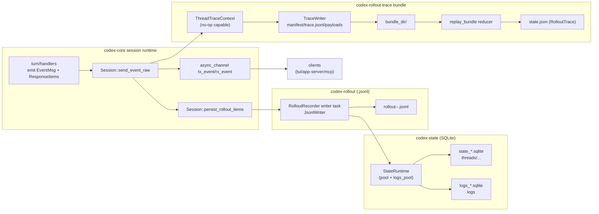

# Storage + Trace Schemas (SQLite, Rollout JSONL, Event Channel, Rollout Trace)

This note captures the on-disk schemas and runtime plumbing for:

- the SQLite state/log DBs
- rollout JSONL files
- the `send_event_raw` event channel
- rollout trace bundles (`CODEX_ROLLOUT_TRACE_ROOT`)

It is intentionally source-driven: each section cites the primary reader/writer aggregates and the struct/table shapes they own.

## SQLite ERD (state DB + logs DB)

### State DB (tables + relationships)

**Source of truth**

- Writer/reader aggregate: `codex_state::StateRuntime` (`codex-rs/state/src/runtime.rs`) owns opening + migrating both SQLite files and exposes the storage APIs through its submodules (`threads`, `goals`, `memories`, `remote_control`, `device_key`, `agent_jobs`, `logs`). See `StateRuntime::init` and the `pool` / `logs_pool` split. (`codex-rs/state/src/runtime.rs:87`)
- Table schemas: `codex-rs/state/migrations/*.sql` (state DB) and `codex-rs/state/logs_migrations/*.sql` (logs DB), including FK constraints in `thread_dynamic_tools`, `stage1_outputs`, `agent_job_items`, and `thread_goals`.

### Logs DB (tables)

**Source of truth**

- Writer/reader aggregate: `codex_state::StateRuntime` uses a dedicated `logs_pool` and runs logs migrations via `runtime_logs_migrator`. (`codex-rs/state/src/runtime.rs:87`)
- Logs schema: `codex-rs/state/logs_migrations/0001_logs.sql` and `codex-rs/state/logs_migrations/0002_logs_feedback_log_body.sql`.

## Rollout JSONL schema (rollout files)

### File shape

Each line is a JSON object with:

- `timestamp`: RFC3339-ish UTC timestamp formatted by the rollout writer
- the rollout item payload, flattened at the top level (`#[serde(flatten)]`)

**Source of truth**

- Writer aggregate: `codex_rollout::RolloutRecorder` + `JsonlWriter` (`codex-rs/rollout/src/recorder.rs:78`) writes `RolloutLineRef { timestamp, item: &RolloutItem }` via `JsonlWriter::write_rollout_item`.
- Reader aggregate: `RolloutRecorder::get_rollout_history` (`codex-rs/rollout/src/recorder.rs:923`) reads the JSONL, parses into `RolloutItem`s, and returns `InitialHistory::Resumed`.
- Rollout item union: `codex_protocol::protocol::RolloutItem` (`codex-rs/protocol/src/protocol.rs:2775`).

### `RolloutItem` variants (tagged union)

**Source of truth**

- `codex-rs/protocol/src/protocol.rs:2775` defines `#[serde(tag = "type", content = "payload", rename_all = "snake_case")] pub enum RolloutItem`.

## Event channel: `send_event_raw` and `tx_event`

### Runtime flow

**Source of truth**

- Writer aggregate (event emission): `Session::send_event_raw` and `Session::deliver_event_raw` (`codex-rs/core/src/session/mod.rs:1617`) persist the event into rollout storage, record it into rollout trace, then push it onto the in-process event channel.
- Channel construction: `Codex::spawn_internal` creates `(tx_event, rx_event) = async_channel::unbounded()` (`codex-rs/core/src/session/mod.rs:473`) and the returned `Codex` surfaces `rx_event` to clients (`codex-rs/core/src/session/mod.rs:367`).

## Rollout trace bundle schema (rollout trace)

### Bundle layout

**Source of truth**

- Writer aggregate: `codex_rollout_trace::TraceWriter` (`codex-rs/rollout-trace/src/writer.rs:36`) writes `manifest.json`, appends raw events to `trace.jsonl`, and writes payloads into `payloads/`.
- Bundle constants + manifest shape: `codex-rs/rollout-trace/src/bundle.rs:1`.
- Reader/reducer aggregate: `codex_rollout_trace::replay_bundle` (`codex-rs/rollout-trace/src/reducer/mod.rs:44`) reads `manifest.json`, streams/parses `trace.jsonl`, and reduces into `RolloutTrace` (`codex-rs/rollout-trace/src/model/mod.rs:54`).

## Dataflow graph (end-to-end)

This is the “what goes where” view that ties together the four systems above.

**Source of truth**

- `send_event_raw` persists + traces + delivers (`codex-rs/core/src/session/mod.rs:1617`).
- Rollout writer and state DB synchronization (`codex-rs/rollout/src/recorder.rs:78` and `codex-rs/rollout/src/recorder.rs:1670`).
- SQLite runtime init and pool split (`codex-rs/state/src/runtime.rs:101`).
- Trace bundle writer + reducer (`codex-rs/rollout-trace/src/writer.rs:29` and `codex-rs/rollout-trace/src/reducer/mod.rs:43`).
