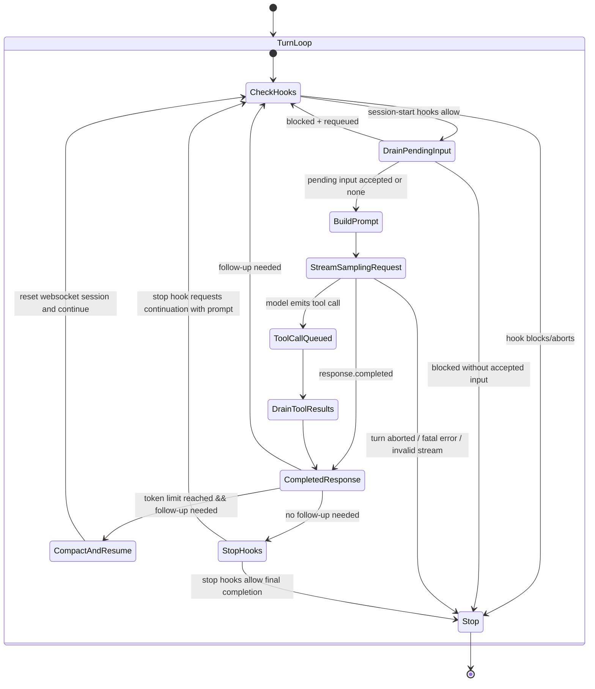
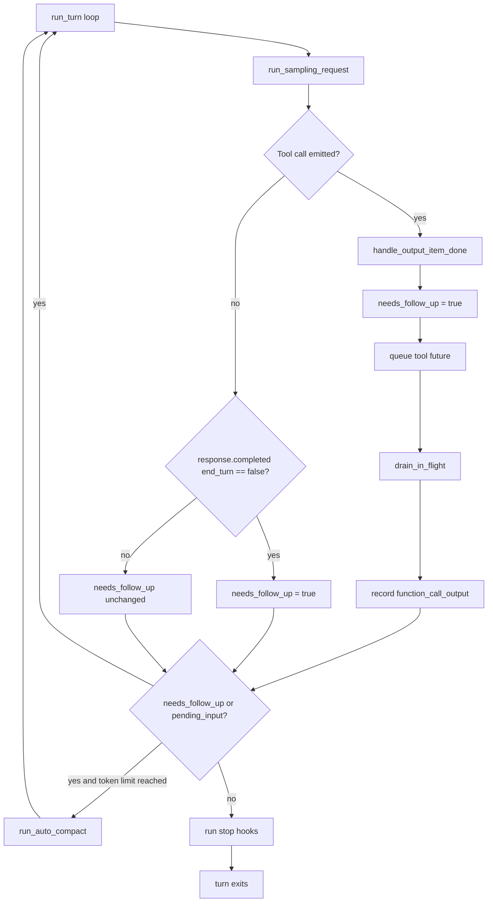
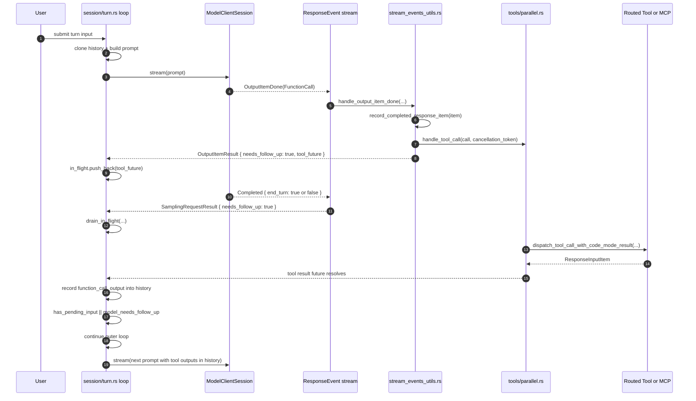
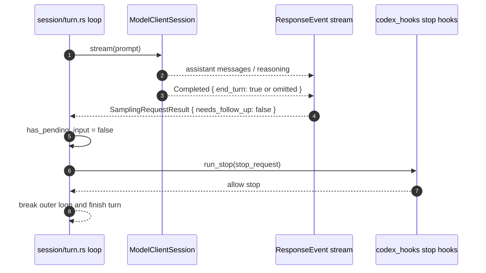

# Turn Tool Execution State Machine

This note documents the multi-turn tool execution loop in `codex-rs/core` and the control pattern
that governs when a turn continues, compacts, or stops.

Primary implementations:

- `codex-rs/core/src/session/turn.rs`
- `codex-rs/core/src/stream_events_utils.rs`
- `codex-rs/core/src/tools/parallel.rs`
- `codex-rs/codex-mcp/src/connection_manager.rs`
- `codex-rs/codex-mcp/src/rmcp_client.rs`
- `codex-rs/core/src/exec.rs`

## What question does this answer?

There is no explicit multi-turn `max_turns` or fixed tool-iteration ceiling in the core turn loop.
The turn is controlled by a follow-up-driven state machine:

- the loop continues when the model still needs follow-up work,
- tool calls set `needs_follow_up = true`,
- `end_turn: false` also keeps the turn alive,
- the loop stops when follow-up is no longer needed, the turn is aborted, or an error path exits.

The practical bounds are timeout, cancellation, approval, compaction, and tool serialization or
parallel-safety policy, not a hard iteration counter.

## High-Level State Machine (Mermaid)

## Follow-Up Loop Graph (Mermaid)

## Sequence: Tool Call Causes Another Sampling Pass (Mermaid)

## Sequence: No Follow-Up, Stop Hooks, Exit (Mermaid)

## Control Pattern

### 1. Outer turn loop

`run_turn` uses an open-ended `loop` and does not decrement an iteration counter. The loop only
exits through normal completion, hook-directed stop, blocked input, abort, or error.

Relevant code paths:

- `codex-rs/core/src/session/turn.rs`: outer `loop`
- `codex-rs/core/src/session/turn.rs`: `needs_follow_up = model_needs_follow_up || has_pending_input`
- `codex-rs/core/src/session/turn.rs`: final `if !needs_follow_up { ... break; }`

### 2. Tool calls reopen the turn

When the model emits a tool call, `handle_output_item_done`:

- converts the response item into a routed tool call,
- records the tool call in history immediately,
- queues a tool future,
- sets `needs_follow_up = true`.

That means tool execution is not a side branch; it is part of the same turn state machine.

### 3. Tool outputs are reinjected through history

Queued tool futures resolve into `ResponseInputItem` values. `drain_in_flight(...)` converts those
results back into response items and records them into conversation history before the next prompt
is built.

This is the handoff that lets the next model pass see `function_call_output` without a separate
control plane.

### 4. Model-directed continuation

Even without a tool call, the stream can keep the turn alive when `response.completed` carries
`end_turn: false`.

That is a second continuation mechanism alongside tool calls.

### 5. Compaction is the main anti-runaway control

If follow-up is still needed and token usage crosses the model auto-compact limit, the turn runs
mid-turn compaction, resets the websocket session, and resumes the same outer loop.

The code comment explicitly assumes compaction is the mechanism that prevents unbounded growth,
instead of a hard iteration cap.

## Effective Bounds

The loop is unbounded in iteration count, but bounded in practice by these controls:

- `exec` default timeout: `DEFAULT_EXEC_COMMAND_TIMEOUT_MS = 10_000`
- MCP startup timeout: default `30s`
- MCP tool timeout: default `120s`
- cancellation tokens on the turn and each tool invocation
- approval policy and hook veto paths
- per-tool parallel or serialized execution policy

## Parallelism Model

MCP tools are serialized by default. A server can opt into parallel eligibility with
`supports_parallel_tool_calls = true`.

At runtime, `ToolCallRuntime` uses a shared `RwLock<()>`:

- parallel-safe tools take the read lock,
- serialized tools take the write lock.

This is not a queue-length or turn-count limiter. It is a concurrency safety gate.

## Code Index

- `codex-rs/core/src/session/turn.rs`: outer state machine, sampling loop, compaction resume,
  `drain_in_flight`
- `codex-rs/core/src/stream_events_utils.rs`: tool-call detection and `needs_follow_up`
- `codex-rs/core/src/tools/parallel.rs`: serialized vs parallel dispatch policy
- `codex-rs/core/src/session/mcp.rs`: session-owned MCP tool dispatch entrypoint
- `codex-rs/codex-mcp/src/connection_manager.rs`: MCP `call_tool(..., client.tool_timeout)`
- `codex-rs/codex-mcp/src/rmcp_client.rs`: MCP default startup and tool timeouts
- `codex-rs/core/src/exec.rs`: local exec default timeout
