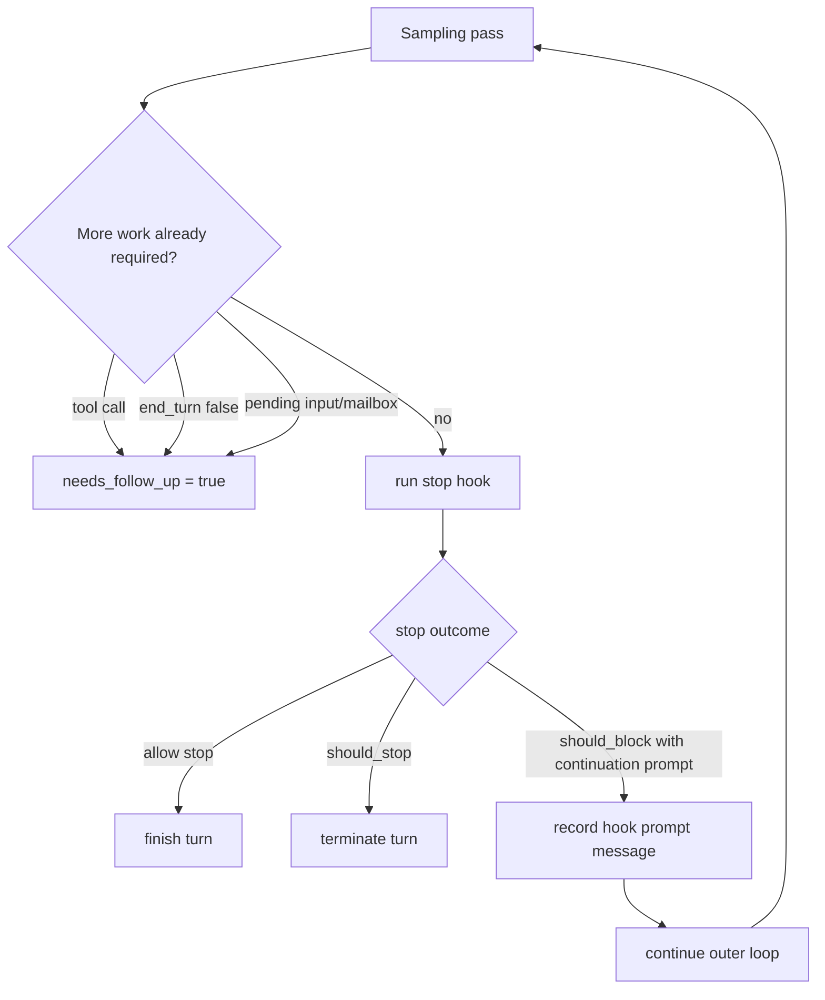
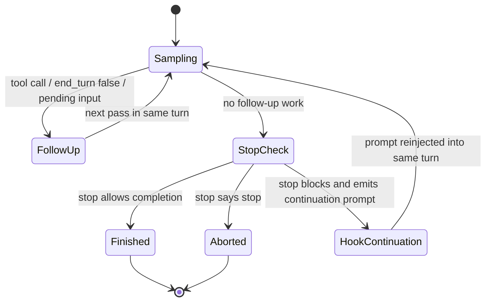
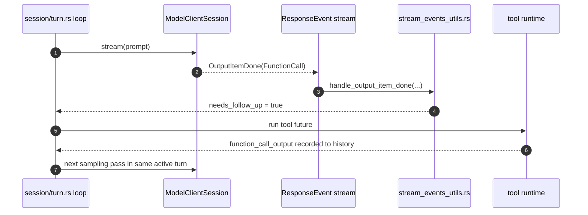
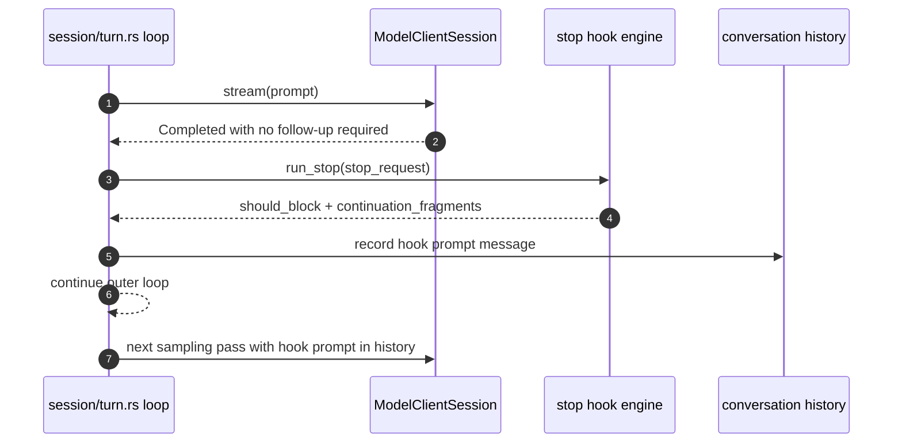

# Follow-Up Versus Stop Hook

This note explains why the turn runtime needs follow-up passes and how that differs from the stop
hook path.

Primary implementations:

- `codex-rs/core/src/session/turn.rs`
- `codex-rs/core/src/stream_events_utils.rs`
- `codex-rs/hooks/src/events/stop.rs`
- `codex-rs/hooks/src/types.rs`

## What question does this answer?

Follow-up is not primarily required because stop is implemented as a hook or because the runtime is
asynchronous.

Follow-up exists because the runtime supports repeated sampling passes within one active turn. Stop
hooks are only one possible producer of another pass, and they run only after the current sampling
pass believes there is no more follow-up work.

The main continuation sources are:

- tool calls
- `response.completed { end_turn: false }`
- pending injected input or mailbox-delivered work
- stop-hook continuation prompts

If stop were reduced to a pure final yes/no gate, a sequential runtime could finish the turn after
stop without another model pass. In the current design, stop can add continuation prompt content,
so another sampling pass is structurally required even in a sequential architecture.

## Control Model

## High-Level State Machine (Mermaid)

## Sequence: General Follow-Up Without Stop Hook (Mermaid)

## Sequence: Stop Hook Continuation (Mermaid)

## What The Stop Hook Actually Is

The stop hook is a post-pass policy point. It runs after the runtime reaches:

- `!needs_follow_up`
- no pending input extending the current pass

Only then does the runtime call `hooks.run_stop(stop_request)`.

That means stop is not the mechanism that creates the general notion of follow-up. It is a late
gate that may:

- allow completion
- force stop
- convert “done” into “continue with this prompt”

The last case is why stop can require another pass, but it is not why follow-up exists in the
system overall.

## Stop Hook As A Design Pattern

The stop hook is best described as a:

- post-condition interception hook
- policy gate at a phase boundary
- resumable veto point

It is not just a callback and not just a notification hook. The important property is that it sits
at the boundary between “the runtime thinks the turn is done” and “the system is allowed to commit
that completion”.

In architectural terms, it behaves like a specialized interceptor around turn finalization:

1. the main turn pipeline reaches a provisional terminal state
2. the stop hook inspects the proposed completion
3. the hook may:
   - accept completion
   - abort completion
   - veto completion but attach continuation material
4. the runtime either finalizes or re-enters the turn loop

That makes it a resumable boundary guard rather than a passive observer.

## What Problem It Solves

The stop hook solves a very specific problem: the model’s own belief that it is “done” is not
always the same thing as the system’s policy for when a turn should actually finalize.

It gives the runtime one late, centralized decision point for concerns that are awkward to encode
inside the model pass itself:

- policy review of the candidate final answer
- workflow enforcement at turn completion time
- external validation that only makes sense once a full answer exists
- controlled continuation when the answer is close but not acceptable yet

Without a stop hook, the runtime would have weaker options:

- force all such policy into the base prompt, which is brittle and model-dependent
- bolt checks into many earlier phases, which fragments control logic
- finalize immediately and require a new user turn to correct course

The stop hook avoids all three by giving the system a single late-stage control point that can
either approve finalization or convert “done” into “continue”.

## Best-Guess Design Motivation

Best guess, based on the code shape and control flow:

the design motivation was to keep the main turn pipeline model-driven and simple most of the time,
while preserving one strong system-owned checkpoint right before completion.

Why this shape is attractive:

- most turns should complete without extra machinery, so stop runs only after `!needs_follow_up`
- the hook can enforce system or product policy without teaching every model/provider a new
  completion contract
- continuation fragments let the system recover in-place when the answer is almost acceptable,
  instead of forcing a brand-new user turn
- the same outer turn loop can already handle “append context and sample again”, so the hook reuses
  existing continuation machinery instead of inventing a second control plane

So the likely motivation was not “hooks are async, so we need follow-up”. It was closer to:

- keep finalization policy outside the model core
- preserve a clean answer boundary
- allow late correction without breaking the same-turn workflow

That is why `run_stop(stop_request)` appears only after the runtime believes there is no more
ordinary follow-up work, and why a blocking stop result is expressed as continuation prompt
fragments instead of an entirely separate interaction mode.

## Why Async Is Not The Core Reason

Asynchrony makes multiple continuation sources coexist at runtime:

- tools finish later
- mailbox work can arrive mid-stream
- user steer input can arrive while a turn is active

That makes the open-ended loop operationally necessary. But the conceptual need for follow-up does
not disappear in a sequential system if any phase can append new model-visible context and ask the
model to continue.

A sequential version would still need something like:

1. sample
2. inspect output
3. maybe run tools
4. maybe append tool or hook continuation context
5. decide whether to sample again

That is still a follow-up loop, just serialized.

## If Stop Were Only A Final Gate

If stop had a much weaker contract, such as:

- inspect final assistant message
- return `allow` or `deny`
- never add continuation prompt content

then a simpler architecture would be possible.

In that design:

- the turn could complete its final model pass
- the client could be prompted once for stop approval or denial
- no extra sampling pass would be needed just because stop exists

So the important distinction is not async versus sequential. The important distinction is whether
stop is allowed to transform terminal completion into “continue the same turn with new prompt
material”.

## Architectural Conclusion

The current runtime needs follow-up because it supports continuation-producing phases, not because
stop happens to be implemented as a hook.

Stop contributes one continuation path, but the more fundamental control structure is:

- sample
- inspect outputs and side effects
- append new context if required
- decide whether the same turn must sample again

That remains true in both async and sequential implementations.

## Code Index

- `core/src/session/turn.rs`: outer loop, `needs_follow_up`, stop-hook continuation path
- `core/src/stream_events_utils.rs`: tool-call path that sets `needs_follow_up = true`
- `hooks/src/events/stop.rs`: stop outcome shape (`should_stop`, `should_block`,
  `continuation_fragments`)
- `hooks/src/types.rs`: generic hook payload and hook execution model
