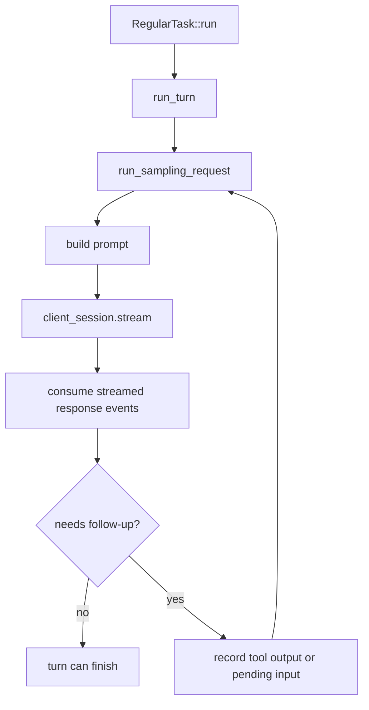
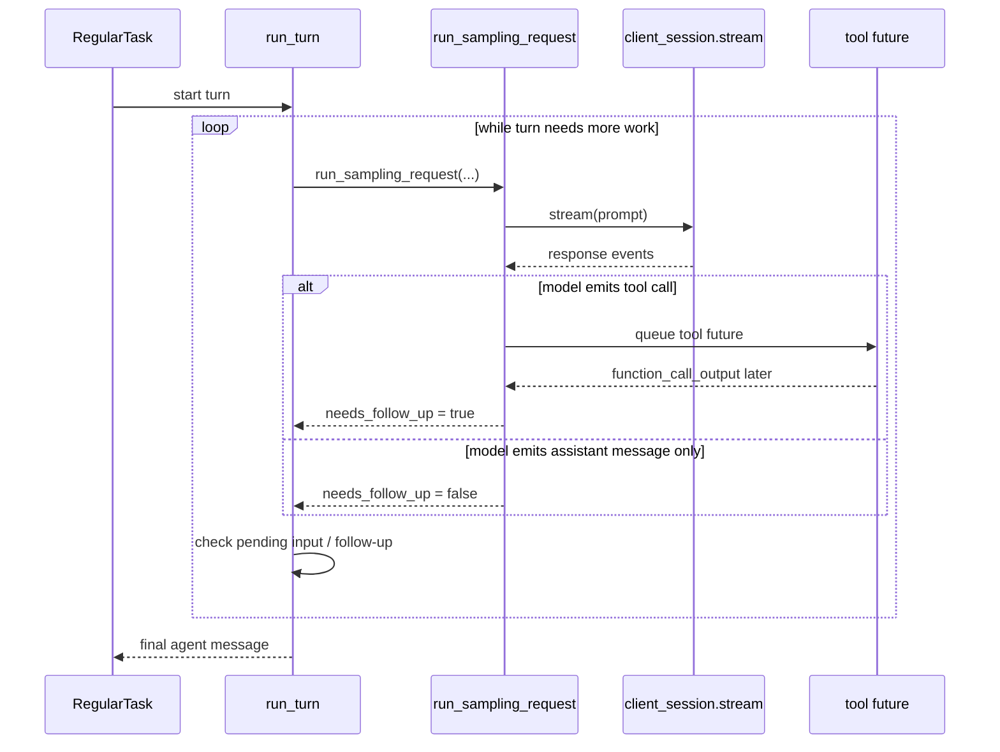

# Sampling Requests

This note explains what "sampling" means in `codex-rs/core`, how many samples are created, who controls the process, and how asynchronous execution fits into the turn loop.

Primary implementations:

- `codex-rs/core/src/session/turn.rs`
- `codex-rs/core/src/tasks/regular.rs`

## What question does this answer?

In this codebase, "sampling" does **not** mean "generate N candidate answers and choose one".

Here, a **sampling request** means:

- build the current model prompt from conversation history and turn state
- send one model inference request
- consume its streamed response events
- decide whether the same turn needs another pass

So a sampling request is one pass through the model for the current turn state.

## Short Answer

- Usually there is **one model stream per sampling request**.
- A turn may perform **multiple sampling requests sequentially**.
- The turn loop controls whether another sampling request happens.
- Tool execution is async.
- Model response streaming is async.
- Sampling requests for a single turn are **not** run in parallel with each other.

## High-Level Flow

## What A Sampling Request Actually Is

`run_turn(...)` is the outer turn loop. Inside it, each iteration calls `run_sampling_request(...)`.

That function:

1. builds the available tool/router set
2. builds the prompt from current history
3. calls `try_run_sampling_request(...)`
4. streams model events until `response.completed` or an error
5. returns `SamplingRequestResult { needs_follow_up, last_agent_message }`

That is why "sampling request" is best read as:

> one complete request/stream cycle against the model

rather than:

> one draw from a bag of many candidate outputs

## How Many Samples Are Created?

### Per sampling request

Normally: **one streamed model response**.

The code comment in `run_turn(...)` says a sampling request can technically contain multiple output items, but in practice it is generally one logical item:

- a tool call, or
- an assistant message

So there is not usually a fan-out like "sample 4 completions".

### Per turn

A single user turn may trigger **multiple sampling requests**, but they are follow-up passes of the same turn.

Common reasons for another sampling request:

- the model emitted a tool call
- `response.completed` had `end_turn: false`
- pending steered input exists
- mailbox-delivered work exists
- compaction ran and the turn must continue

So the right mental model is:

- one turn
- zero or more follow-up sampling passes
- each pass reuses updated history from the previous pass

## Who Controls Sampling?

The **turn runtime** controls it.

### Outer controller

`RegularTask::run(...)` drives the top-level repetition:

- call `run_turn(...)`
- if pending input still exists, loop again with empty fresh input and continue the same active turn

### Turn controller

Inside `run_turn(...)`, the control logic decides whether another sampling pass is needed.

After one sampling request finishes, the turn checks:

- `model_needs_follow_up`
- `sess.has_pending_input()`

If either is true, the turn continues.

So the model influences continuation, but the runtime is the controller that decides whether to run another pass.

## Is There A Sampling Request Picker?

There is no separate "sampling request picker" abstraction in this codepath.

Instead, the choice is split across two layers:

- the **turn loop** chooses **whether** another sampling request should happen
- the **prompt-building path** chooses **what** that next sampling request contains

So if you are looking for a single component named something like "sampling picker", that is not how the runtime is structured.

### Who chooses whether to issue the next sampling request?

`run_turn(...)` and `RegularTask::run(...)` choose that.

They look at runtime state such as:

- whether the last sampling pass returned `needs_follow_up`
- whether pending input exists
- whether tool outputs were produced
- whether compaction or mailbox work requires continuation

If continuation is needed, the loop issues the next sampling request. If not, the turn can finish.

### Who chooses what goes into the next sampling request?

`run_sampling_request(...)` chooses that by rebuilding prompt input from the current state:

- on the first pass, it uses the initial turn input
- on later passes, it rebuilds from cloned conversation history via `for_prompt(...)`
- then `build_prompt(...)` packages that input together with router/tool state, turn context, and base instructions

So the effective "picker" for the next request payload is:

1. conversation history
2. pending accepted inputs already recorded into history
3. tool outputs recorded into history
4. current turn context and instructions
5. `build_prompt(...)`

### What does the model choose versus what does the runtime choose?

The runtime chooses:

- whether to make another request
- the prompt content for that request
- which model session/provider transport to use
- retry behavior on stream failures

The model chooses:

- what response items to emit for that request
- whether to produce assistant text or tool calls
- whether the server response implies more follow-up work

So the model is not picking the next sampling request. The model is producing the result of the current request, and the runtime decides what to do next.

## Sequence Diagram

## Is Sampling Async?

Yes, but there are two different meanings here.

### 1) The model stream is async

`try_run_sampling_request(...)` awaits `client_session.stream(...)`, then asynchronously consumes events from that stream.

So the response is delivered incrementally as:

- output items added
- deltas
- completed items
- final completed event

### 2) Tool work is async

When a tool call is emitted, the runtime creates a tool future and stores it in `FuturesOrdered`.

Those tool futures are later drained asynchronously by `drain_in_flight(...)`.

So tool execution is async too.

## What Is Async Versus Sequential?

This is the key distinction:

- **Within one sampling request**, response handling is async and event-driven.
- **Tool futures** are async.
- **Across sampling requests in the same turn**, execution is sequential.

The runtime does **not** launch multiple model sampling requests in parallel for one turn. It waits for the current sampling request to finish, then decides whether to issue the next one.

So if you were asking:

> are they all sampled asynchronously at once?

The answer is:

- response streaming: yes, async
- tool handling: yes, async
- multiple sampling passes for one turn: no, sequential

## Are They Sampling For The Same Test?

If by "same test" you mean "same task / same user turn", then usually yes.

Multiple sampling requests inside one turn are follow-up passes for the same turn. They are not separate independent experiments.

Example:

1. user asks for a change
2. model emits a tool call
3. tool output is recorded
4. next sampling request sees that updated history
5. model continues the same turn

That is a single logical turn with multiple model passes.

## Retries Are Not Extra Intentional Samples

`run_sampling_request(...)` also has a retry loop for retryable stream failures.

That means if a stream disconnects:

- the runtime may retry the same sampling request
- this is a transport/reliability retry
- it is not a deliberate "take another candidate sample and compare outputs" feature

So "multiple samples" can sometimes really mean:

- follow-up passes in the same turn, or
- retries of the same request

not:

- candidate diversity sampling

## Practical Mental Model

Use this mental model when reading the code:

- **turn** = one end-user interaction
- **sampling request** = one model pass inside that turn
- **sampling request picker** = not a standalone object; the turn loop plus prompt builder together play that role
- **follow-up** = another model pass because the turn is not done yet
- **async** = how streams and tool futures are processed
- **controller** = the runtime turn loop, not a batch-sampling policy

## Why This Design Exists

This design maps closely to the official Responses API model for tool-enabled agent workflows.

### 1) It solves multi-step tool orchestration

OpenAI's function-calling flow is explicitly a multi-step conversation:

1. send a request with tools
2. receive a tool call
3. execute the tool in the application
4. send another request with the tool output
5. receive a final answer or more tool calls

That is almost exactly the shape of the `run_turn(...)` follow-up loop. The runtime needs repeated sampling passes because a single model pass cannot both decide on a tool call and also know the tool result before the application executes it.

Source:

- OpenAI Function Calling guide: <https://platform.openai.com/docs/guides/function-calling/example-use-cases?api-mode=responses>

### 2) It solves conversation continuity across passes

The Responses API conversation-state guidance is built around reusing prior outputs as input for later requests. That is why this runtime rebuilds prompt input from accumulated history for each follow-up pass instead of treating every model call as an isolated one-shot request.

Source:

- OpenAI Conversation State guide: <https://platform.openai.com/docs/guides/conversation-state?api-mode=responses>
- OpenAI Responses API reference: <https://platform.openai.com/docs/api-reference/responses/object>

### 3) It solves low-latency progress and incremental UI updates

OpenAI's streaming guidance says streaming exists so applications can start printing or processing output before the full response is complete, and the Responses API exposes typed semantic events for that purpose.

That matches the streamed event handling here:

- text deltas
- output-item lifecycle events
- streamed function-call argument deltas
- final completion

Without this design, the runtime would have to wait for full completion before showing progress or reacting to intermediate tool-call events.

Source:

- OpenAI Streaming Responses guide: <https://platform.openai.com/docs/guides/streaming-responses>
- OpenAI Function Calling guide, streaming section: <https://platform.openai.com/docs/guides/function-calling?api-mode=responses>

### 4) It solves long-running context growth

For long-running conversations, the Responses API docs explicitly describe compaction as a way to shrink the context sent with future turns while preserving enough latent state to continue.

That is why this turn loop can compact and then continue sampling, instead of assuming one request can carry the whole lifetime context forever.

Source:

- OpenAI Conversation State guide, compaction section: <https://platform.openai.com/docs/guides/conversation-state?api-mode=chat&lang=javascript>

### Bottom line

The design is not using repeated sampling passes because of an arbitrary local preference. It is solving the same problems the Responses API itself is designed around:

- iterative tool use
- carry-forward state between passes
- incremental streaming updates
- survivable long-running conversations

## Cross-References

- State machine overview: [01-turn-tool-execution-state-machine.md](/Users/yao/projects/codex/learning/turn-execution/01-turn-tool-execution-state-machine.md)
- Follow-up and stop behavior: [02-follow-up-vs-stop-hook.md](/Users/yao/projects/codex/learning/turn-execution/02-follow-up-vs-stop-hook.md)
- Steering overview: [00-steering-overview.md](/Users/yao/projects/codex/learning/steering/00-steering-overview.md)
